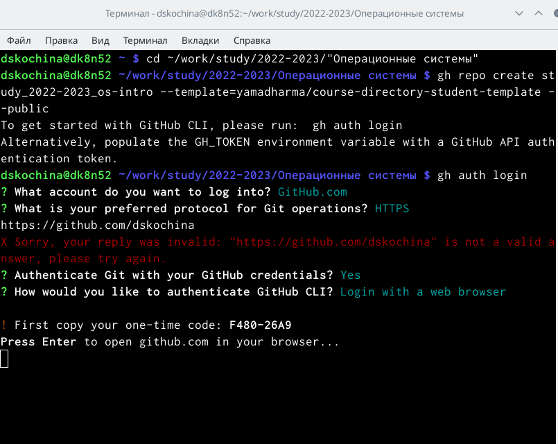
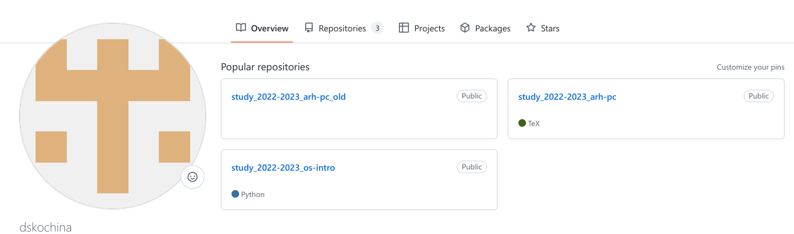
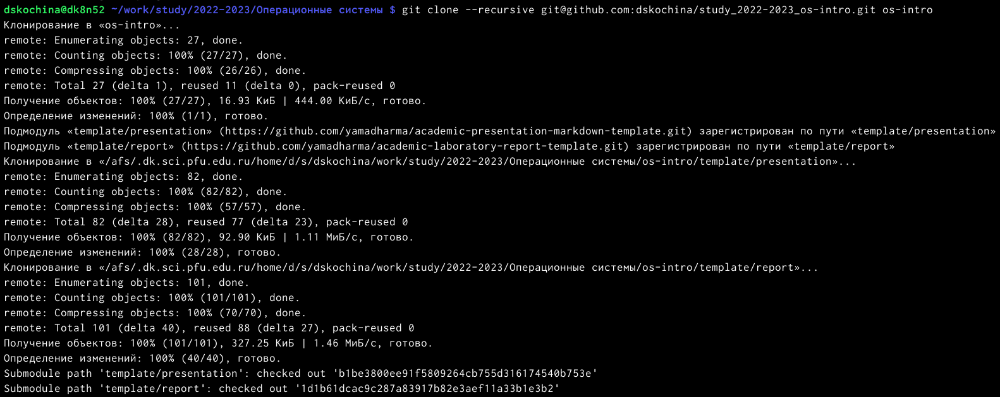
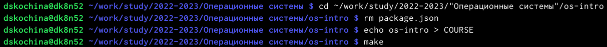
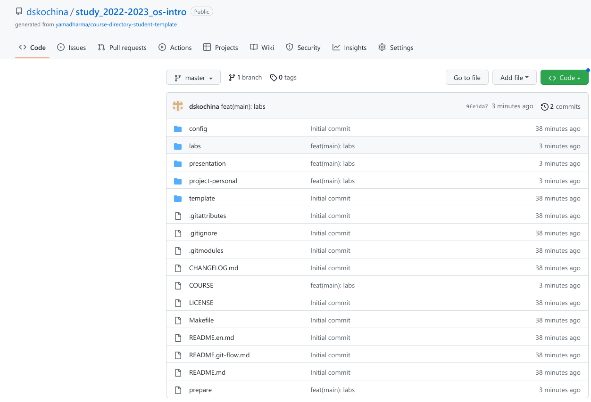

---
## Front matter
lang: ru-RU
title: Отчёт по лабораторной работе №2
subtitle: Первоначальная настройка версий git
author:
  - Кочина Д. С.
institute:
  - Российский университет дружбы народов, Москва, Россия
date: 18 февраля 2023

## i18n babel
babel-lang: russian
babel-otherlangs: english

## Formatting pdf
toc: false
toc-title: Содержание
slide_level: 2
aspectratio: 169
section-titles: true
theme: metropolis
header-includes:
 - \metroset{progressbar=frametitle,sectionpage=progressbar,numbering=fraction}
 - '\makeatletter'
 - '\beamer@ignorenonframefalse'
 - '\makeatother'
---

# Вводная часть

## Цель работы

Целью данной лабораторной работы является изучение идеологии и применения средств системы контроля версий Git, а также приобретение практических навыков работы с ней.

# Основная часть

## Создание каталога "Операционные системы"

- Создала каталог "Операционные системы".

## Создания репозитория на GitHub

- Перешла в каталог "Операционные системы" и начала процесс создания репозитория на GitHub.
- После ввода определённых команд я авторизировалась на GitHub, ввела свой логин и пароль.
- Перешла на сайт GitHub, чтобы убедиться, произошло ли создание нового репозитория под названием "study_2022-2023_os-intro"

## Клонирование созданного репозитория

- Клонировала созданный репозиторий при помощи определённой команды.

## Удаление лишних файлов и создание каталогов

- Удалила лишние файлы и создала необходимые каталоги при помощи команд, набранных в терминале.
- Проверила созданные папки

## Отправка файлов на сервер

- Отправила файлы на сервер при помощи команд:
git add .
git commit -am 'feat(main): labs'
git push
- Зашла на сайт GitHub для того, чтобы убедиться в наличии созданных папок.

# Заключение

## Вывод

В ходе выполнения данной лабораторной работы я создала каталог "Операционные системы" и новый репозиторий на сервере GitHub на основе шаблона, внесла в него изменения. Также я создала рабочее пространство для выполнения следующих лабораторных работ.

