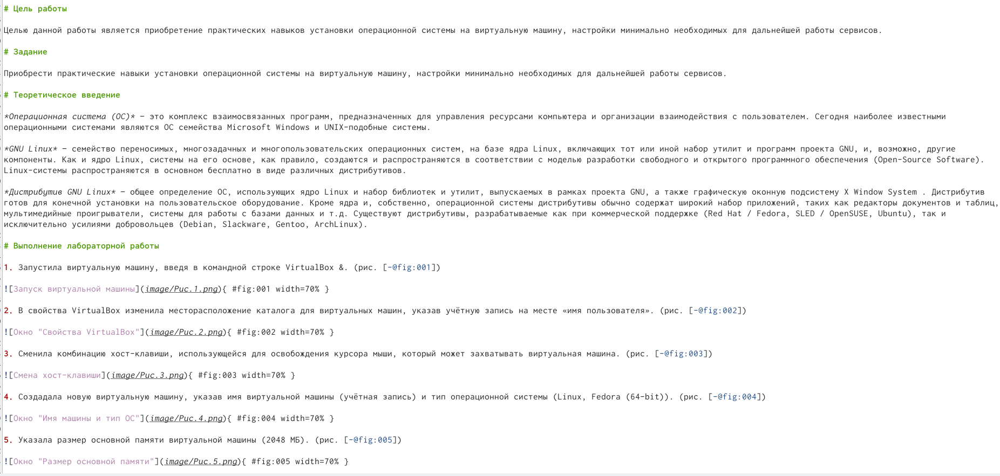
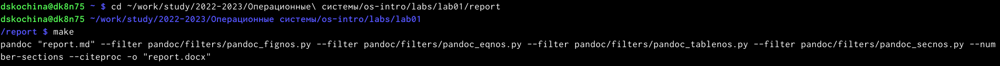
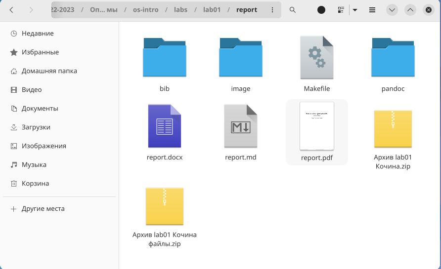
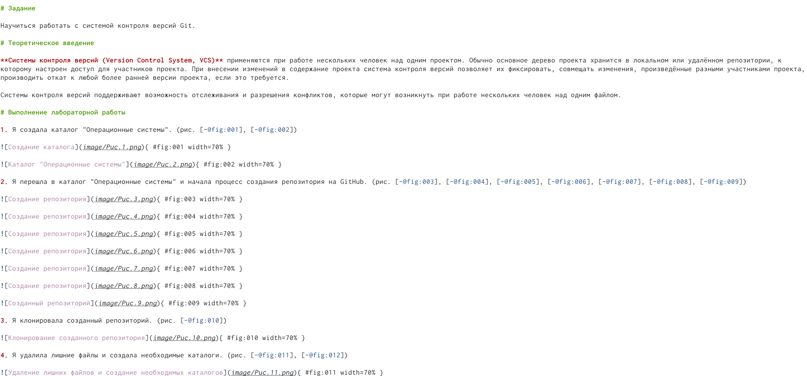
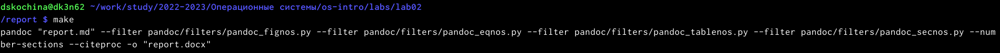
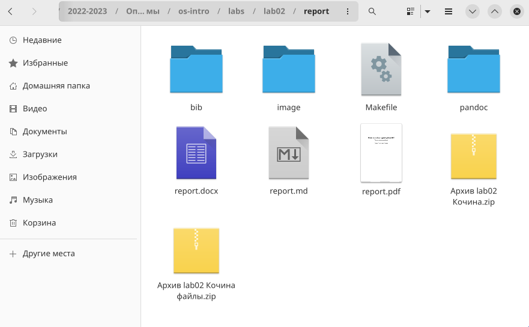

---
## Front matter
lang: ru-RU
title: Отчёт по лабораторной работе №3
subtitle: Markdown
author:
  - Кочина Д. С.
institute:
  - Российский университет дружбы народов, Москва, Россия
date: 21 февраля 2023

## i18n babel
babel-lang: russian
babel-otherlangs: english

## Formatting pdf
toc: false
toc-title: Содержание
slide_level: 2
aspectratio: 169
section-titles: true
theme: metropolis
header-includes:
 - \metroset{progressbar=frametitle,sectionpage=progressbar,numbering=fraction}
 - '\makeatletter'
 - '\beamer@ignorenonframefalse'
 - '\makeatother'
---

# Вводная часть

## Цель работы

Цель данной лабораторной работы: научиться оформлять отчёты с помощью легковесного языка разметки Markdown.

# Основная часть

## Отчёт по первой лабораторной работе в md.

- Я начала оформление первой лабораторной работы в Markdawn, используя все знания об этом языке разметки.

## Команда make

- Я перешла в каталог с лабораторной работой №1 с помощью терминала.
- Ввела команду make, при помощи которой скомпилировались файлы в формате docx и pdf.

## Файлы в трёх форматах

- Я убедилась в том, что после команды make создались файлы в форматах docx и pdf.

## Отчёт по второй лабораторной работе в md.

- Я начала оформление второй лабораторной работы в Markdawn.

## Команда make

- Я открыла терминал и перешла в каталог с лабораторной работой №2.
- Ввела команду make, при помощи которой скомпилировались файлы в формате docx и pdf.

## Файлы в трёх форматах

- Я убедилась в том, что после команды make создались файлы в форматах docx и pdf.

# Заключение

## Вывод

В ходе выполнения данной лабораторной работы я научилась оформлять отчёты с помощью легковесного языка разметки Markdown, оформила отчёты по первой и второй лабораторным работам.

