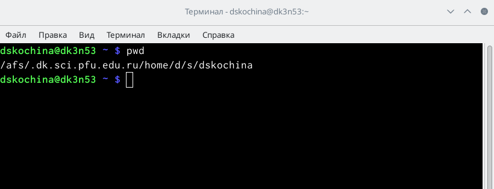
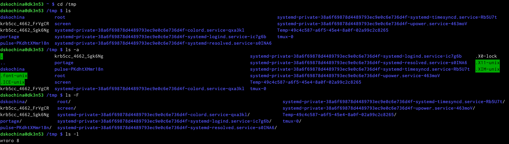
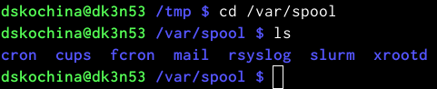
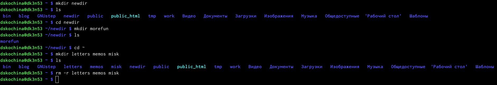
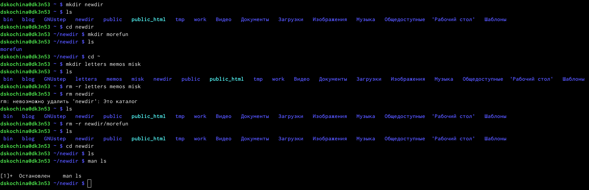
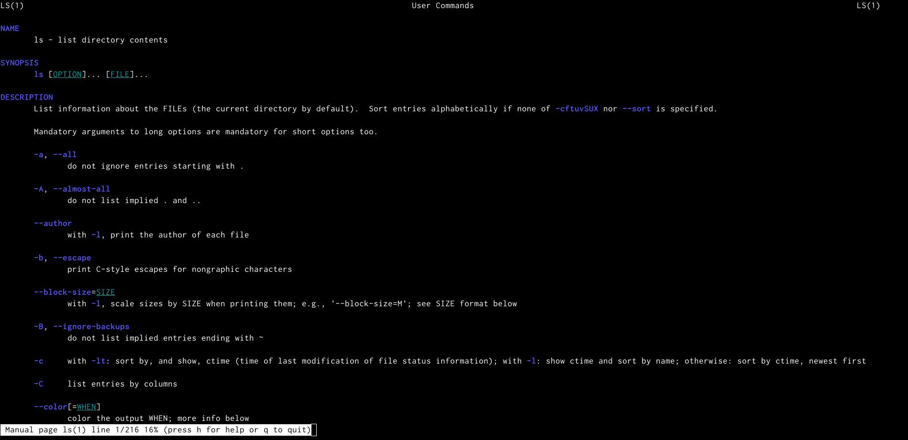
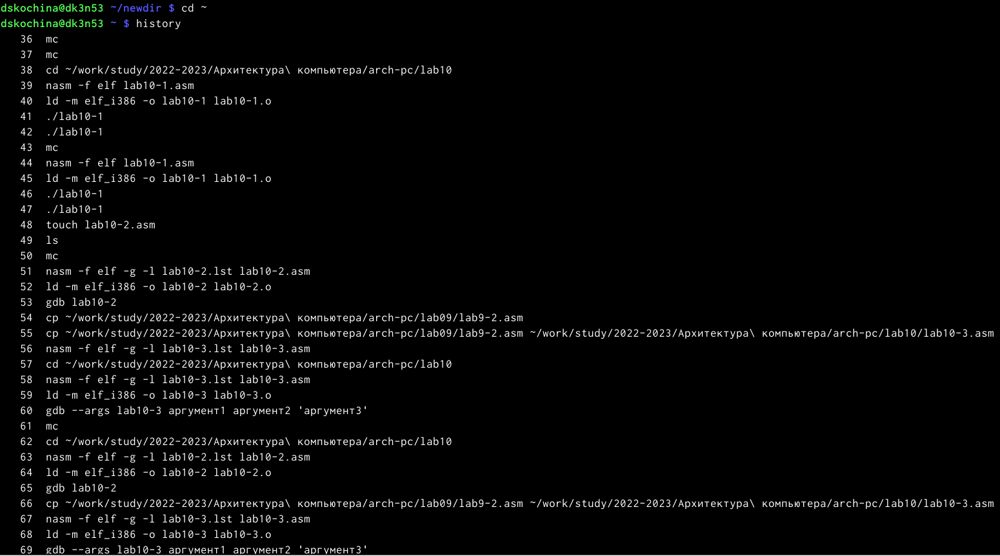
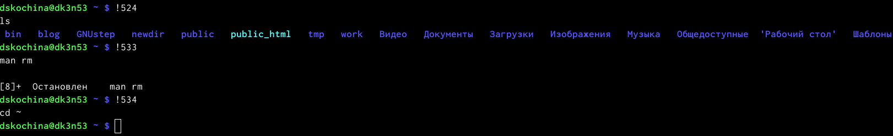

---
## Front matter
lang: ru-RU
title: Отчёт по лабораторной работе №4
subtitle: Основы интерфейса взаимодействия пользователя с системой Unix на уровне командной строки
author:
  - Кочина Д. С.
institute:
  - Российский университет дружбы народов, Москва, Россия
date: 02 марта 2023

## i18n babel
babel-lang: russian
babel-otherlangs: english

## Formatting pdf
toc: false
toc-title: Содержание
slide_level: 2
aspectratio: 169
section-titles: true
theme: metropolis
header-includes:
 - \metroset{progressbar=frametitle,sectionpage=progressbar,numbering=fraction}
 - '\makeatletter'
 - '\beamer@ignorenonframefalse'
 - '\makeatother'
---

# Вводная часть

## Цель работы

Целью данной лабораторной работы является приобретение практических навыков взаимодействия пользователя с системой посредством командной строки.

# Основная часть

## Имя домашнего каталога

- Определила полное имя домашнего каталога, используя команду pwd, так как уже нахожусь в домашнем каталоге.

## Содержимое каталога /tmp

- Перешла в каталог/tmp.
- Вывела на экран содержимое каталога /tmp. Для этого использовала команду ls с различными опциями.

## Подкаталог cron

- Для того, чтобы определить, есть ли в каталоге /var/spool подкаталог с именем cron, необходимо перейти в указанный каталог, используя команду "cd /var/spool". Теперь необходимо просмотреть его содержимое с помощью команды ls. Таким образом, я убедилась, что данный подкаталог существует.
- Перешла в домашний каталог и проверила его содержимое. Владельцем файлов и подкаталогов является dskochina.

## Создание новых каталогов

- В домашнем каталоге создала новый каталог с именем newdir. В каталоге ~/newdir создала новый каталог с именем morefun. С помощью команды "ls" проверила правильность выполненных действий.
- В домашнем каталоге создала с помощью одной команды (mkdir) три новых каталога с именами "letters, memos, misk". Затем удалила эти каталоги одной командой "rm -r letters, memos, misk". Проверила правильность выполненных действий с помощью команды ls.

## Удаление каталогов

- Попробовала удалить ранее созданный каталог ~/newdir командой rm. Каталог не был удалён (получила отказ в выполнении команды, так как данный каталог содержит подкаталог и требует при удалении использовать опцию -r).
- Удалила каталог ~/newdir/morefun из домашнего каталога. Для этого используем команду "rm -r newdir/morefun". Командой ls проверила правильность выполненных действий.

## Команда man

- Используя команду "man ls", определила, какую опцию команды ls необходимо использовать, чтобы просмотреть содержимое не только указанного каталога, но и подкаталогов, входящих в него.
- Используя то же руководство по команде "ls", открытое в предыдущем пункте, определила набор опции команды ls. Данный набор опций позволяет отсортировать по времени последнего изменения выводимый список содержимого каталога с развернутым описанием файлов.
- Используя команду man для следующих команд: cd, pwd, mkdir, rmdir, rm, просматриваю описание соответствующих команд. Команда cd не имеет дополнительных опций.

## Команда history

- Вывела историю команд с помощью команды «history».

## Команды !524 и !534

- Используя команды, "!524" и "!534", выполнила команды 524 и 534.

# Заключение

## Вывод

В ходе выполнения данной лабораторной работы я приобрела практические навыки взаимодействия пользователя с системой посредством командной строки.

