---
## Front matter
title: "Отчёт по лабораторной работе №4"
subtitle: "Основы интерфейса взаимодействия пользователя с системой Unix на уровне командной строки"
author: "Дарья Сергеевна Кочина"

## Generic otions
lang: ru-RU
toc-title: "Содержание"

## Bibliography
bibliography: bib/cite.bib
csl: pandoc/csl/gost-r-7-0-5-2008-numeric.csl

## Pdf output format
toc: true # Table of contents
toc-depth: 2
lof: true # List of figures
fontsize: 12pt
linestretch: 1.5
papersize: a4
documentclass: scrreprt
## I18n polyglossia
polyglossia-lang:
  name: russian
  options:
	- spelling=modern
	- babelshorthands=true
polyglossia-otherlangs:
  name: english
## I18n babel
babel-lang: russian
babel-otherlangs: english
## Fonts
mainfont: PT Serif
romanfont: PT Serif
sansfont: PT Sans
monofont: PT Mono
mainfontoptions: Ligatures=TeX
romanfontoptions: Ligatures=TeX
sansfontoptions: Ligatures=TeX,Scale=MatchLowercase
monofontoptions: Scale=MatchLowercase,Scale=0.9
## Biblatex
biblatex: true
biblio-style: "gost-numeric"
biblatexoptions:
  - parentracker=true
  - backend=biber
  - hyperref=auto
  - language=auto
  - autolang=other*
  - citestyle=gost-numeric
## Pandoc-crossref LaTeX customization
figureTitle: "Рис."
tableTitle: "Таблица"
listingTitle: "Листинг"
lofTitle: "Список иллюстраций"
lolTitle: "Листинги"
## Misc options
indent: true
header-includes:
  - \usepackage{indentfirst}
  - \usepackage{float} # keep figures where there are in the text
  - \floatplacement{figure}{H} # keep figures where there are in the text
---

# Цель работы

Целью данной лабораторной работы является приобретение практических навыков взаимодействия пользователя с системой посредством командной строки.

# Теоретическое введение

**Unix** - семейство переносимых, многозадачных и многопользовательских операционных систем, которые основаны на идеях оригинального проекта AT&T Unix, разработанного в 1970-х годах в исследовательском центре Bell Labs Кеном Томпсоном, Деннисом Ритчи и другими. Операционные системы семейства Unix характеризуются модульным дизайном, в котором каждая задача выполняется отдельной утилитой, взаимодействие осуществляется через единую файловую систему, а для работы с утилитами используется командная оболочка.

В операционной системе типа Linux взаимодействие пользователя с системой обычно осуществляется с помощью командной строки посредством построчного ввода команд. При этом обычно используется командные интерпретаторы языка shell: /bin/sh; /bin/csh; /bin/ksh.

# Выполнение лабораторной работы

1. Определила полное имя домашнего каталога, используя команду pwd, так как уже нахожусь в домашнем каталоге. Имя моего домашнего каталога: /afs/.dk.sci.pfu.edu.ru/home/d/s/dskochina (рис. [-@fig:001])

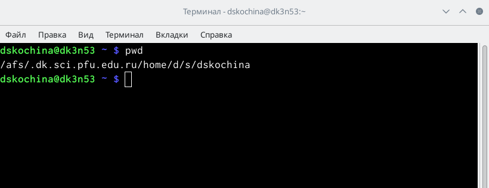{ #fig:001 width=70% }

2. Перешла в каталог/tmp (команда cd /tmp). (рис. [-@fig:002])

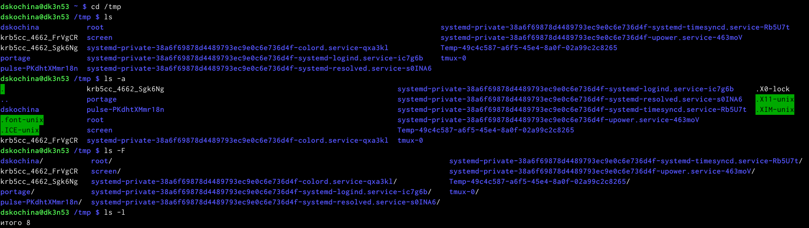{ #fig:002 width=70% }

3. Вывела на экран содержимое каталога /tmp. Для этого использовала команду ls с различными опциями. (рис. [-@fig:003])

1) "ls" - используется для просмотра содержимого каталога. Для этого вручную открываем каталог tmp;
2) "ls -a" - используется для того, чтобы отобразить имена скрытых файлов;
3) "ls -F" - команда для того, чтобы получить информацию о типах файлов (каталог, исполняемый файл, ссылка). При использовании этой опции вполе имени выводится символ, который определяет тип файла;
4) "ls -l" - команда для того, чтобы вывести на экран подробную информацию о файлах и каталогах;
5) "ls -alF" - данная команда отобразит список всех каталогов и файлов, в том числе и скрытых, с подробной информацией о них.

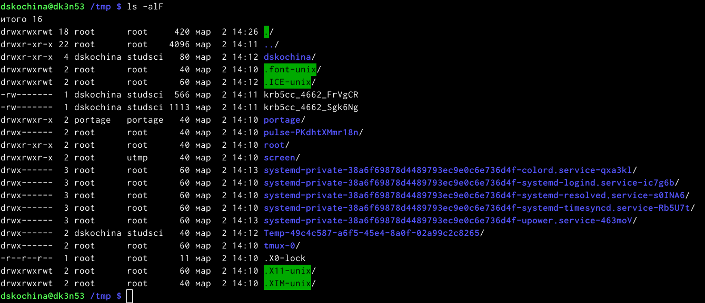{ #fig:003 width=70% }

4. Для того, чтобы определить, есть ли в каталоге /var/spool подкаталог с именем cron, необходимо перейти в указанный каталог, использу команду "cd /var/spool". Теперь необходимо просмотреть его содержимое с помощью команды ls. Таким образом, я убедилась, что данный подкаталог существует. (рис. [-@fig:004])

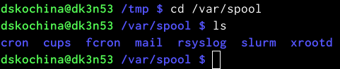{ #fig:004 width=70% }

5. Перешла в домашний каталог и проверила его содержимое. Владельцем файлов и подкаталогов является dskochina. (рис. [-@fig:005])

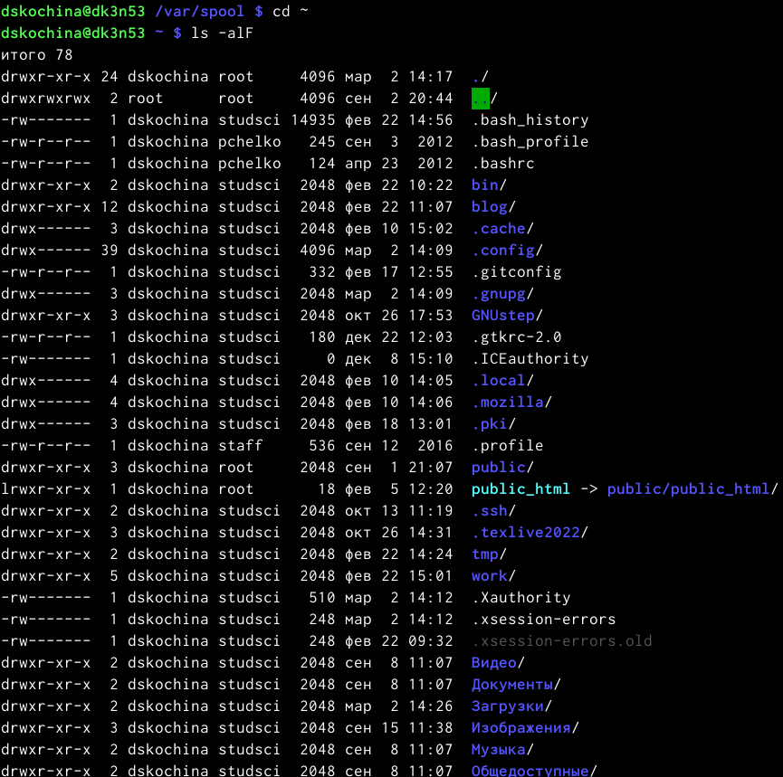{ #fig:005 width=70% }

6. В домашнем каталоге создала новый каталог с именем newdir. В каталоге ~/newdir создала новый каталог с именем morefun. С помощью команды "ls" проверила правильность выполненных действий. (рис. [-@fig:006])

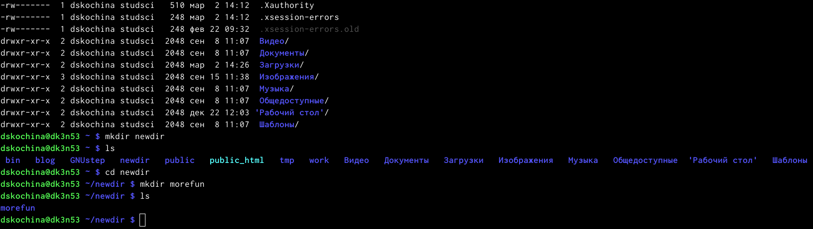{ #fig:006 width=70% }

7. В домашнем каталоге создала с помощью одной команды (mkdir) три новых каталога с именами "letters, memos, misk". Затем удалила эти каталоги одной командой "rm -r letters, memos, misk". Проверила правильность выполненных действий с помощью команды ls. (рис. [-@fig:007])

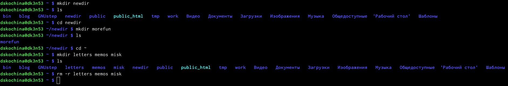{ #fig:007 width=70% }

8. Попробовала удалить ранее созданный каталог ~/newdir командой rm. Каталог не был удалён (получила отказ в выполнении команды, так как данный каталог содержит подкаталог и требует при удалении использовать опцию -r). (рис. [-@fig:008])

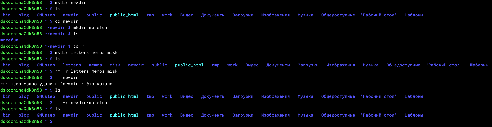{ #fig:008 width=70% }

9. Удалила каталог ~/newdir/morefun из домашнего каталога. Для этого используем команду "rm -r newdir/morefun". Командой ls проверила правильность выполненных действий.

10. Используя команду "man ls", определила, какую опцию команды ls необходимо использовать, чтобы просмотреть содержимое не только указанного каталога, но и подкаталогов, входящих в него. (рис. [-@fig:009], [-@fig:010])

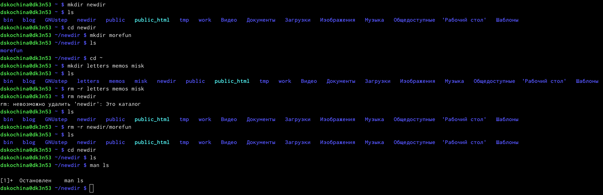{ #fig:009 width=70% }

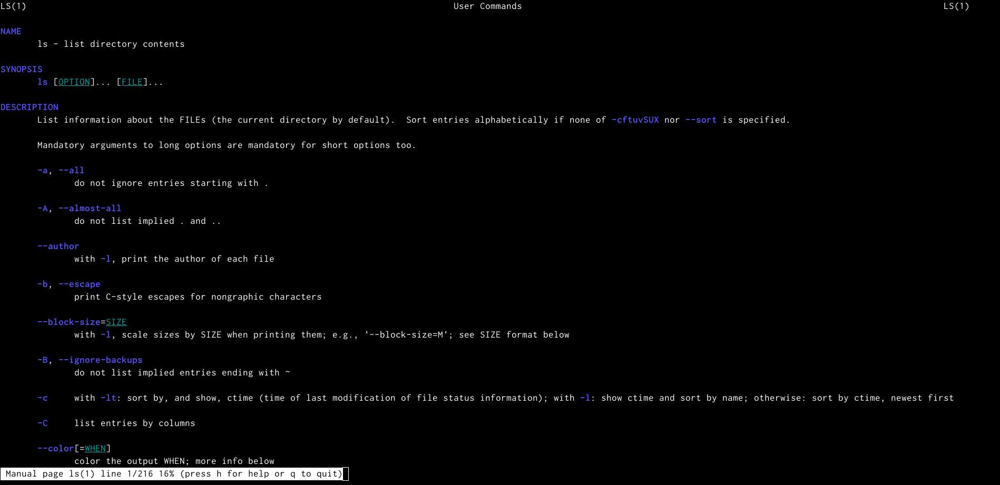{ #fig:010 width=70% }

11. Используя то же руководство по команде "ls", открытое в предыдущем пункте, определила набор опции команды ls. Данный набор опций позволяет отсортировать по времени последнего изменения выводимый список содержимого каталога с развернутым описанием файлов.

12. Используя команду man для следующих команд: cd, pwd, mkdir, rmdir, rm, просматриваю описание соответствующих команд. Команда cd не имеет дополнительных опций. (рис. [-@fig:011], [-@fig:012], [-@fig:013], [-@fig:014], [-@fig:015]) 

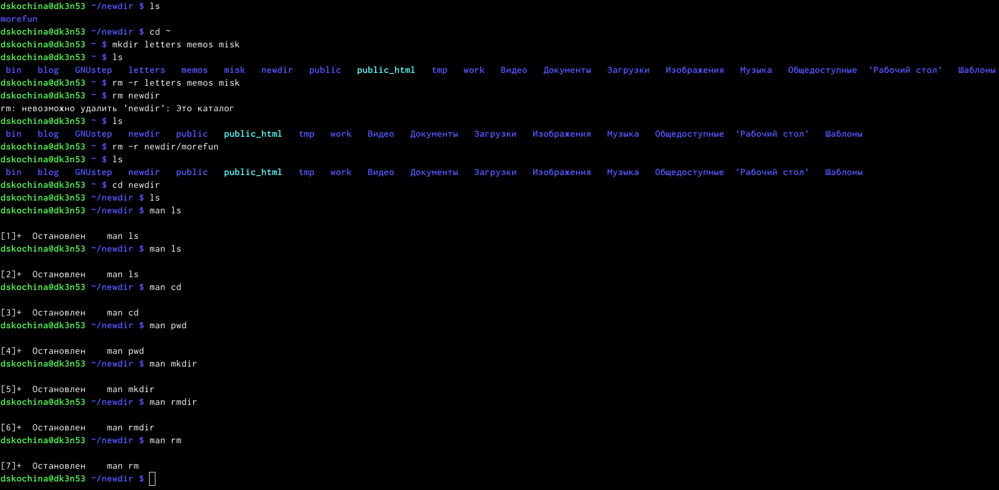{ #fig:011 width=70% }

-Команда pwd

-L, --logical - не разыменовывать символические ссылки. Если путь содержит ссылки, то выводить их без преобразования в исходный путь;
-P, --physical - преобразовывать символические ссылки в исходные имена. Если путь содержит данные ссылки, то они будут преобразованы в названия исходных директорий (на которые они указаны).
--help - показать справку по команде pwd;
--version - показать версию утилиты pwd.

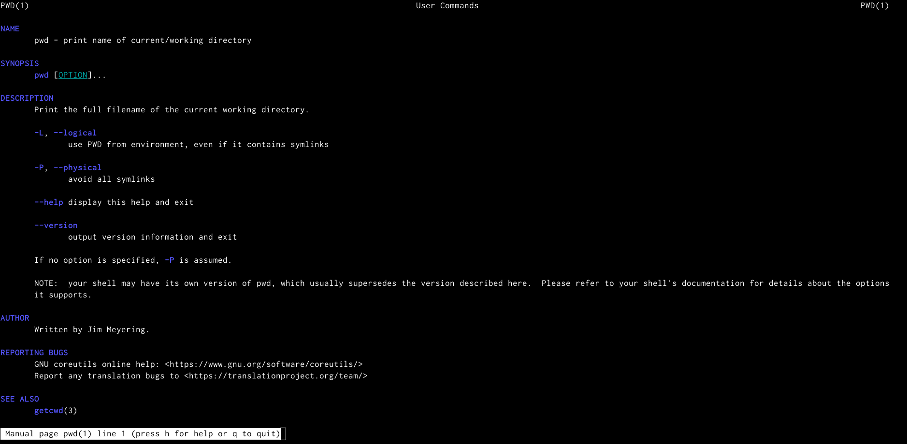{ #fig:012 width=70% }

-Команда mkdir

-m,--mode=MODE - устанавливает права доступа для создаваемой директории. Синтаксис MODE такой же как у команды chmod;
-p,--parents - создаёт все директории, которые указаны внутри пути (если директория существует, сообщение об этом не выводится);
-v, --verbose - выводит сообщение о каждой создаваемой директории;
-z - устанавливает контекст SELinux для создаваемой директории по умолчанию;
--context[=CTX] - устанавливает контекст SELinux для создаваемой директории в значение CTX;
--help - показывает справку по команде mkdir;
--version - показывает версию утилиты mkdir.

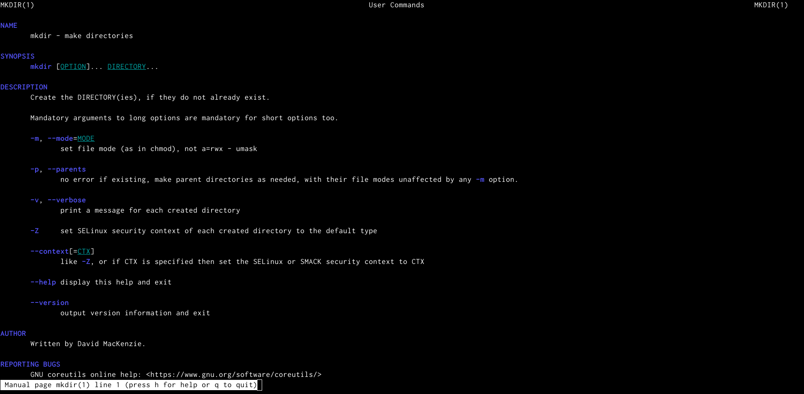{ #fig:013 width=70% }

-Команда rmdir

--ignore-fail-on-non-empty - игнорировать директории, которые содержат в себе файлы;
-p, --parents - в этой опции каждый аргумент каталога обрабатывается как путь, из которого будут удалены все компоненты, если они уже пусты, начиная с последнего компонента;
-v, --verbose - отображение подробной информациидля каждого обрабатываемого каталога;
--help - показать справку по команде rmdir;
--version - показать версию утилиты rmdir.

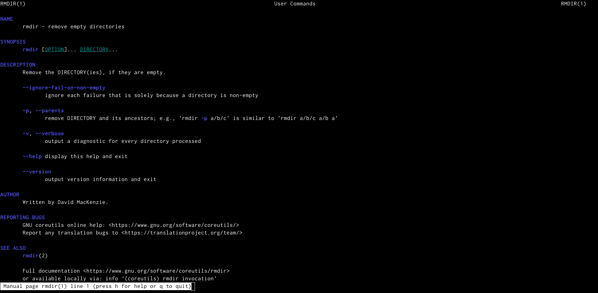{ #fig:014 width=70% }

-Команда rm

-f, --force - игнорировать несуществующие файлы и аргументы. Никогда не выдавать запросы на подтверждение удаления;
-i - выводить запрос на подтверждение удаления каждого файла;
-I - выдать один запрос на подтверждение удаления всех файлов, если удаляется больше трех файлов или используется рекурсивное удаление. Опция применяется, как более «щадящая» версия опции –i;
--interactive[=WHEN] - вместо WHEN можно использовать:never — никогда не выдавать запросы на подтверждение удаления, once — выводить запрос один раз (аналог опции -I). always —выводить запрос всегда (аналог опции -i).Если значение КОГДА не задано, то используется always;
--one-file-system - во время рекурсивного удаления пропускать директории, которые находятся на других файловых системах;
--no-preserve-root - если в качестве директории для удаления задан корневой раздел /, то считать, что это обычная директория и начать выполнять удаление;
--preserve-root[=all] - если в качестве директории для удаления задан корневой раздел /, то запретить выполнять команду rm над корневым разделом. Данное поведение используется по умолчанию;
-r, -R, --recursive - удаление директорий и их содержимого. Рекурсивное удаление;
-d, --dir - удалять пустые директории;
-v, --verbose - выводить информацию об удаляемых файлах;
--help - показать справку по команде rm;
--version - показать версию утилиты rm.

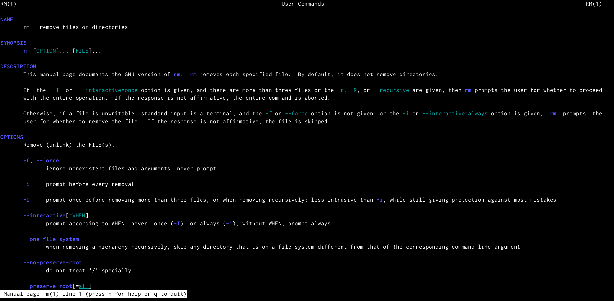{ #fig:015 width=70% }

13. Вывела историю команд с помощью команды «history».  Далее, используя команды, "!524" и "!534", выполнила команды 524 и 534. (рис. [-@fig:016], [-@fig:017], [-@fig:018]) 

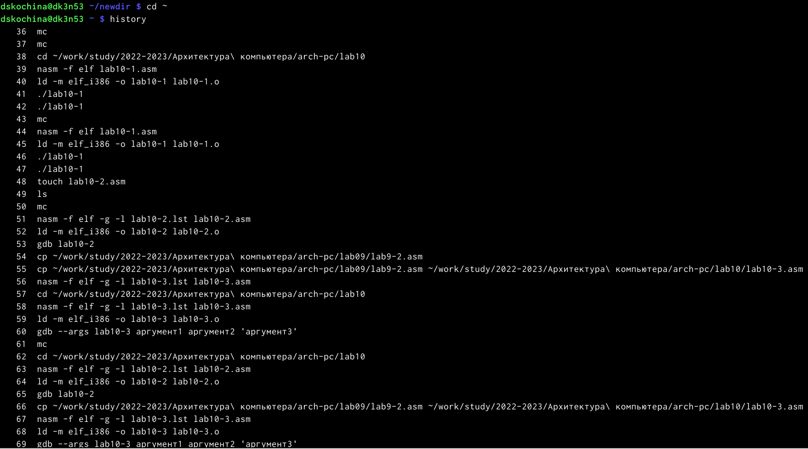{ #fig:016 width=70% }

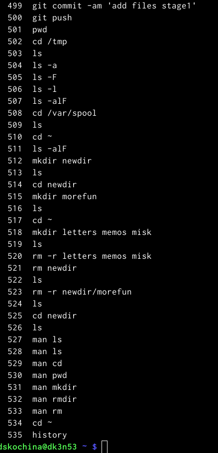{ #fig:017 width=70% }

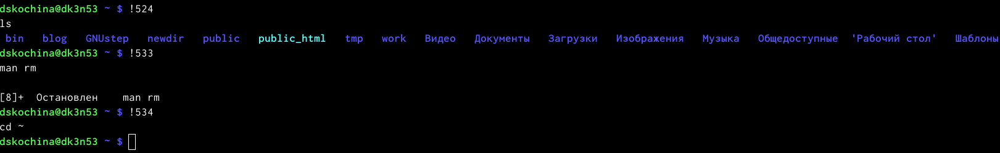{ #fig:018 width=70% }

**Ответы на контрольные вопросы**

1. Командная строка – специальная программа, позволяющая управлять операционной системой при помощи текстовых команд, вводимых в окне приложения. 

2. Для определения абсолютного пути к текущему каталогу используется команда pwd (print working directory). Например, команда «pwd» в моем домашнем каталоге выведет: /home/dskochina 

3. Команда «ls-F» (или «ls-aF», тогда появятся еще скрытые файлы) выведет имена файлов в текущем каталоге и их типы. Тип каталога обозначается /, тип исполняемого файла обозначается , тип ссылки обозначается @. Пример на рисунке 2. 

4. Имена скрытых файлов начинаются с точки. Эти файлы в операционной системе скрыты от просмотра и обычно используются для настройки рабочей среды. Для того, чтобы отобразить имена скрытых файлов, необходимо использовать команду «ls –a». Пример на рисунке 2.

5. Команда rm используется для удаления файлов и/или каталогов. Команда rm-i выдает запрос подтверждения наудаление файла. Команда rm-r необходима, чтобы удалить каталог, содержащий файлы. Без указания этой опции команда не будет выполняться. Если каталог пуст, то можно воспользоваться командой rmdir. Если удаляемый каталог содержит файлы, то команда не будет выполнена –нужно использовать «rm -r имя_каталога». Таким образом, каталог, не содержащий файлов, можно удалить и командой rm, и командой rmdir. Файл командой rmdir удалить нельзя. Примеры на рисунке 9.

6. Чтобы определить, какие команды выполнил пользователь в сеансе работы, необходимо воспользоваться командой «history». 

7. Чтобы исправить илизапустить на выполнение команду, которую пользователь уже использовал в сеансе работы, необходимо: в первом случае:воспользоваться конструкцией !<номер_команды>:s/<что_меняем>/<на_что_меняем>, во втором случае: !<номер_команды>. Примеры на рисунке 18. 

8. Чтобы записать в одной строке несколько команд, необходимо между ними поставить ; . Например, «cd /tmp; ls». 

9. Символ обратного слэша позволяет использовать управляющие символы (".", "/", "$", "", "[", "]", "^", "&") без их интерпретации командной оболочкой; процедура добавления данного символа перед управляющими символами называется экранированием символов. Например, команда «lsnewdir/morefun» отобразит содержимое каталога newdir/morefun. 

10. Команда «ls -l» отображает список каталогов и файлов с подробной информацией о них (тип файла, право доступа, число ссылок, владелец, размер, дата последней ревизии, имя файла или каталога). 

11. Полный, абсолютный путь от корня файловой системы –этот путь начинается от корня "/" и описывает весь путь к файлу или каталогу; Относительный путь – это путь к файлу относительно текущего каталога (каталога, где находится пользователь). Например, «cd/newdir/morefun» – абсолютный путь, «cdnewdir» – относительный путь. 

12. Чтобы получить необходимую информацию о команде, необходимо воспользоваться конструкцией man[имя_команды], либо использовать опцию help, которая предусмотрена для некоторых команд. 

13. Для автоматического дополнения вводимых команд служит клавиша Tab.

# Выводы

В ходе выполнения данной лабораторной работы я приобрела практические навыки взаимодействия пользователя с системой посредством командной строки.

