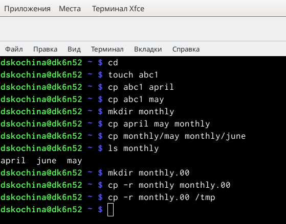
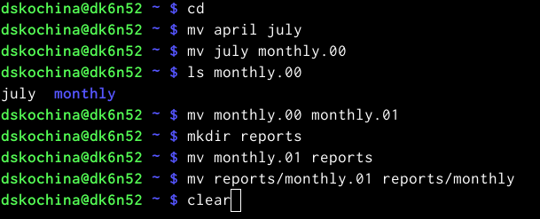
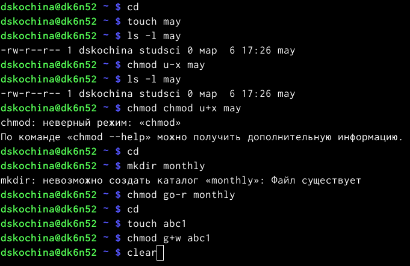
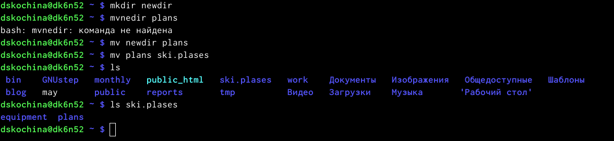
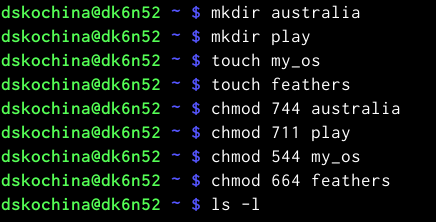
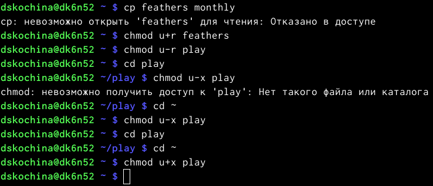
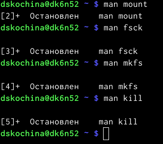

---
## Front matter
lang: ru-RU
title: Отчёт по лабораторной работе №5
subtitle: Анализ файловой системы Linux. Команды для работы с файлами и каталогами
author:
  - Кочина Д. С.
institute:
  - Российский университет дружбы народов, Москва, Россия
date: 09 марта 2023

## i18n babel
babel-lang: russian
babel-otherlangs: english

## Formatting pdf
toc: false
toc-title: Содержание
slide_level: 2
aspectratio: 169
section-titles: true
theme: metropolis
header-includes:
 - \metroset{progressbar=frametitle,sectionpage=progressbar,numbering=fraction}
 - '\makeatletter'
 - '\beamer@ignorenonframefalse'
 - '\makeatother'
---

# Вводная часть

## Цель работы

Целью данной лабораторной работы является ознакомление с файловой системой Linux, её структурой, именами и содержанием каталогов. А также приобретение практических навыков по применению команд для работы с файлами и каталогами, по управлению процессами (и работами), по проверке использования диска и обслуживанию файловой системы.

# Основная часть

## Копирование каталогов и файлов

- Копирование файла в текущем каталоге. Скопировала файл ~/abc1 в файл april и в файл may: создала файл abcl (команда "touch abc1"), копировала, используя команду "cp abc1 april" и "cp abc1 may".
- Копирование нескольких файлов в каталог. Скопировала файлы april и may в каталог monthly.

## Перемещение и переименование файлов и каталогов

- Переименование файлов в текущем каталоге. Изменила название файла april на july в домашнем каталоге.
- Перемещение файлов в другой каталог. Переместила файл july в каталог monthly.00 (с помощью команды mv).

## Изменение прав доступа

- Создала файл /may с правом выполнения для владельца.
- Лишила владельца файла/may права на выполнение.

## Копирование и создание каталогов

- Скопировала файл /usr/include/io.h в домашний каталог и назвала его equipment.
- В домашнем каталоге создала директорию ~/ski.plases.
- Переместила файл equipment в каталог ~/ski.plases.
- Переименовала файл ~/ski.plases/equipment в ~/ski.plases/equiplist. Создала каталог с именем equipment в каталоге ~/ski.plases.
- Переместила файлы ~/ski.plases/equiplist и equiplist2 в каталог ~/ski.plases/equipment. Создала и переместила каталог ~/newdir в каталог ~/ski.plases и называла его plans.

## Определение опции chmod

- Определила опции команды chmod, необходимые для того, чтобы присвоить соответствующим файлам выделенные права доступа, считая, что в начале таких прав нет. Предварительно создала необходимые файлы с помощью команд: «mkdiraustralia», «mkdirplay», «touchmy_os», «touchfeathers».

## Изменение прав владельца

- Скопировала файл ~/feathers в файл ~/file.old. Переместила файл ~/file.old в каталог ~/play.
- Скопировала каталог ~/play в каталог ~/fun. Переместила каталог ~/fun в каталог ~/play и назвала его games.
- Лишила владельца файла ~/feathers права на чтение. Затем дала владельцу файла ~/feathers право на чтение.
- Лишила владельца каталога ~/play права на выполнение. Перешла в каталог ~/play. Получила отказ в доступе, т.к. в предыдущем пункте лишила владельца права на выполнение данного каталога. Затем дала владельцу каталога ~/play право на выполнение (команда «chmod u+ xplay»).

## Работа с командами man

- Используя команды «man mount», «man fsck», «man mkfs», «man kill», получила информацию о соответствующих командах.

# Заключение

## Вывод

В ходе выполнения данной лабораторной работы я ознакомилась с файловой системой Linux, её структурой, именами и содержанием каталогов. А также приобрела практические навыки по применению команд для работы с файлами и каталогами, по управлению процессами (и работами), по проверке использования диска и обслуживанию файловой системы.

