---
## Front matter
title: "Отчёт по лабораторной работе №5"
subtitle: "Анализ файловой системы Linux. Команды для работы с файлами и каталогами"
author: "Дарья Сергеевна Кочина"

## Generic otions
lang: ru-RU
toc-title: "Содержание"

## Bibliography
bibliography: bib/cite.bib
csl: pandoc/csl/gost-r-7-0-5-2008-numeric.csl

## Pdf output format
toc: true # Table of contents
toc-depth: 2
lof: true # List of figures
fontsize: 12pt
linestretch: 1.5
papersize: a4
documentclass: scrreprt
## I18n polyglossia
polyglossia-lang:
  name: russian
  options:
	- spelling=modern
	- babelshorthands=true
polyglossia-otherlangs:
  name: english
## I18n babel
babel-lang: russian
babel-otherlangs: english
## Fonts
mainfont: PT Serif
romanfont: PT Serif
sansfont: PT Sans
monofont: PT Mono
mainfontoptions: Ligatures=TeX
romanfontoptions: Ligatures=TeX
sansfontoptions: Ligatures=TeX,Scale=MatchLowercase
monofontoptions: Scale=MatchLowercase,Scale=0.9
## Biblatex
biblatex: true
biblio-style: "gost-numeric"
biblatexoptions:
  - parentracker=true
  - backend=biber
  - hyperref=auto
  - language=auto
  - autolang=other*
  - citestyle=gost-numeric
## Pandoc-crossref LaTeX customization
figureTitle: "Рис."
tableTitle: "Таблица"
listingTitle: "Листинг"
lofTitle: "Список иллюстраций"
lolTitle: "Листинги"
## Misc options
indent: true
header-includes:
  - \usepackage{indentfirst}
  - \usepackage{float} # keep figures where there are in the text
  - \floatplacement{figure}{H} # keep figures where there are in the text
---

# Цель работы

Целью данной лабораторной работы является ознакомление с файловой системой Linux, её структурой, именами и содержанием каталогов. А также приобретение практических навыков по применению команд для работы с файлами и каталогами, по управлению процессами (и работами), по проверке использования диска и обслуживанию файловой системы.

# Задание

Ознакомиться с файловой системой Linux, её структурой, именами и содержанием каталогов.

# Теоретическое введение

**Файловая система (file system, ФС)** — важная составляющая любой операционной системы (ОС), отвечающая за организацию, хранение, чтение, запись файлов. От ФС зависит физическая и логическая структура файлов, политика создания и управления ими, максимальный размер файла и длина его имени. Linux поддерживает множество разных file system, включая FAT, FAT32, NTFS из Windows. Но использовать рекомендуем «родные» системы: Ext3, Ext4, ReiserFS, XFS, Btrfs и пр. Особенно если вы намерены работать с облачной инфраструктурой.

**Организация файловой системы Linux**

Linux позволяет установить отдельную ФС для каждого раздела. Выбранная система определяет, как быстро будет выполняться работа с файлами, запись и чтение информации. Как в оперативной памяти будет храниться информация (и будет ли она вообще храниться), каким образом можно вносить изменения в конфигурацию ядра ОС — это тоже зависит от ФС.

File system Linux — пространство раздела, состоящее из кратных размеру сектора блоков. Обмен данными производится через VFS или с помощью драйверов. VFS (virtual file system) — это слой абстракции, необходимый для взаимодействия между ядром и софтом. VFS позволяет не думать о специфике работы той или иной ФС. Драйверы ФС обеспечивают взаимодействие между оборудованием (железом) и приложениями. 

# Выполнение лабораторной работы

1. Выполнила примеры, описанные в первой части лабораторной работы. (рис. [-@fig:001])
Копирование файла в текущем каталоге. Скопировала файл ~/abc1 в файл april и в файл may: создала файл abcl (команда "touch abc1"), копировала, используя команду "cp abc1 april" и "cp abc1 may".
Копирование нескольких файлов в каталог. Скопировала файлы april и may в каталог monthly.
Копирование файлов в произвольном каталоге. Скопировала файл monthly/may в файл с именем june.
Копирование каталогов в текущем каталоге. Скопировала каталог monthly в каталог monthly.00.
Копирование каталогов в произвольном каталоге. Скопировала каталог monthly.00 в каталог /tmp.

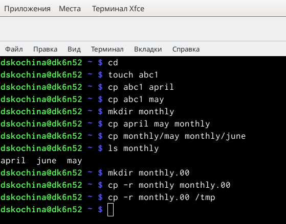{ #fig:001 width=70% }

2. Продолжила выполнять примеры. (рис. [-@fig:002])
Переименование файлов в текущем каталоге. Изменила название файла april на july в домашнем каталоге.
Перемещение файлов в другой каталог. Переместила файл july в каталог monthly.00 (с помощью команды mv).
Переименование каталогов в текущем каталоге. Переименовала каталог monthly.00 в monthly.01.
Перемещение каталога в другой каталог. Переместила каталог monthly.01 в каталог reports.
Переименование каталога, не являющегося текущим. Переименовала каталог reports/monthly.01 в reports/monthly.

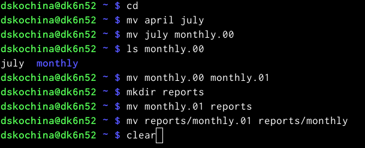{ #fig:002 width=70% }

3. Продолжила выполнять примеры. (рис. [-@fig:003])
Создала файл /may с правом выполнения для владельца.
Лишила владельца файла/mayправа на выполнение.
Создала каталог monthly с запретом на чтение для членов группы ивсех остальных пользователей.
Создала файл ~/abc1 с правом записи для членов группы.

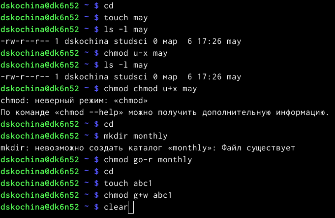{ #fig:003 width=70% }

4. Выполнила следующие действия. (рис. [-@fig:004], [-@fig:005])
Скопировала файл /usr/include/io.h в домашний каталог (используя команду «cp/usr/include/io.h ~»), и назвала его equipment (команда «mv io.h equipment»).
В домашнем каталоге создала директорию ~/ski.plases (с помощью команды «mkdir ski.plases»).
Переместила файл equipment в каталог ~/ski.plases(используем команду «mv equipment ski.plases»).
Переименовала файл ~/ski.plases/equipment в ~/ski.plases/equiplist (с помощью команды «mvski.plases/equipment ski.plases/equiplist»).
Создала в домашнем каталоге файл abc1 (команда «touchabc1») и скопировала его в каталог ~/ski.plases (команда «cp abcl ski.plases»), назвала его equiplist2 (с помощью команды «mv ski.plases/abc1 ski.plases/equiplist2»).
Создала каталог с именем equipment в каталоге ~/ski.plases (команда «mkdir ski.plases/equipment»).
Переместила файлы ~/ski.plases/equiplist и equiplist2 в каталог ~/ski.plases/equipment. Создала (команда «mkdir newdir») и переместила каталог ~/newdir в каталог ~/ski.plases (команда «mv newdir ski.plases») и называла его plans (команда «mv ski.plases/newdir ski.plases/plans»).

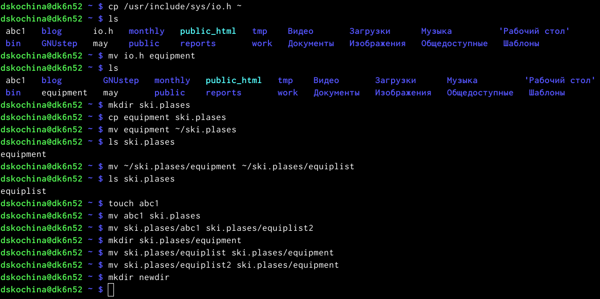{ #fig:004 width=70% }

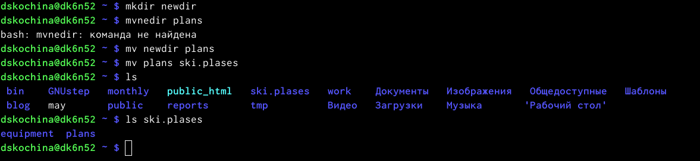{ #fig:005 width=70% }

5. Определила опции команды chmod, необходимые для того, чтобы присвоить соответствующим файлам выделенные права доступа, считая, что в начале таких прав нет. Предварительно создала необходимые файлы с помощью команд: «mkdiraustralia», «mkdirplay», «touchmy_os», «touchfeathers». (рис. [-@fig:006], [-@fig:007])

1) drwxr--r--... australia: команда «chmod 744 australia» (это каталог, владелец имеет право на чтение, запись и выполнение, группа владельца и остальные – только чтение).
2) drwx--x--x ... play: команда «chmod 711 play» (это каталог, владелец имеет право на чтение, запись и выполнение, группа владельца и остальные – только выполнение).
3) -r-xr--r--... my_os: команды «chmod 544 my_os» (это файл, владелец имеет право на чтение и выполнение, группа владельца и остальные – только чтение).
4) -rw-rw-r--... feathers: команды «chmod 664 feathers» (это файл, владелец и группа владельца имеют право на чтение и запись, остальные – только чтение). Командой «ls-l» проверяем правильность выполненных действий.

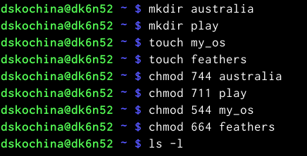{ #fig:006 width=70% }

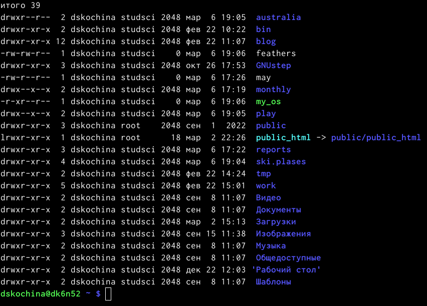{ #fig:007 width=70% }

6. Выполнила следующие действия. (рис. [-@fig:008], [-@fig:009], [-@fig:010])
Просмотрела содержимое файла /etc/passwd (команда «cat/etc/passwd»).
Скопировала файл ~/feathers в файл ~/file.old (используем команду «cp feathers file.old»).
Переместила файл ~/file.old в каталог ~/play (с помощью команды «mv file.ordplay»).
Скопировала каталог ~/play в каталог ~/fun (команда «cp - r play fun»).
Переместила каталог ~/fun в каталог ~/play (используем команда «mv fun play») и назвала его games (используем команда «mv play/funplay/games»).
Лишила владельца файла ~/feathers права на чтение (команда «chmod u-r feathers»).
Если мы попытаемся просмотреть файл ~/feathers командой cat, то получим отказ в доступе, т.к. в предыдущем пункте лишили владельца права на чтение данного файла.
Если мы попытаемся скопировать файл ~/feathers, например, в каталог monthly, то получим отказ в доступе, по причине, описанной в предыдущем пункте.
Дала владельцу файла ~/feathers право на чтение (команда «chmod u+r feathers»).
Лишила владельца каталога ~/play права на выполнение (с помощью команды «chmod u-x play»).
Перешла в каталог ~/play (команда «cd play»). Получила отказ в доступе, т.к. в предыдущем пункте лишила владельца права на выполнение данного каталога.
Дала владельцу каталога ~/play право на выполнение (команда «chmod u+ xplay»).

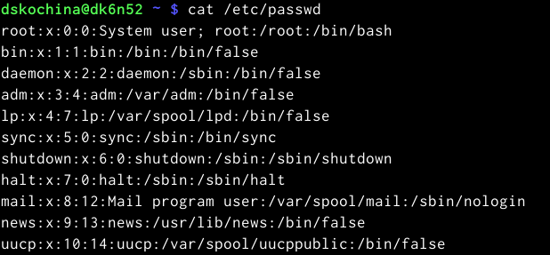{ #fig:008 width=70% }

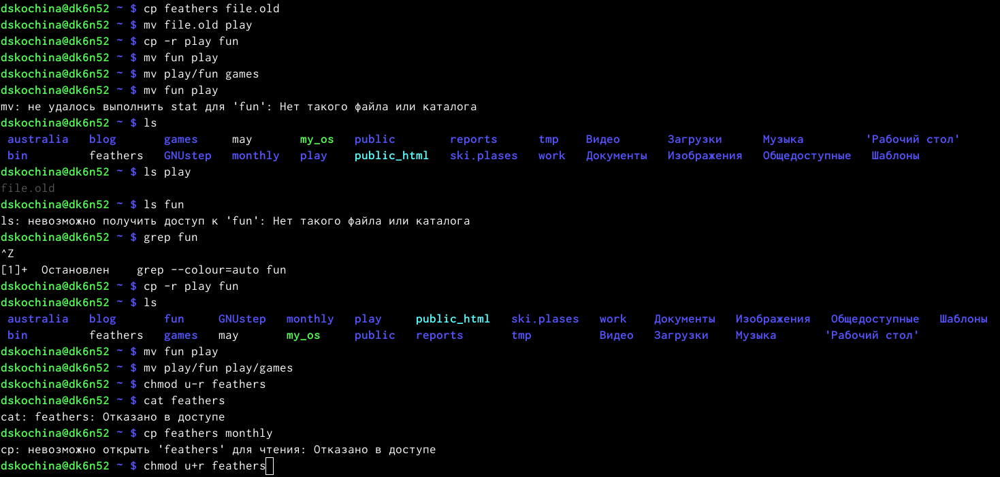{ #fig:009 width=70% }

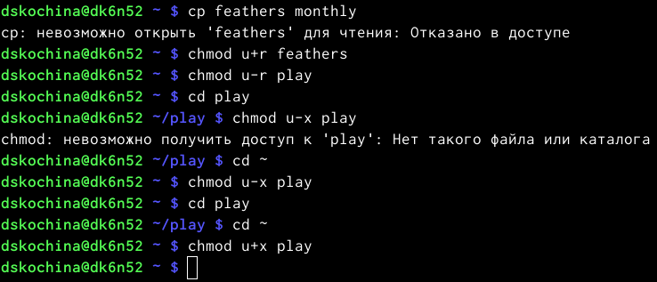{ #fig:010 width=70% }

7. Используя команды «man mount», «man fsck», «man mkfs», «man kill», получила информацию о соответствующих командах. (рис. [-@fig:011], [-@fig:012], [-@fig:013], [-@fig:014], [-@fig:015])

1) Команда mount: предназначена для монтирования файловой системы. Все файлы, доступные в Unix системах, составляют иерархическую файловую структуру, котораяимеет ветки (каталоги) и листья (файлы в каталогах). Корень этого дерева обозначается как слеш. Физически файлы могут располагаться на различных устройствах. Команда mount служит для подключения файловых систем разных устройств к этому большому дереву. Наиболее часто встречающаяся форма команды mount выглядит следующим образом: «mount -t vfstype device dir». Такая команда предлагает ядру смонтировать (подключить) файловую систему указанного типа vfstype, расположенную на устройстве device, к заданному каталогу dir, который часто называют точкой монтирования.

2) Команда fsck: это утилита командной строки, которая позволяет выполнять проверки согласованности и интерактивное исправление в одной или нескольких файловых системах Linux. Он использует программы, специфичные для типа файловой системы, которую он проверяет.У команды fsck следующий синтаксис: fsck [параметр] --[параметры ФС] [<файловая система> . . .]. Например, если нужно восстановить («починить») файловую систему на некотором устройстве /dev/sdb2, следует воспользоваться командой: «sudo fsck -y /dev/sdb2». Опция -y необходима, т.к. при её отсутствии придётся слишком часто давать подтверждение.

3) Команда mkfs: создаёт новую файловую систему Linux. Имеет следующий синтаксис: mkfs[-V] [-tfstype] [fs-options] filesys [blocks] mkfs используется для создания файловой системы Linux на некотором устройстве, обычно в разделе жёсткого диска. В качестве аргумента file sys для файловой системы может выступать или название устройства (например,/dev/hda1,/dev/sdb2) или точка монтирования (например,/,/usr,/home). Аргументом blocks указывается количество блоков, которые выделяются для использования этой файловой системой. По окончании работы mkfs возвращает 0 -в случае успеха, а 1 при неудачной операции. Например, команда «mkfs -t ext2 /dev/hdb1» создаёт файловую систему типа ext 2 в разделе /dev/hdb1(второй жёсткий диск).

4) Команда kill: посылает сигнал процессу или выводит список допустимых сигналов. Имеет следующий синтаксис: kill [опции] PID, где PID – это PID (числовой идентификатор) процесса или несколько PID процессов, если требуется послать сигнал сразу нескольким процессам. Например, команда «kill -KILL 3121» посылает сигнал KILL процессу с PID 3121, чтобы принудительно завершить процесс.

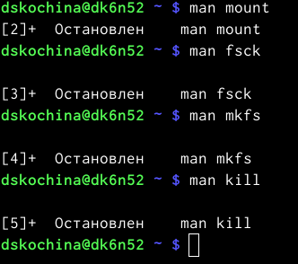{ #fig:011 width=70% }

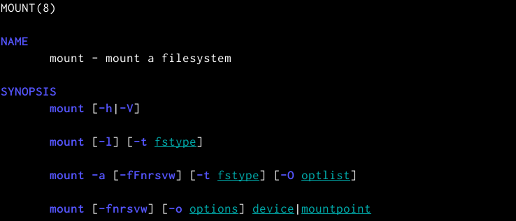{ #fig:012 width=70% }

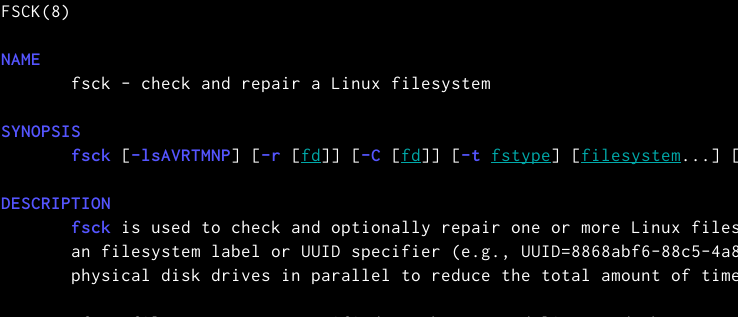{ #fig:013 width=70% }

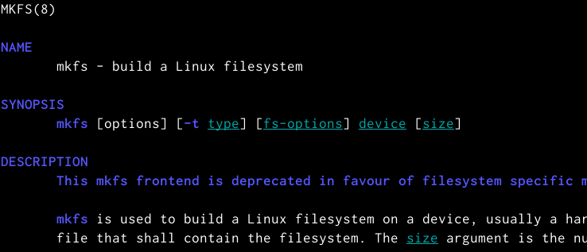{ #fig:014 width=70% }

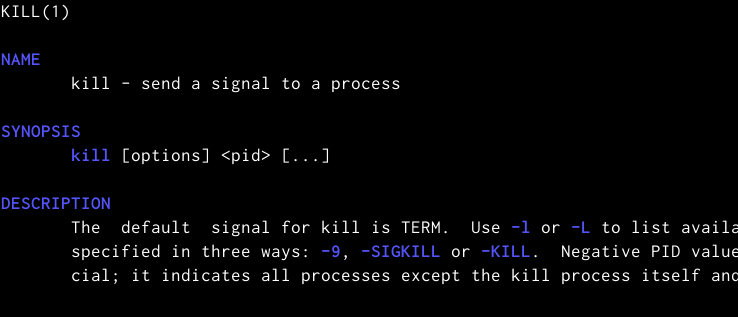{ #fig:015 width=70% }

**Ответы на контрольные вопросы**

1. Чтобы узнать, какие файловые системы существуют на жёстком диске моего компьютера, использую команду «df-Th». Из рисунка видно, что на моем компьютере есть следующие файловые системы: dev tmpfs,tmpfs,ext4,iso9660. dev tmpfs позволяет ядру создать экземпляр tmpfs с именем devtmpfs при инициализации ядра, прежде чем регистрируется какое-либо устройство с драйверами. Каждое устройство с майором / минором будет предоставлять узел устройства в devtmpfs.devtmpfs монтируется на /dev и содержит специальные файлы устройств для всех устройств.tmpfs−временное файловое хранилище во многих Unix-подобных ОС. Предназначена для монтирования файловой системы, но размещаетсяв ОЗУ вместо ПЗУ. Подобная конструкция является RAM диском. Данная файловая система также предназначенная для быстрого и ненадёжного хранения временных данных. Хорошо подходит для /tmp и массовой сборки пакетов/образов.Предполагает наличие достаточного объёма виртуальной памяти.Файловая система tmpfs предназначенадля того, чтобы использовать часть физической памяти сервера как обычный дисковый раздел, в котором можно сохранять данные (чтение и запись). Поскольку данные размещены в памяти, то чтение или запись происходят во много раз быстрее, чем с обычного HDD диска.ext4− имеет обратную совместимость с предыдущими версиями ФС. Эта версия была выпущена в 2008 году. Является первой ФС из «семейства»Ext, использующая механизм «extentfile system», который позволяет добиться меньшей фрагментации файлов и увеличить общую производительностьфайловой системы. Кроме того, вExt4реализован механизм отложенной записи (delayed allocation −delalloc), который так же уменьшает фрагментацию диска и снижает нагрузку на CPU. С другой стороны, хотя механизм отложенной записи и используется во многих ФС, но в силу сложности своей реализации он повышает вероятность утери данных.Характеристики:максимальный размер файла: 16 TB; максимальный размер раздела: 16TB;максимальный размер имени файла: 255 символов.Рекомендации по использованию:наилучший выбор дляSSD; наилучшая производительность по сравнению с предыдущимиEtx-системами;она так же отлично подходит в качестве файловой системы для серверов баз данных, хотя сама система и моложеExt3.ISO 9660−стандарт, выпущенный Международной организацией по стандартизации, описывающий файловую систему для дисков CD-ROM. Также известен как CDFS (Compact Disc File System). Целью стандарта является обеспечить совместимость носителей под разными операционными системами, такими, как Unix, Mac OS, Windows.

2. Файловая система Linux/UNIX физически представляет собой пространство раздела диска разбитое на блоки фиксированного размера, кратные размеру сектора − 1024, 2048, 4096 или 8120 байт. Размер блока указывается при создании файловой системы.В файловой структуре Linux имеется один корневой раздел −/ (он же root, корень). Все разделы жесткого диска (если их несколько) представляют собой структуру подкаталогов, "примонтированных" к определенным каталогам.

    "/" − корень. Это главный каталог в системе Linux. По сути, это и есть файловая система Linux.Адреса всех файлов начинаются с корня, а дополнительные разделы, флешки или оптические диски подключаются в папки корневого каталога. Только пользователь root имеет право читать и изменять файлы в этом каталоге.
    "/BIN" – бинарные файлы пользователя. Этот каталог содержит исполняемые файлы. Здесь расположены программы, которые можно использовать в однопользовательском режиме или режиме восстановления.
    "/SBIN" – системные испольняемые файлы. Так же как и "/bin", содержит двоичные исполняемые файлы, которые доступны на ранних этапах загрузки, когда не примонтирован каталог /usr. Но здесь находятся программы, которые можно выполнять только с правами суперпользователя.
    "/ETC" – конфигурационные файлыВ этой папке содержатся конфигурационные файлы всех программ, установленных в системе.Кроме конфигурационных файлов, в системе инициализации Init Scripts, здесь находятся скрипты запуска и завершения системных демонов, монтирования файловых систем и автозагрузки программ.
    "/DEV" – файлы устройствВ Linux все, в том числе внешние устройства являются файлами. Таким образом, все подключенные флешки, клавиатуры, микрофоны, камеры −это просто файлы в каталоге /dev/. Выполняется сканирование всех подключенных устройств и создание для них специальных файлов.
    "/PROC" –информация о процессахПо сути, это псевдофайловая система, содержащая подробную информацию о каждом процессе, его Pid, имя исполняемого файла, параметры запуска, доступ к оперативной памяти и так далее. Также здесь можно найти информацию об использовании системных ресурсов.
    "/VAR" – переменные файлы. Название каталога "/var" говорит само за себя, он должен содержать файлы, которые часто изменяются. Размер этих файлов постоянно увеличивается. Здесь содержатся файлы системных журналов, различные кеши, базы данных и так далее.
    "/TMP" – временные файлыВ этом каталоге содержатся временные файлы, созданные системой, любыми программами или пользователями. Все пользователи имеют право записи в эту директорию.
    "/USR" – программы пользователяЭто самый большой каталог с большим количеством функций. Здесь находятся исполняемые файлы, исходники программ, различные ресурсы приложений, картинки, музыку и документацию.
    "/HOME" – домашняя папка. В этой папке хранятся домашние каталоги всех пользователей. В них они могут хранить свои личные файлы, настройки программ и т.д.
    "/BOOT" – файлы загрузчика. Содержит все файлы,связанные с загрузчиком системы. Это ядро vmlinuz, образ initrd, а также файлы загрузчика, находящие в каталоге /boot/grub.
    "/LIB" – системные библиотеки. Содержит файлы системных библиотек, которые используются исполняемыми файлами в каталогах /bin и /sbin.
    "/OPT" – дополнительные программыВ эту папку устанавливаются проприетарные программы, игры или драйвера. Это программы созданные в виде отдельных исполняемых файлов самими производителями.
    "/MNT" – монтирование. В этот каталог системные администраторы могут монтировать внешние или дополнительные файловые системы.
    "/MEDIA" –съемные носители. В этот каталог система монтирует все подключаемые внешние накопители –USB флешки, оптические диски и другие носители информации.
    "/SRV" – сервер. В этом каталоге содержатся файлы серверов и сервисов.
    "/RUN" -процессыКаталог,содержащий PID файлы процессов, похожий на "/var/run", но в отличие от него, он размещен в TMPFS, а поэтому после перезагрузки все файлы теряются.

3. Чтобы содержимое некоторой файловойсистемы было доступно операционной системе необходимо воспользоваться командой mount.

4. Целостность файловой системы может быть нарушена из-за перебоевв питании, неполадок в оборудовании или из-за некорректного/внезапного выключения компьютера. Чтобы устранить повреждения файловой системы необходимо использовать команду fsck.

5. Файловую систему можно создать, используя команду mkfs. Ее краткое описание дано в пункте 5) в ходе выполнения заданий лабораторной работы.

6. Для просмотра текстовых файлов существуют следующие команды:

    сat. Задача команды cat очень проста −она читает данные из файла или стандартного ввода и выводит их на экран. Синтаксис утилиты:cat [опции] файл1 файл2 ...Основные опции:-b–нумеровать только непустые строки-E–показыватьсимвол $ в конце каждой строки-n–нумеровать все строки-s–удалять пустые повторяющиеся строки -T–отображать табуляции в виде ^I-h–отобразить справку-v–версия утилиты
    nl. Команда nl действует аналогично командеcat, новыводит еще иномера строк встолбце слева.
    less. Cущественно более развитая командадля пролистывания текста. При чтении данных со стандартного ввода она создает буфер, который позволяет листать текст как вперед, так и назад, а также искать как по направлению к концу, так и по направлению к началу текста.Синтаксис аналогичный синтаксисукоманды cat.Некоторые опции:-g –при поиске подсвечивать только текущее найденное слово (по умолчанию подсвечиваются все вхождения)-N –показывать номера строк
    head. Команда head выводит начальные строки (по умолчанию − 10) из одного или нескольких документов. Также она может показывать данные, которые передает на вывод другая утилита.Синтаксис аналогичный синтаксису команды cat.Основные опции:-c (--bytes) −позволяет задавать количество текста не в строках, а в байтах-n (--lines) −показывает заданное количество строк вместо 10, которые выводятся по умолчанию-q (--quiet, --silent) −выводит только текст, недобавляя к нему название файла-v (--verbose) −перед текстом выводит название файла -z (--zero-terminated) −символы перехода на новую строку заменяет символами завершения строк
    tailЭта командапозволяет выводить заданное количество строк с конца файла, а также выводить новые строки в интерактивном режиме.Синтаксис аналогичный синтаксису команды cat.Основные опции:-c −выводить указанное количество байт с конца файла-f −обновлять информацию по мере появления новых строк в файле-n −выводить указанное количество строк из конца файла--pid −используется с опцией -f, позволяет завершить работу утилиты, когда завершится указанный процесс-q −не выводить имена файлов--retry− повторять попытки открыть файл, если он недоступен-v −выводить подробную информацию о файле.

7. Утилита cpпозволяет полностью копировать файлы и директории.Cинтаксис:cp [опции] файл-источник файл-приемникПосле выполнения команды файл-источник будет полностью перенесен в файл-приемник. Если в конце указан слэш, файл будет записан в заданную директорию с оригинальным именем.Основные опции:--attributes-only −не копировать содержимое файла, а только флаги доступа и владельца-f, --force −перезаписывать существующие файлы-i, --interactive −спрашивать, нужно ли перезаписывать существующие файлы-L −копировать не символические ссылки, а то, на что они указывают -n −не перезаписывать существующие файлы-P −не следовать символическим ссылкам-r −копировать папку Linux рекурсивно-s −не выполнять копирование файлов в Linux, асоздавать символические ссылки-u −скопировать файл, только если он был изменён-x −не выходить за пределы этой файловой системы-p −сохранять владельца, временные метки и флаги доступа при копировании-t −считать файл-приемник директорией и копировать файл-источник в эту директорию.

8. Команда mv используется для перемещения одного или нескольких файлов (или директорий) вдругую директорию, атакже для переименования файлов идиректорий. Синтаксис:mv [-опции] старый_файл новый_файлОсновные опции:--help −выводит на экран официальную документацию об утилите--version −отображает версию mv-b−создает копию файлов, которые были перемещены или перезаписаны-f −при активации не будет спрашивать разрешение у владельца файла, если речь идет о перемещении или переименовании файла -i −наоборот, будет спрашивать разрешение у владельца-n −отключает перезапись уже существующих объектов--strip-trailing-slashes —удаляет завершающий символ / у файла при его наличии-t [директория] —перемещает все файлы в указанную директорию-u −осуществляет перемещение только в том случае, если исходный файл новее объекта назначения -v −отображает сведения о каждом элементе во время обработки командыКоманда renameтакже предназначена, чтобы переименовать файл.Синтаксис:rename [опции] старое_имя новое_имя файлы. Основные опции:-v −вывести список обработанных файлов-n −тестовый режим, на самом деле никакие действия выполнены не будут -f −принудительно перезаписывать существующие файлы.

9. Права доступа− совокупность правил, регламентирующих порядок и условия доступа субъекта к объектам информационной системы (информации, её носителям, процессам и другим ресурсам) установленных правовыми документами или собственником, владельцем информации. Права доступа к файлу или каталогу можно изменить, воспользовавшись командой chmod. Сделать это может владелец файла (или каталога) или пользователь с правами администратора. Синтаксис команды:chmod режим имя_файлаРежим имеет следующие компоненты структуры и способзаписи:= установить право-лишить права+ датьправоr чтениеw записьx выполнениеu (user) владелец файлаg (group) группа, к которой принадлежит владелец файлаo (others) все остальные.

# Выводы

В ходе выполнения данной лабораторной работы я ознакомилась с файловой системой Linux, её структурой, именами и содержанием каталогов. А также приобрела практические навыки по применению команд для работы с файлами и каталогами, по управлению процессами (и работами), по проверке использования диска и обслуживанию файловой системы.

