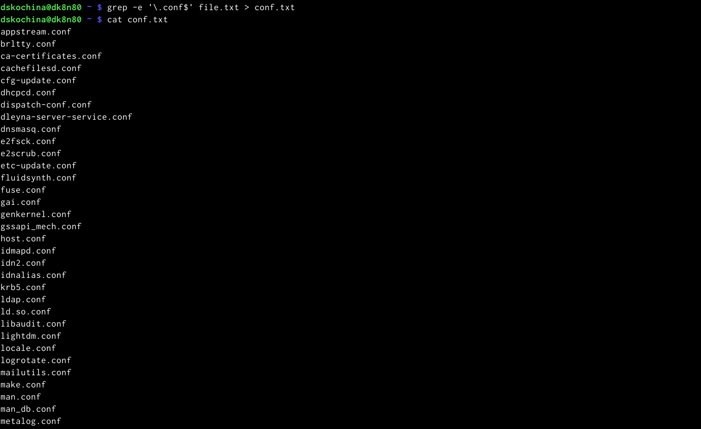
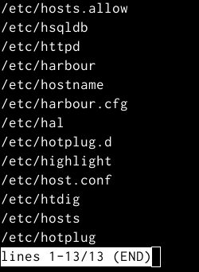
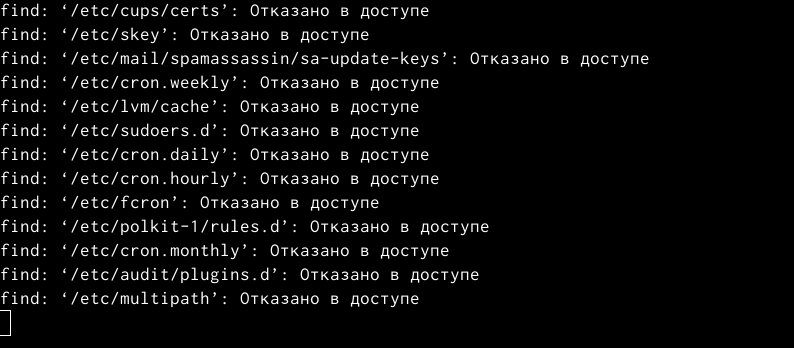
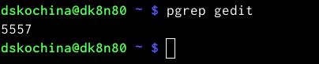
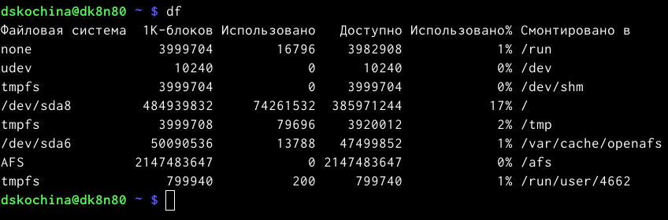
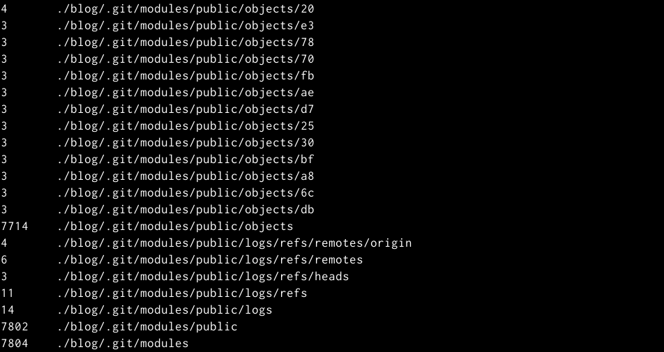
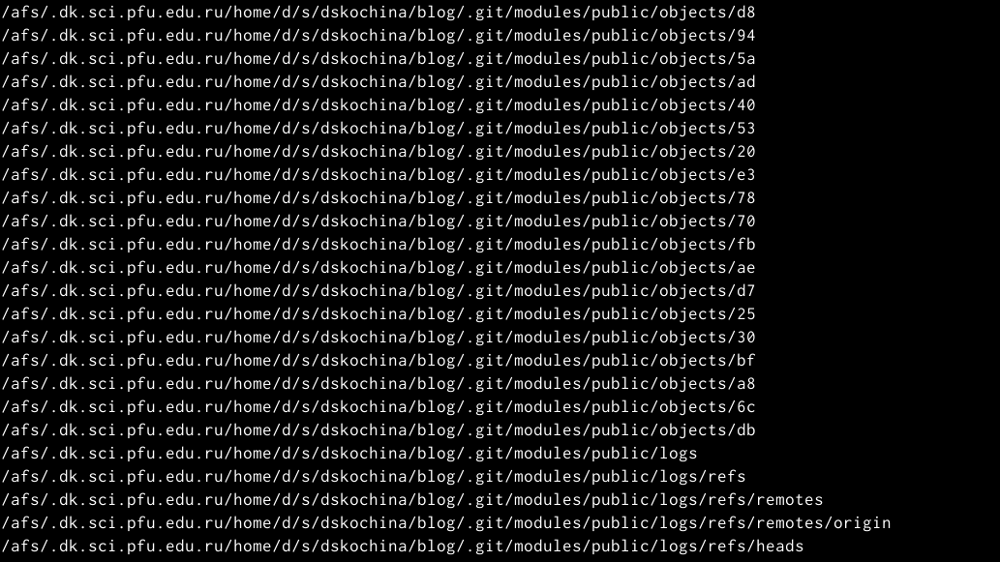

---
## Front matter
lang: ru-RU
title: Отчёт по лабораторной работе №6
subtitle: Поиск файлов. Перенаправление ввода-вывода. Просмотр запущенных процессов
author:
  - Кочина Д. С.
institute:
  - Российский университет дружбы народов, Москва, Россия
date: 13 марта 2023

## i18n babel
babel-lang: russian
babel-otherlangs: english

## Formatting pdf
toc: false
toc-title: Содержание
slide_level: 2
aspectratio: 169
section-titles: true
theme: metropolis
header-includes:
 - \metroset{progressbar=frametitle,sectionpage=progressbar,numbering=fraction}
 - '\makeatletter'
 - '\beamer@ignorenonframefalse'
 - '\makeatother'
---

# Вводная часть

## Цель работы

Целью данной лабораторной работы является ознакомление с инструментами поиска файлов и фильтрации текстовых данных. А также приобретение практических навыков по управлению процессами (и заданиями), по проверке использования диска и обслуживанию файловых систем.

# Основная часть

## Запись в файл

- Записала, в файл file.txt название файлов, содержащийхся в определённом каталоге. Для того, чтобы записать в файл file.txt названия файлов, содержащихся в каталоге /etc, использовала команду «ls–a/etc> file.txt».
- С помощью команды «ls-a~ >> file.txt» дописала в этот же файл названия файлов, содержащихся в домашнем каталоге. Командой «cat file.txt» просматриваю файл, чтобы убедиться в правильности действий.

## Вывод имён файлов из file.txt

- Вывела имена всех файлов из file.txt, имеющих расширение .conf, после чего записала их в новый текстовой файл conf.txt.

## Команда «find /etc –maxdepth1 –name “h*” | less»

- Вывела на экран имена файлов из каталога /etc, начинающиеся с символа h.

## Файл logfile

- Запустила в фоновом режиме процесс, который будет записывать в файл ~/logfile файлы, имена которых начинаются с log.
- Удалила файл ~/logfile.

## Редактор gedit

- Запустила из консоли в фоновом режиме редактор gedit.
- Определила идентификатор процесса gedit, используя команду ps, конвейер и фильтр grep.
- Прочтитала справку (man) команды kill, после чего использовала её для завершения процесса gedit.

## Команды df и du

- Выполнила команды df и du, предварительно получив более подробную информацию об этих командах, с помощью команды man.

## Команда find ~ -type d

- Воспользовавшись справкой команды find, вывела имена всех директорий, имеющихся в моём домашнем каталоге

# Заключение

## Вывод

В ходе выполнения данной лабораторной работы я ознакомилась с инструментами поиска файлов и фильтрации текстовых данных. А также приобрела практические навыки по управлению процессами (и заданиями), по проверке использования диска и обслуживанию файловых систем.

