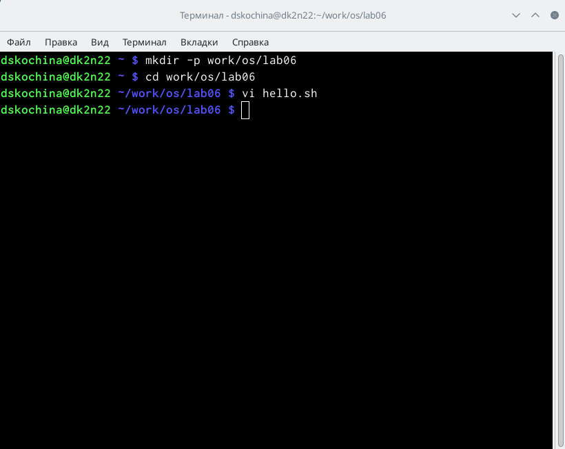
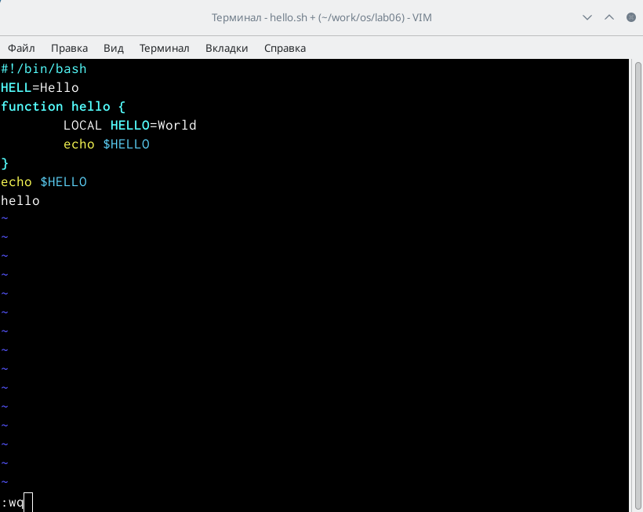
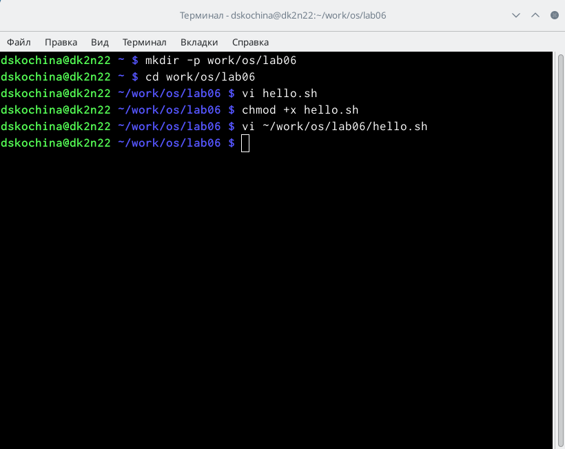
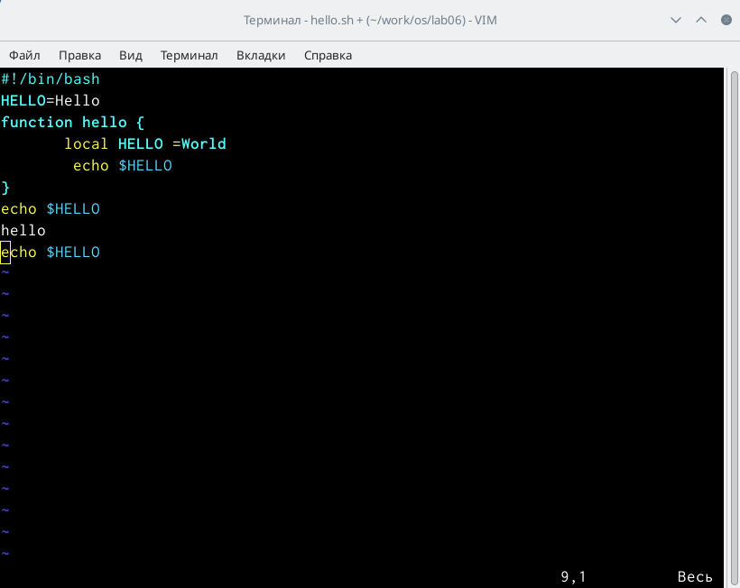
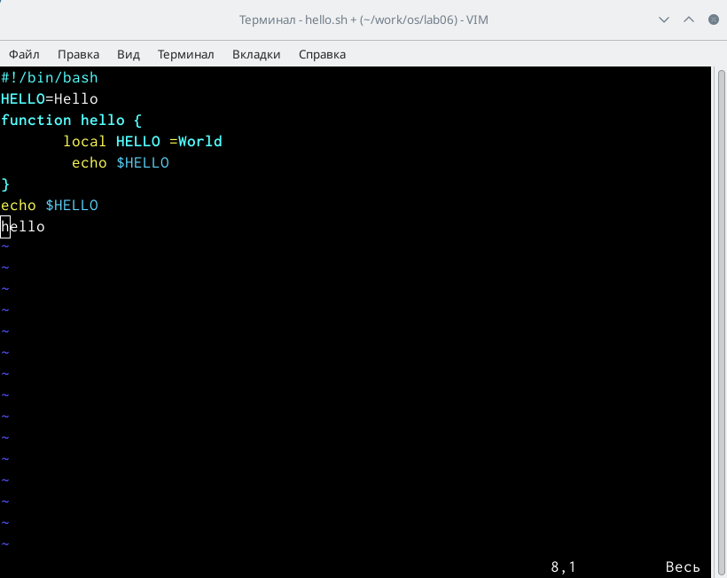

---
## Front matter
lang: ru-RU
title: Отчёт по лабораторной работе №8
subtitle: Текстовый редактор vi
author:
  - Кочина Д. С.
institute:
  - Российский университет дружбы народов, Москва, Россия
date: 27 марта 2023

## i18n babel
babel-lang: russian
babel-otherlangs: english

## Formatting pdf
toc: false
toc-title: Содержание
slide_level: 2
aspectratio: 169
section-titles: true
theme: metropolis
header-includes:
 - \metroset{progressbar=frametitle,sectionpage=progressbar,numbering=fraction}
 - '\makeatletter'
 - '\beamer@ignorenonframefalse'
 - '\makeatother'
---

# Вводная часть

## Цель работы

Целью данной лабораторной работы является знакомство с операционной системой Linux. А также получение практических навыков работы с редактором vi, установленным по умолчанию практически во всех дистрибутивах.

# Основная часть

## Создание каталога и вызов vi

- Создала каталог с именем ~/work/os/lab06 с помощью команды mkdir.
- Командой «cd work/os/lab06» перешла в созданный каталог.
- Вызвала vi и создала файл hello.sh с помощью команды «vi hello.sh».

## Работа с текстом в редакторе

- Нажала клавишу «i» и ввела текст, указанный в лабораторной работе.
- Нажала клавишу «esc», чтобы перейти в командный режим после завершения ввода текста.

## Работа с текстом в редакторе

- Нажала «:» для перехода в режим последней строки и внизу экрана увидела, что появилось приглашение в виде двоеточия.
- Нажала «w» (записать) и «q» (выйти), далее нажимаю клавишу «enter» для сохранения текста и завершения работы.

## Работа с терминалом

- Использовала команду «chmod +x hello.sh», чтобы сделать файл исполняемым.
- Вызвала vi для редактирования файла с помощью команды «vi ~/work/os/lab06/hello.sh».

## Работа с текстом в редакторе

- Перешла в режим вставки, нажав на клавишу «i», и заменила HELL на HELLO, дописав O.
- С помощью стрелок установила курсор на четвертую строку и стёрла слово LOCAL с помощью комбинации клавиш «d» (delete) и «w» (word).
- Перешла в режим вставки, нажав клавишу «i», и набрала следующий текст: local. Нажала «esc» для возврата в командный режим.
- Установила курсор на последней строке файла, используя стрелки. Вставила после неё строку, содержащую следующий текст: echo $HELLO.
- Далее нажала «esc», чтобы перейти в командный режим.

## Работа с текстом в редакторе

## Работа с текстом в редакторе

## Работа с текстом в редакторе

- Удалила последнюю строку, используя комбинацию клавиш «d» и «d».
- Ввела команду отмены изменений «u» для отмены последней команды.
- Ввела символ «:» для перехода в режим последней строки. Записала произведённые изменения, нажав «w» и «q» и вышла из vi.

## Работа с текстом в редакторе

# Заключение

## Вывод

В ходе выполнения данной лабораторной работы я познакомилась с операционной системой Linux. А также получила практические навыки работы с редактором vi, установленным по умолчанию практически во всех дистрибутивах.

