---
## Front matter
title: "Отчёт по лабораторной работе №8"
subtitle: "Текстовый редактор vi"
author: "Дарья Сергеевна Кочина"

## Generic otions
lang: ru-RU
toc-title: "Содержание"

## Bibliography
bibliography: bib/cite.bib
csl: pandoc/csl/gost-r-7-0-5-2008-numeric.csl

## Pdf output format
toc: true # Table of contents
toc-depth: 2
lof: true # List of figures
fontsize: 12pt
linestretch: 1.5
papersize: a4
documentclass: scrreprt
## I18n polyglossia
polyglossia-lang:
  name: russian
  options:
	- spelling=modern
	- babelshorthands=true
polyglossia-otherlangs:
  name: english
## I18n babel
babel-lang: russian
babel-otherlangs: english
## Fonts
mainfont: PT Serif
romanfont: PT Serif
sansfont: PT Sans
monofont: PT Mono
mainfontoptions: Ligatures=TeX
romanfontoptions: Ligatures=TeX
sansfontoptions: Ligatures=TeX,Scale=MatchLowercase
monofontoptions: Scale=MatchLowercase,Scale=0.9
## Biblatex
biblatex: true
biblio-style: "gost-numeric"
biblatexoptions:
  - parentracker=true
  - backend=biber
  - hyperref=auto
  - language=auto
  - autolang=other*
  - citestyle=gost-numeric
## Pandoc-crossref LaTeX customization
figureTitle: "Рис."
tableTitle: "Таблица"
listingTitle: "Листинг"
lofTitle: "Список иллюстраций"
lolTitle: "Листинги"
## Misc options
indent: true
header-includes:
  - \usepackage{indentfirst}
  - \usepackage{float} # keep figures where there are in the text
  - \floatplacement{figure}{H} # keep figures where there are in the text
---

# Цель работы

Целью данной лабораторной работы является знакомство с операционной системой Linux. А также получение практических навыков работы с редактором vi, установленным по умолчанию практически во всех дистрибутивах.

# Задание

Познакомиться с операционной системой Linux. Получить практические навыки работы с редактором vi, установленным по умолчанию практически во всех дистрибутивах.

# Теоретическое введение

В большинстве дистрибутивов Linux в качестве текстового редактора по умолчанию устанавливается интерактивный экранный редактор vi (Visual display editor).

Редактор vi имеет три режима работы:

– *командный режим* — предназначен для ввода команд редактирования и навигации по редактируемому файлу;

– *режим вставки* — предназначен для ввода содержания редактируемого файла;

– *режим последней (или командной) строки* — используется для записи изменений в файл и выхода из редактора.

Для вызова редактора vi необходимо указать команду vi и имя редактируемого файла: vi <имя_файла>

При этом в случае отсутствия файла с указанным именем будет создан такой файл.

Переход в командный режим осуществляется нажатием клавиши Esc. Для выхода из редактора vi необходимо перейти в режим последней строки: находясь в командном режиме, нажать Shift-; (по сути символ : — двоеточие), затем:

– набрать символы wq, если перед выходом из редактора требуется записать изменения в файл;

– набрать символ q (или q!), если требуется выйти из редактора без сохранения.

# Выполнение лабораторной работы

1. Создала каталог с именем ~/work/os/lab06 с помощью команды mkdir (опция -p позволяет создать все каталоги, которые указаны внутри пути). (рис. [-@fig:001])

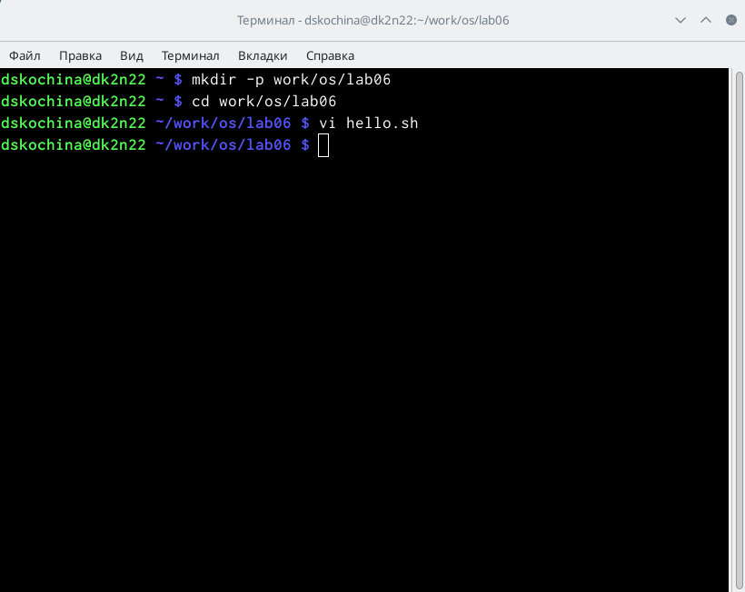{ #fig:001 width=70% }

2. Командой «cd work/os/lab06» перешла в созданный каталог.

3. Вызвала vi и создала файл hello.sh с помощью команды «vi hello.sh». (рис. [-@fig:002])

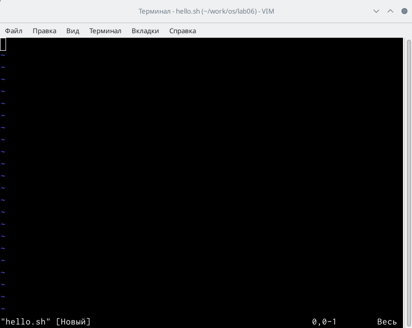{ #fig:002 width=70% }

4. Нажимаем клавишу «i» и вводим текст, указанный в лабораторной работе. (рис. [-@fig:003])

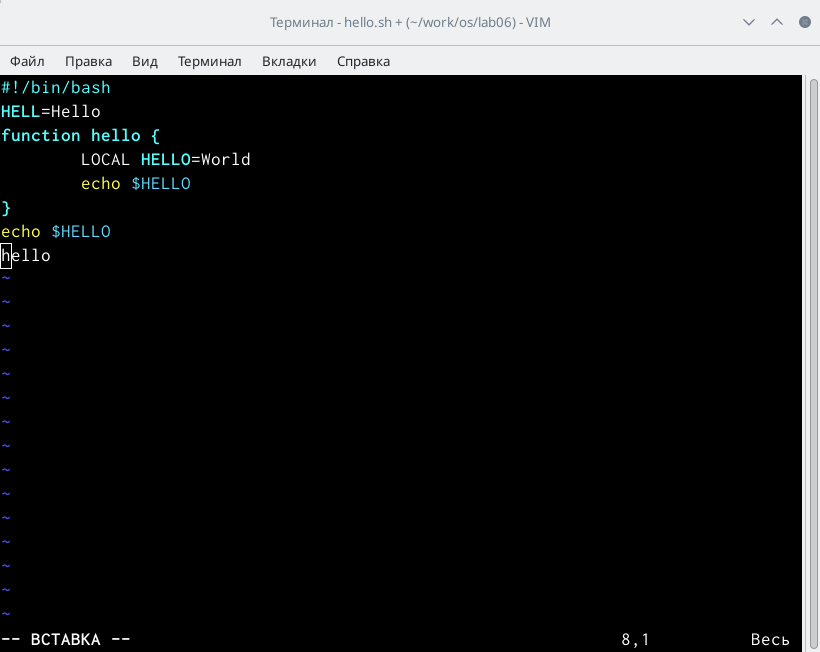{ #fig:003 width=70% }

5. Нажимаем клавишу «esc», чтобы перейти в командный режим после завершения ввода текста. (рис. [-@fig:004])

{ #fig:004 width=70% }

6. Нажимаем «:» для перехода в режим последней строки и внизу экрана видим, что появилось приглашение в виде двоеточия. (рис. [-@fig:005])

{ #fig:005 width=70% }

7. Нажала «w» (записать) и «q» (выйти), далее нажимаю клавишу «enter» для сохранения текста и завершения работы. (рис. [-@fig:006])

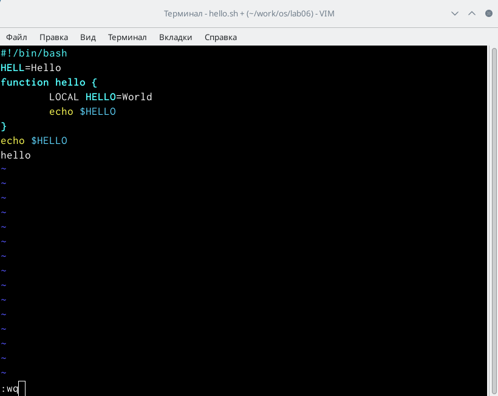{ #fig:006 width=70% }

8. Чтобы сделать файл исполняемым, использую команду «chmod +x hello.sh». (рис. [-@fig:007])

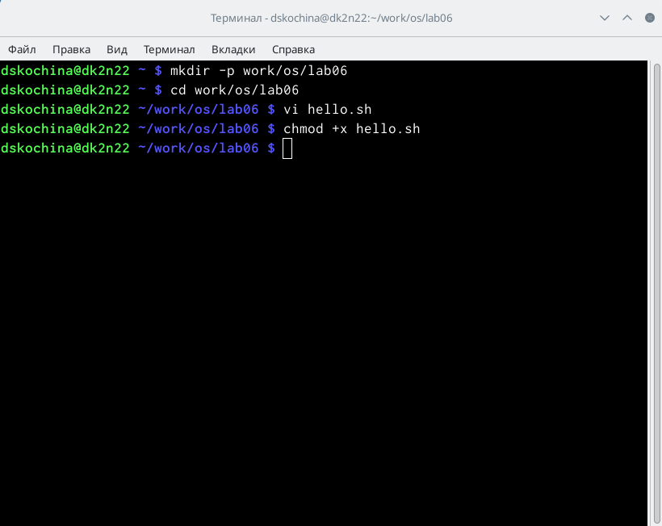{ #fig:007 width=70% }

9. Вызовем vi для редактирования файла с помощью команды «vi ~/work/os/lab06/hello.sh». (рис. [-@fig:008], [-@fig:009])

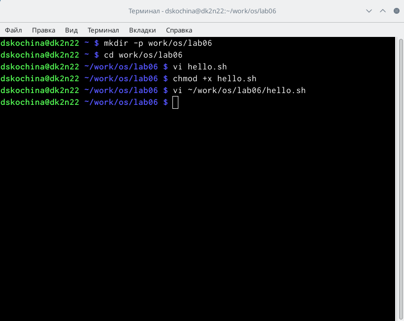{ #fig:008 width=70% }

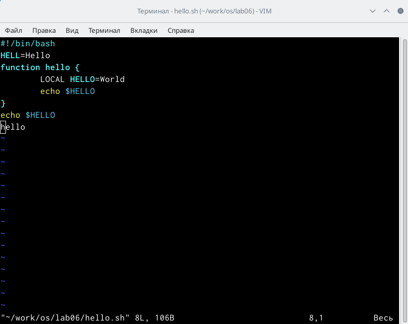{ #fig:009 width=70% }

10. Далее с помощью стрелок установила курсор в конец слова HELL второй строки. (рис. [-@fig:010])

{ #fig:010 width=70% }

11. Перешла в режим вставки, нажав на клавишу «i», и заменила HELL на HELLO, дописав O. Нажала «esc» для возврата в командный режим.

12. С помощью стрелок установила курсор на четвертую строку и стёрла слово LOCAL с помощью комбинации клавиш «d» (delete) и «w» (word).

13. Перешла в режим вставки, нажав клавишу «i», и набрала следующий текст: local. Нажала «esc» для возврата в командный режим. (рис. [-@fig:011])

{ #fig:011 width=70% }

14. Установила курсор на последней строке файла, используя стрелки. Вставила после неё строку, содержащую следующий текст: echo $HELLO. (рис. [-@fig:012], [-@fig:013])

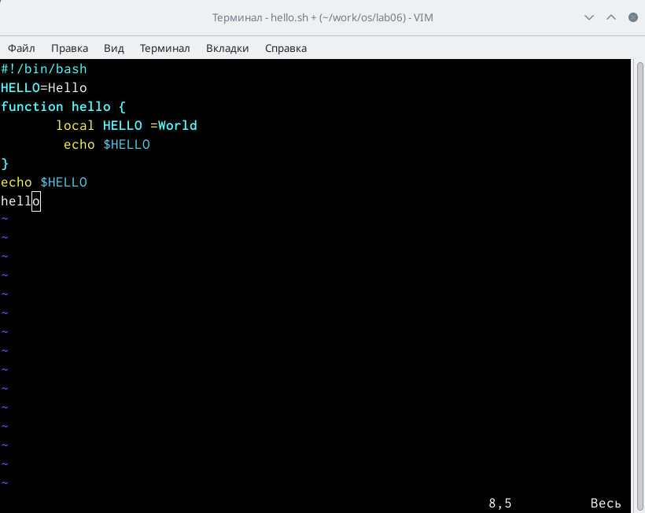{ #fig:012 width=70% }

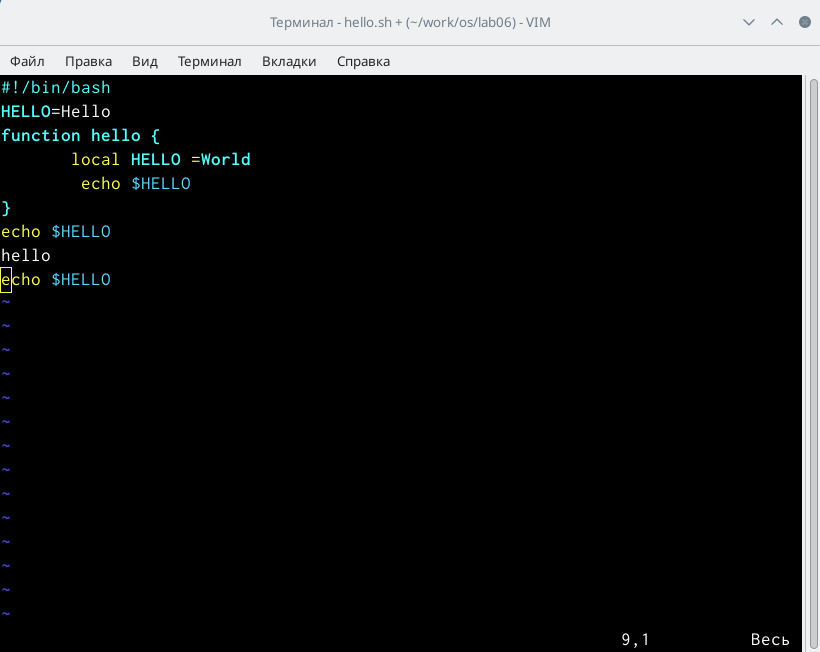{ #fig:013 width=70% }

15. Далее нажала «esc», чтобы перейти в командный режим.

16. Удалила последнюю строку, используя комбинацию клавиш «d» и «d». (рис. [-@fig:014])

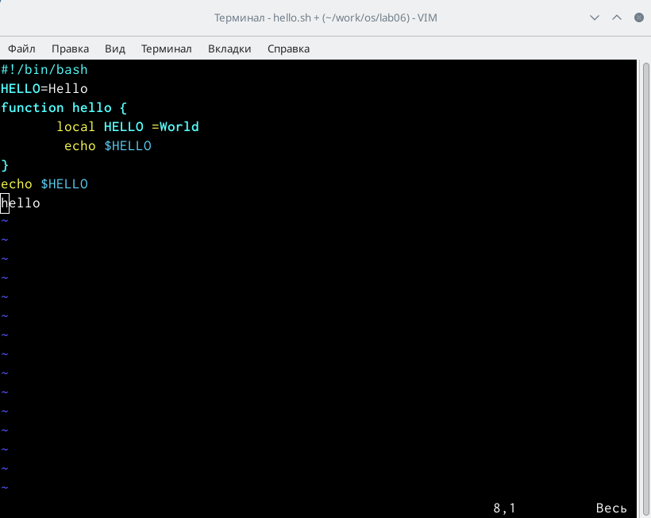{ #fig:014 width=70% }

17. Ввела команду отмены изменений «u» для отмены последней команды. (рис. [-@fig:015])

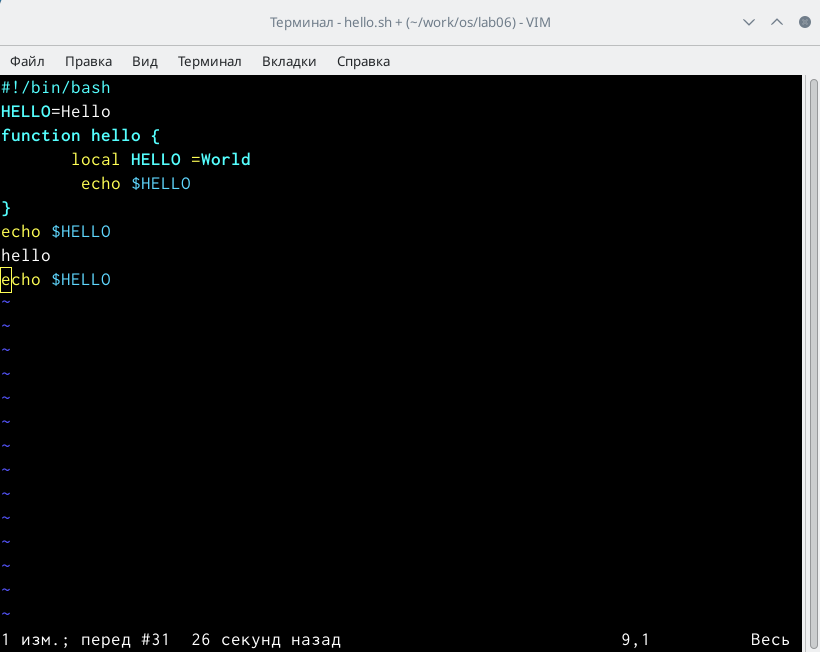{ #fig:015 width=70% }

18. Ввела символ «:» для перехода в режим последней строки. Записала произведённые изменения, нажав «w» и «q» и вышла из vi. (рис. [-@fig:016])

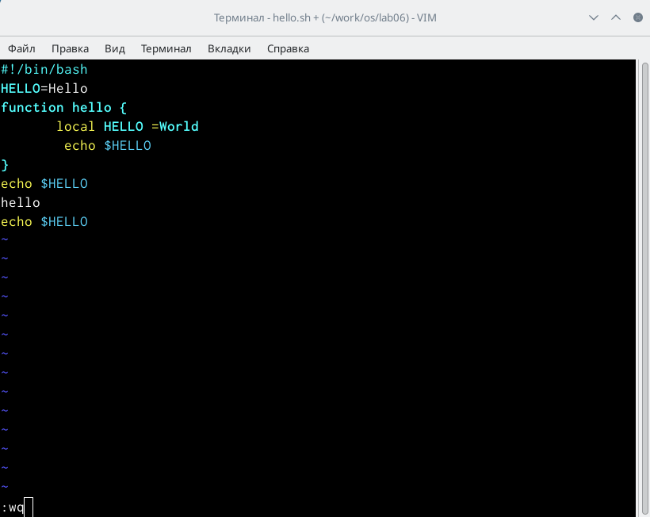{ #fig:016 width=70% }

**Ответы на контрольные вопросы:**

1. Редактор vi имеет три режима работы:

- командный режим − предназначен для ввода команд редактирования и навигации по редактируемому файлу;

- режим вставки − предназначен для ввода содержания редактируемого файла;

- режим последней (или командной) строки − используется для записи изменений в файл и выхода из редактора.

2. Чтобы выйти из редактора, не сохраняя произведённые изменения, нужно в режиме командной строки нажать клавиши «:» «q» «!»

3. Команды позиционирования:

- «0»(ноль) − переход в начало строки;

- «$» − переход в конец строки;

- «G» − переход в конец файла;

- n«G» − переход на строку с номером n.

4. При использовании прописных W и B под разделителями понимаются только пробел, табуляция и возврат каретки. При использовании строчных w и b под разделителями понимаются также любые знаки пунктуации.

5. Чтобы из любого места редактируемого файла перейти в начало (конец) файла, нужно в режиме командной строки нажать клавиши «1» «G» («G»).

6. Команды редактирования:

6.1. Вставка текста

- «а» − вставить текст после курсора;

- «А» − вставить текст в конец строки;

- «i» − вставить текст перед курсором;

- n «i» − вставить текст n раз;

- «I» − вставить текст в начало строки.

6.2. Вставка строки

- «о» − вставить строку под курсором;

- «О» − вставить строку над курсором.

6.3. Удаление текста

- «x» − удалить один символ в буфер;

- «d» «w» − удалить одно слово в буфер;

- «d» «$» − удалить в буфер текст от курсора до конца строки;

- «d» «0» − удалить в буфер текст от начала строки до позиции курсора;

- «d» «d» − удалить в буфер одну строку;

- n «d» «d» − удалить в буфер n строк.

- Отмена и повтор произведённых изменений

- «u» − отменить последнее изменение;

- «.» − повторить последнее изменение.

6.4. Копирование текста в буфер

- «Y» − скопировать строку в буфер;

- n «Y» − скопировать n строк в буфер;

- «y» «w» − скопировать слово в буфер.

6.5. Вставка текста из буфера

- «p» − вставить текст из буфера после курсора;

- «P» − вставить текст из буфера перед курсором.

6.6. Замена текста

- «c» «w» − заменить слово;

- n «c» «w» − заменить nслов;

- «c» «$» − заменить текст от курсора до конца строки;

- «r» − заменить слово;

- «R» − заменить текст.

6.7. Поиск текста

- «/» текст − произвести поиск вперёд по тексту указанной строки символов текст;

- «?» текст − произвести поиск назад по тексту указанной строки символов текст.

6.8. Копирование и перемещение текста

- «:» n,m «d» – удалить строки с n по m;

- «:» i,j «m» k – переместить строки с i по j, начиная со строки k;

- «:» i,j «t» k – копировать строки с i по j в строку k;

- «:» i,j «w» имя-файла – записать строки с i по j в файл с именем имя-файла.

7. Чтобы заполнить строку символами необходимодляначалаперейтинаэтустрокунажавклавиши«»гденомерстрокидалеенажать«»дляпереходавначалострокиТеперь необходимо нажать «»«», чтобы заменить текст от курсора до конца строки, и ввести символы $.

8. Чтобы отменить по одному предыдущему действию последовательно, необходимо нажать «u». Чтобы отменить все изменения, произведённые со времени последней записи, нужно нажать «:» «e» «!».

9. Команды редактирования в режиме командной строки

9.1. Копирование и перемещение текста

- «:»n,m «d» − удалить строки с n по m;

- «:»i,j «m» k − переместить строки с i по j, начиная со строки k;

- «:»i,j «t» k − копировать строки с i по j в строку k;

- «:»i,j «w» имя-файла − записать строки с i по j в файл с именем имя-файла.

9.2. Запись в файл и выход из редактора

- «:» «w» − записать изменённый текст в файл, не выходя из vi;

- «:» «w» имя-файла − записать изменённый текст в новый файл с именем имя-файла;

- «:» «w» «!» имя-файла − записать изменённый текст в файл с именем имя-файла;

- «:» «w» «q» − записать изменения в файл и выйти из vi;

- «:» «q» − выйти из редактора vi;

- «:» «q» «!» − выйти из редактора без записи;

- «:» «e» «!» − вернуться в командный режим, отменив все изменения, произведённые со времени последней записи.

9.3. Опции

Опции редактора vi позволяют настроить рабочую среду. Для задания опций используется команда set (в режиме последней строки):

- «:»set all − вывести полный список опций;

- «:»set nu − вывести номера строк;

- «:»set list − вывести невидимые символы;

- «:»set ic − не учитывать при поиске, является ли символ прописным или строчным.

Если вы хотите отказаться от использования опции, то в команде set перед именем опции надо поставить no.

10. Чтобы определить, не перемещая курсора, позицию, в которой заканчивается строка, нужно в командном режиме находясь на нужной строке нажать «$»и посмотреть на число после запятой в правом нижнем углу экрана

11. Опции редактора vi позволяют настроить рабочую среду. Для задания опций используется команда set (в режиме командной строки). Если вы хотите отказаться от использования опции, то в команде set перед именем опции надо поставить no. Чтобы просмотреть опции редактора vi, необходимо нажать «:» set all. Нажав «:» help “название_опции”, можно узнать назначение конкретной опции.

12. В режиме командной строки внизу редактора присутствует «:», в режиме ввода – «--ВСТАВКА --», в командном режиме внизу ничего нет.

13. Граф взаимосвязи режимов работы редактора vi. 

# Выводы

В ходе выполнения данной лабораторной работы я познакомилась с операционной системой Linux. А также получила практические навыки работы с редактором vi, установленным по умолчанию практически во всех дистрибутивах. 

