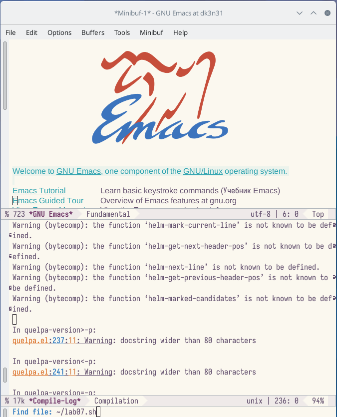
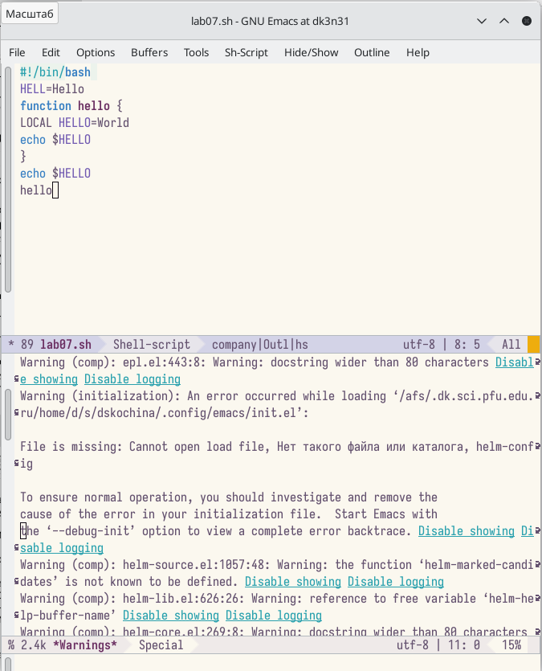
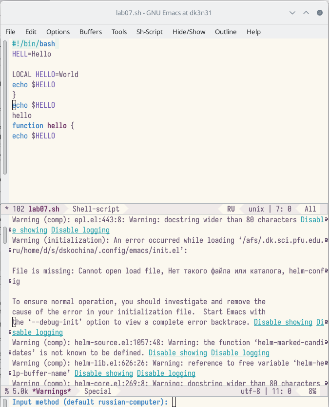
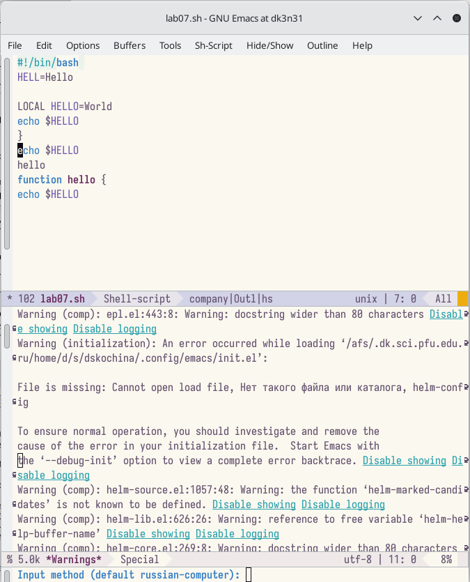
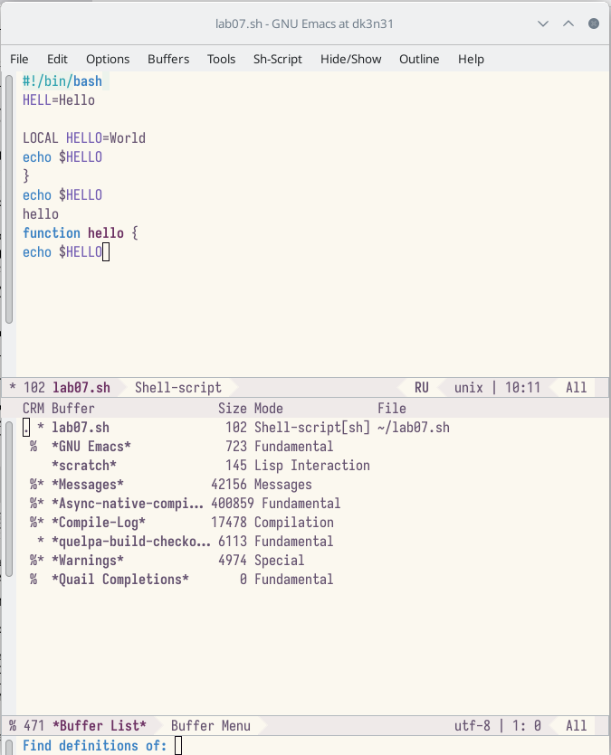
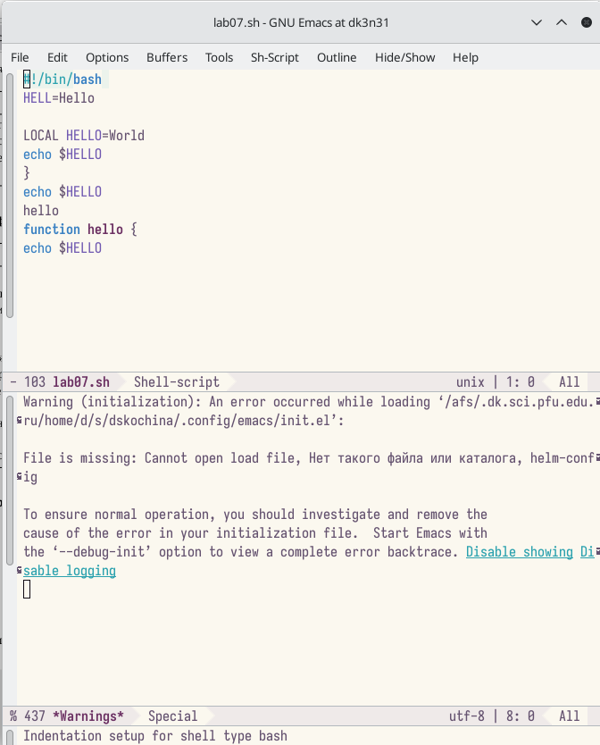
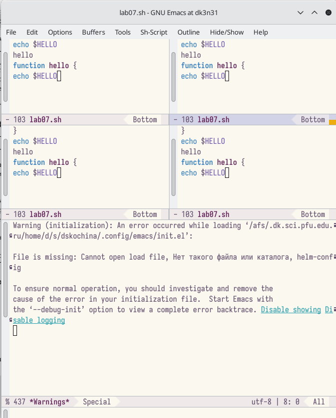
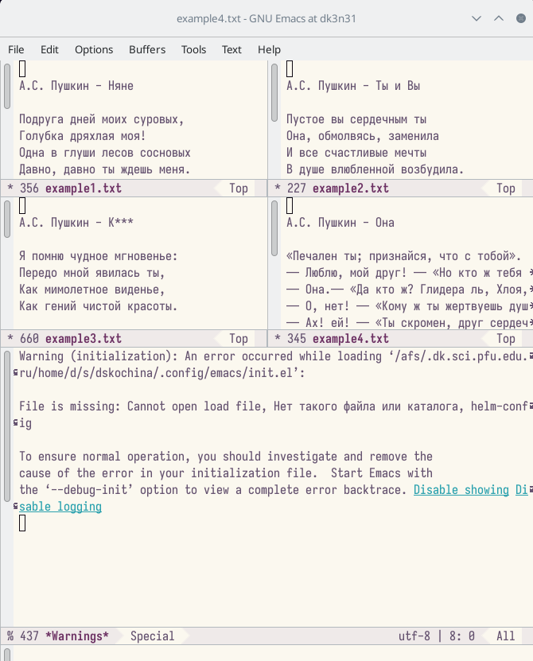
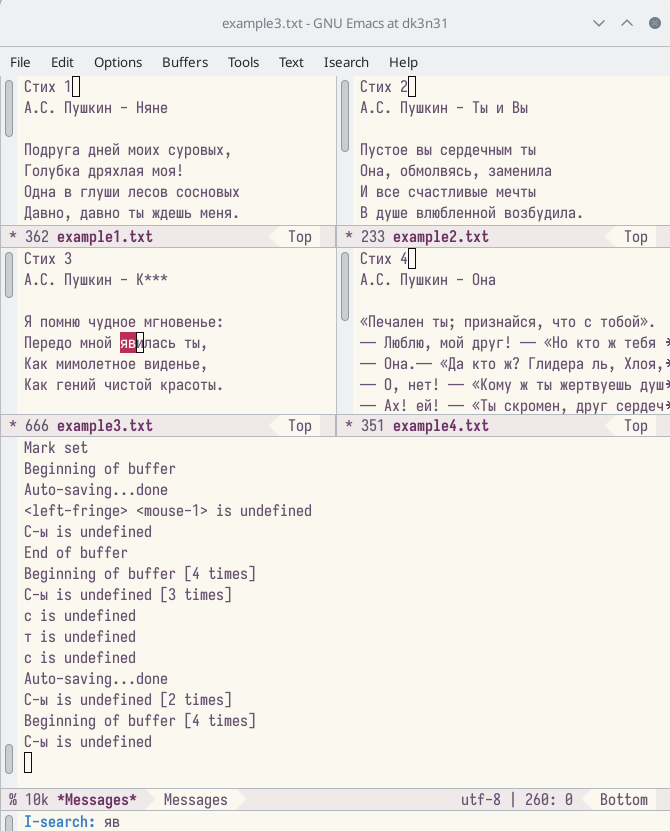

---
## Front matter
lang: ru-RU
title: Отчёт по лабораторной работе №9
subtitle: Текстовый редактор emacs
author:
  - Кочина Д. С.
institute:
  - Российский университет дружбы народов, Москва, Россия
date: 5 апреля 2023

## i18n babel
babel-lang: russian
babel-otherlangs: english

## Formatting pdf
toc: false
toc-title: Содержание
slide_level: 2
aspectratio: 169
section-titles: true
theme: metropolis
header-includes:
 - \metroset{progressbar=frametitle,sectionpage=progressbar,numbering=fraction}
 - '\makeatletter'
 - '\beamer@ignorenonframefalse'
 - '\makeatother'
---

# Вводная часть

## Цель работы

Целью данной лабораторной работы является ознакомление с операционной системой Linux. А также получение практических навыков работы с редактором Emacs.

# Основная часть

## Открытие редактора и создание файла

- Открыла редактор Emacs с помощью команды «emacs &».
- Создала файл lab07.sh с помощью комбинации «Ctrl-x» «Ctrl-f».

## Работа с текстом в редакторе

- В открывшемся буфере набрала необходимый текст.
- Сохранила файл с помощью комбинации «Ctrl-x»«Ctrl-s».

## Процедуры редактирования текста

- Врезала одной командой целую строку (С-k).
- Вставила эту строку в конец файла (C-y).
- Выделила область текста (C-space).
- Скопировала область в буфер обмена (M-w).
- Вставила область в конец файла.
- Вновь выделила эту область и на этот раз вырезала её (C-w).
- Отменила последнее действие (C-/)

## Процедуры редактирования текста

## Команды по перемещению курсора

- Переместила курсор в начало строки (C-a).
- Переместила курсор в конец строки (C-e).
- Переместила курсор в начало буфера (M-<).
- Переместила курсор в конец буфера (M->).

## Команды по перемещению курсора

## Управление буферами

- Вывела список активных буферов на экран (C-x C-b).
- Переместилась во вновь открытое окно (C-x o) со списком открытых буферов и переключилась на другой буфер.
- Закрыла это окно (C-x 0).
- Вновь переключилась между буферами, но уже без вывода их списка на экран (C-x b).

## Управление буферами

## Управление буферами

## Управление окнами

- Поделила фрейм на 4 части: разделила фрейм на два окна по вертикали (C-x 3), а затем каждое из этих окон на две части по горизонтали (C-x 2).

## Управление окнами

- В каждом из четырёх созданных окон открыла новый буфер (файл) и ввела несколько строк текста. Для этого предварительно создала эти файлы с помощью команд «touch example1.txt», «touch example2.txt», «touch example3.txt», «touch example4.txt».

## Режим поиска

- Переключилась в режим поиска (C-s) и нашла несколько слов, присутствующих в тексте.
- Перешла в режим поиска и замены, ввела текст, который следует найти и заменила.
- Попробовала другой режим поиска, нажав «Alt-so».

## Режим поиска

# Заключение

## Вывод

В ходе выполнения данной лабораторной работы я познакомилась с операционной системой Linux. А также получила практические навыки работы с редактором Emacs.

