---
## Front matter
lang: ru-RU
title: Отчёт по лабораторной работе №10
subtitle: Программирование в командном процессоре ОС UNIX. Командные файлы
author:
  - Кочина Д. С.
institute:
  - Российский университет дружбы народов, Москва, Россия
date: 10 апреля 2023

## i18n babel
babel-lang: russian
babel-otherlangs: english

## Formatting pdf
toc: false
toc-title: Содержание
slide_level: 2
aspectratio: 169
section-titles: true
theme: metropolis
header-includes:
 - \metroset{progressbar=frametitle,sectionpage=progressbar,numbering=fraction}
 - '\makeatletter'
 - '\beamer@ignorenonframefalse'
 - '\makeatother'
---

# Вводная часть

## Цель работы

Целью данной лабораторной работы является изучение основ программирования в оболочке ОС UNIX/Linux. А также приобретение практических навыков написания небольших командных файлов.

# Основная часть

## Изучение команд архивации

- Я изучила команды архивации, используя команды "manzip", "manzip2", "mantar".

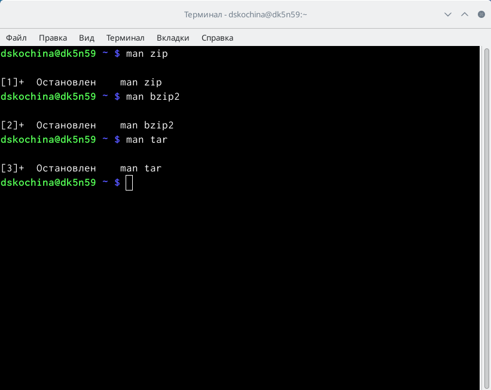

## Информация о zip

## Информация о bzip2

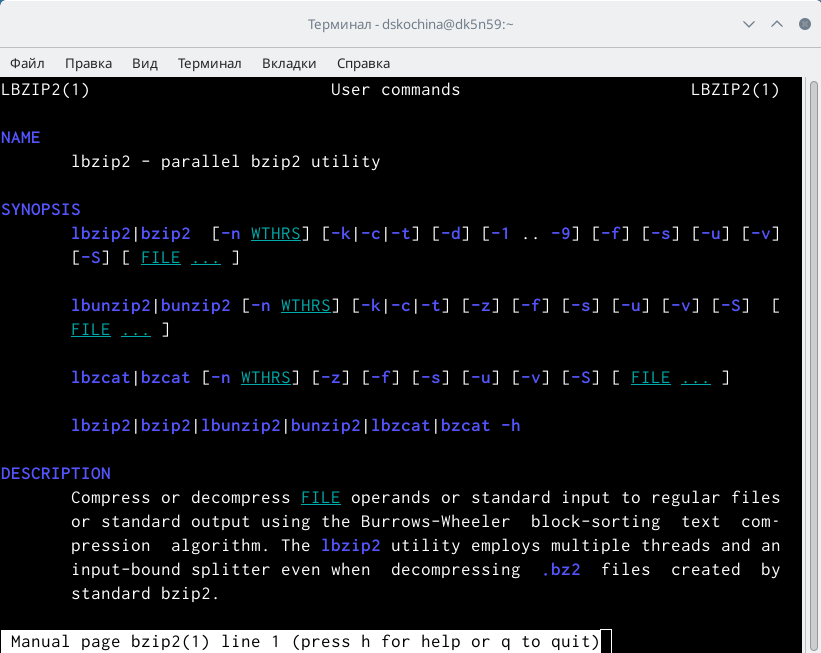

## Информация о tar

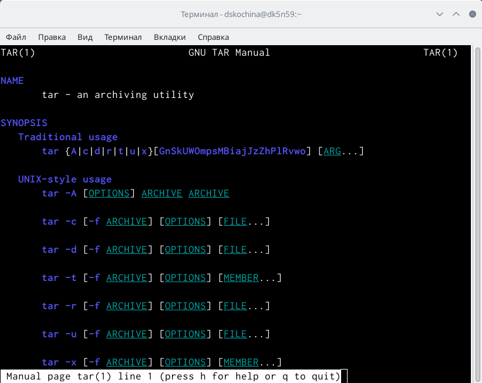

## Скрипт №1

- Я создала файл, в котором будуписать первый скрипт, и открыла его в редакторе emacs, используя клавиши «Ctrl-x»и «Ctrl-f».
- Я написала скрипт, который при запуске будет делать резервную копию самого себя (то есть файла, в котором содержится его исходный код) в другую директорию backup в моём домашнем каталоге. При этом файл должен архивироваться одним из архиваторов на выбор zip, bzip2 или tar. При написании скрипта использовала архиватор bzip2.

## Скрипт №1

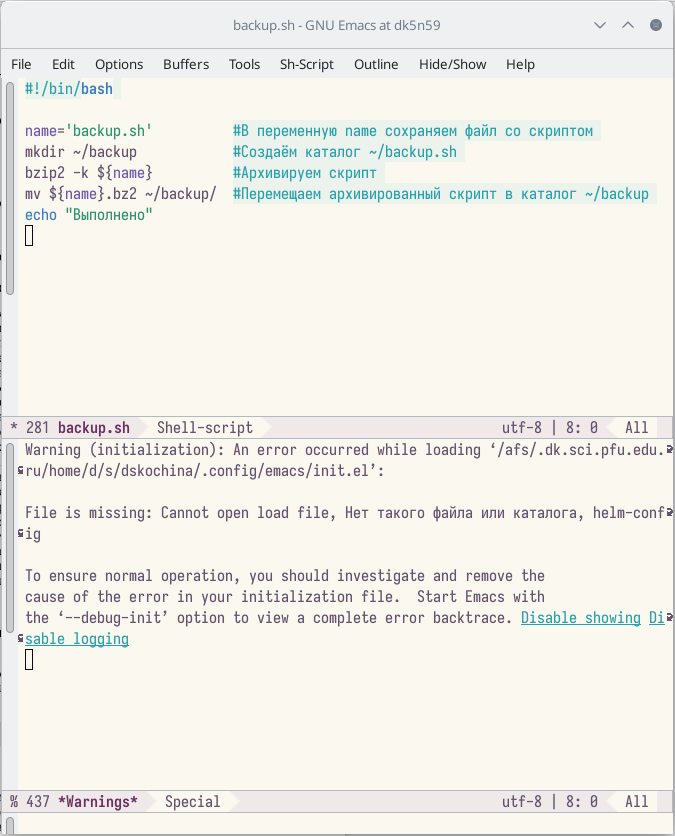

## Проверка работы скрипта

- Проверила работу скрипта, предварительно добавив для него право на выполнение (команда «chmod+x*.sh»). Проверила, появился ли каталог backup/, перейдя в него (команда «cd backup/»), посмотрела его содержимое (команда «ls») и просмотрела содержимое архива (команда «bunzip2 -cbackup.sh.bz2»).

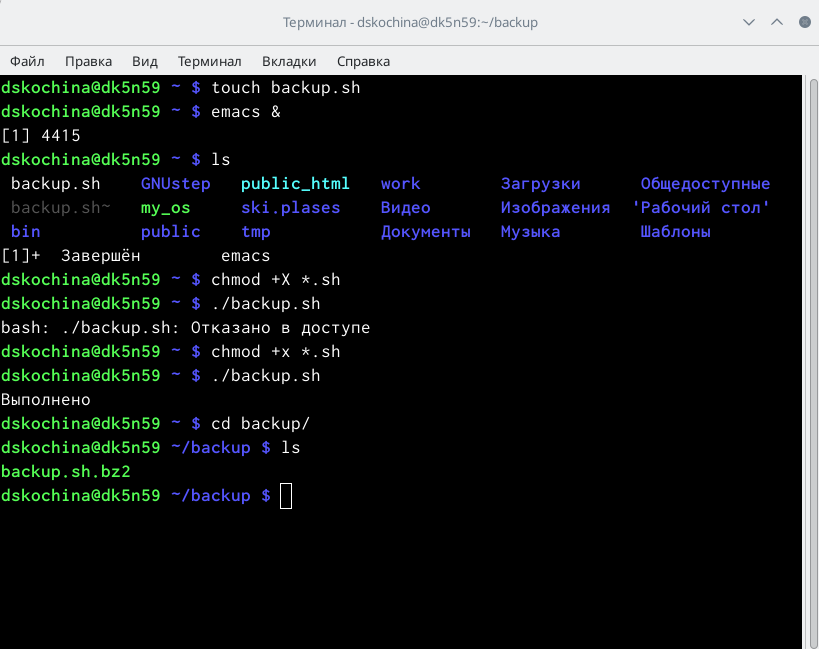

## Проверка работы скрипта

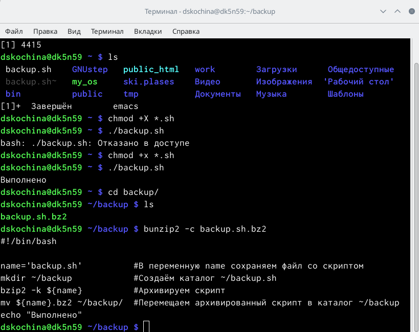

## Скрипт №2

- Создала файл, в котором буду писать второйскрипт, и открыла его в редакторе emacs, используя клавиши.
- Написала пример командного файла, обрабатывающего любое произвольное число аргументов командной строки, в том числе превышающее десять. Например, скрипт может последовательно распечатывать значения всех переданных аргументов.

## Скрипт №2

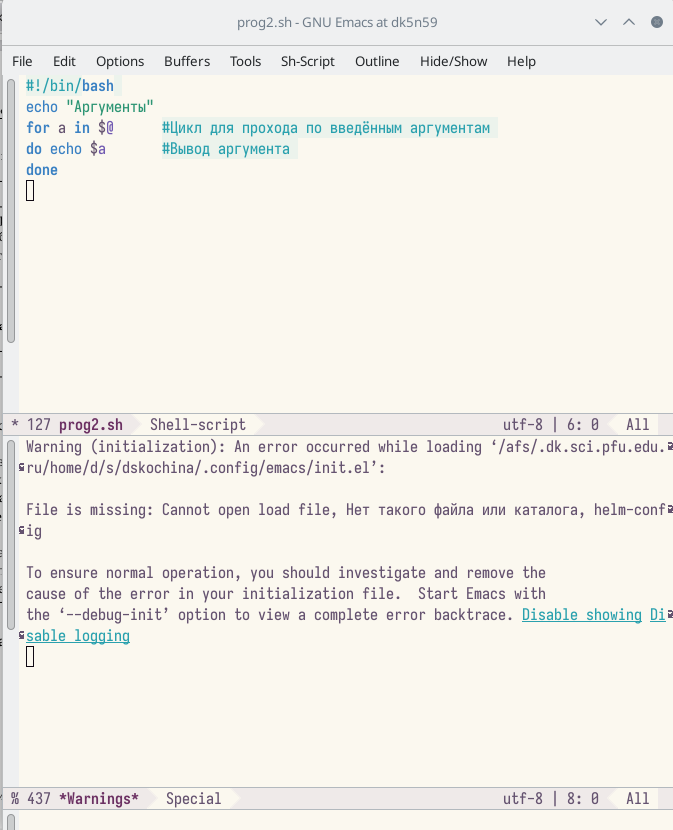

## Проверка работы скрипта

- Проверила работу написанного скрипта, предварительно добавив для него право на выполнение. Вводила аргументы, количество которых меньше 10 и больше 10. Скрипт работает корректно.

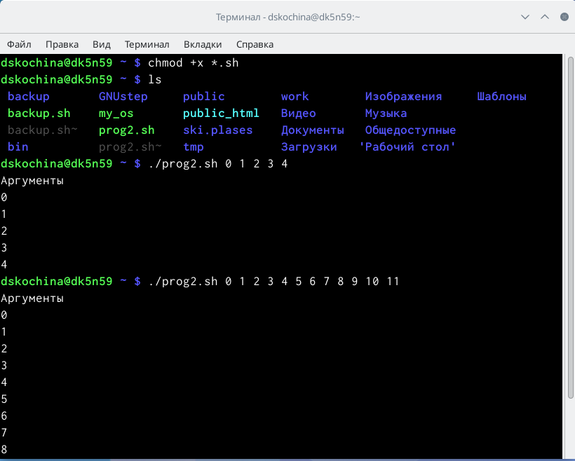

## Проверка работы скрипта

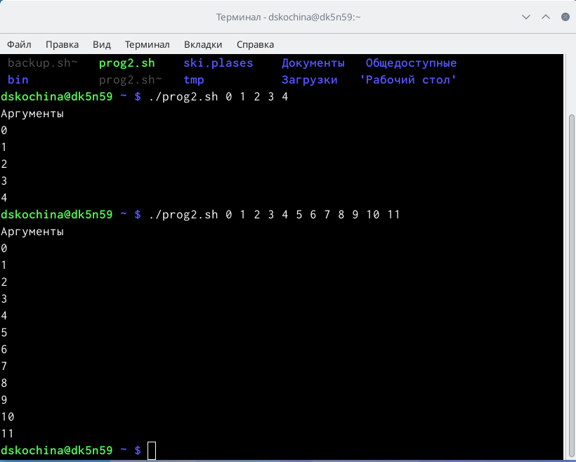

## Скрипт №3

- Создала файл, в котором буду писать третий скрипт, и открыла его в редакторе emacs, используя клавиши.
- Написала командный файл − аналог команды ls. Он должен выдавать информацию о нужном каталоге и выводить информацию о возможностях доступа к файлам этого каталога.

## Скрипт №3

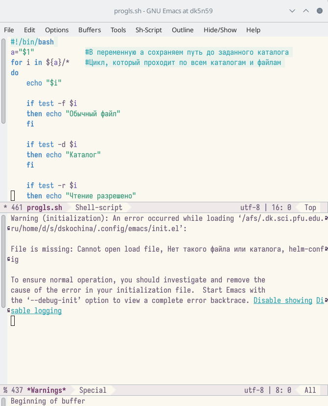

## Скрипт №3

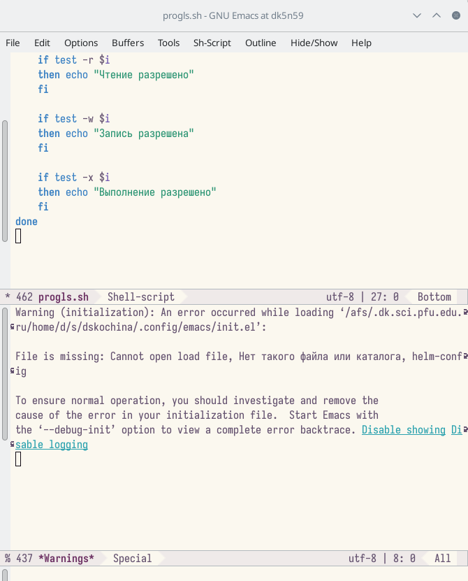

## Проверка работы скрипта

- Проверила работу скрипта, предварительно добавив для него право на выполнение. Скрипт работает корректно.

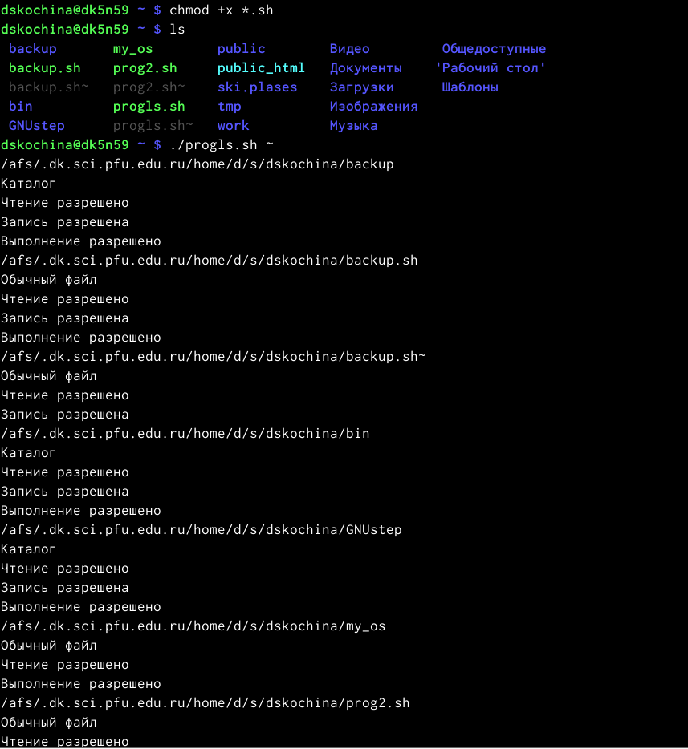

## Скрипт №4

- Для четвертого скрипта создала файл и открыла его в редакторе emacs.
- Написала командный файл, который получает в качестве аргумента командной строки формат файла и вычисляет количество таких файлов в указанной директории. Путь к директории также передаётся в виде аргумента командной строки.

## Скрипт №4

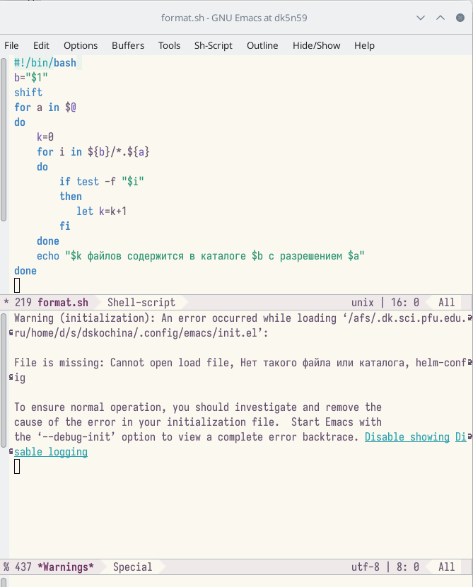

## Проверка работы скрипта

- Проверила работу написанного скрипта, предварительно добавив для него право на выполнение, а также создав дополнительные файлы с разными расширениями.

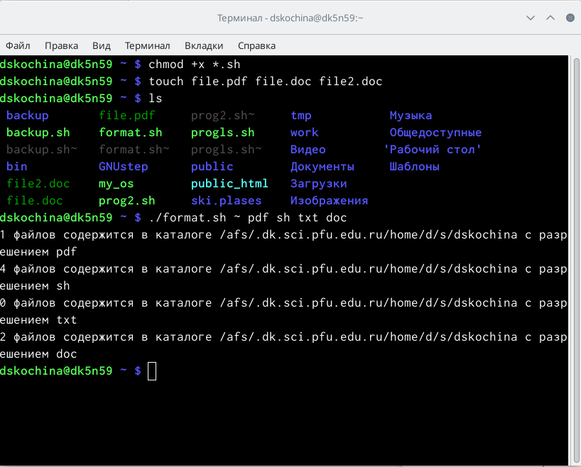

# Заключение

## Вывод

В ходе выполнения данной лабораторной работы я изучила основы программирования в оболочке ОС UNIX/Linux. А также приобрела практические навыки написания небольших командных файлов.

