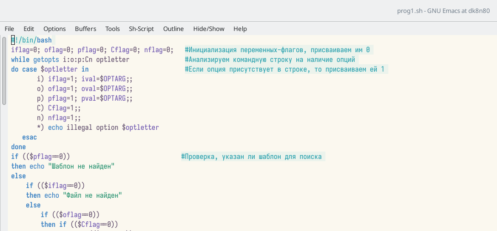
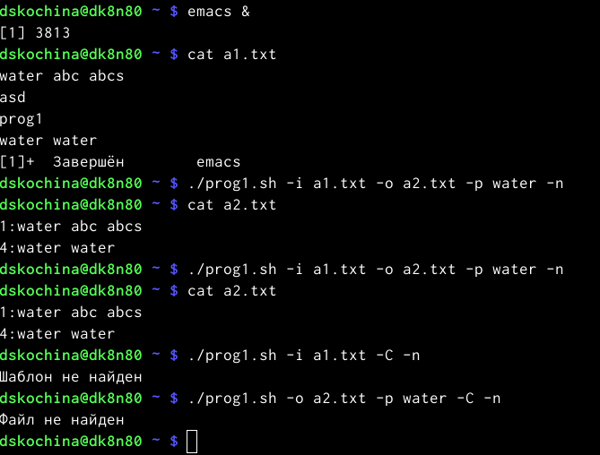
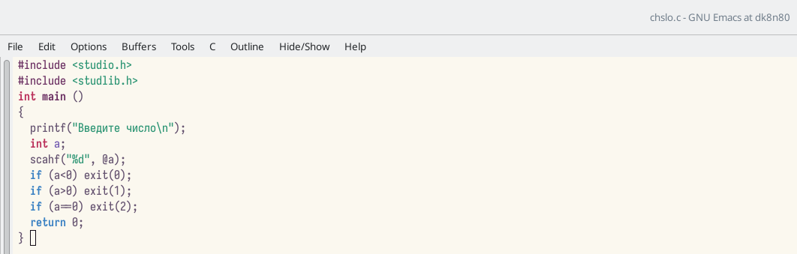
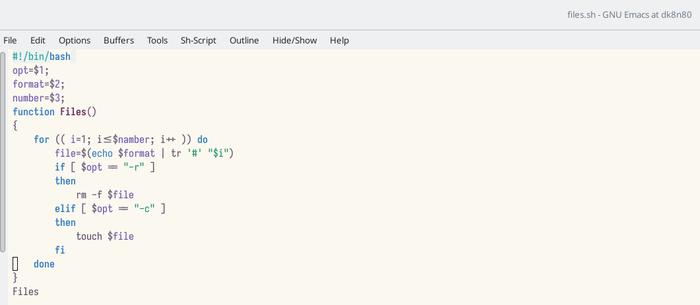
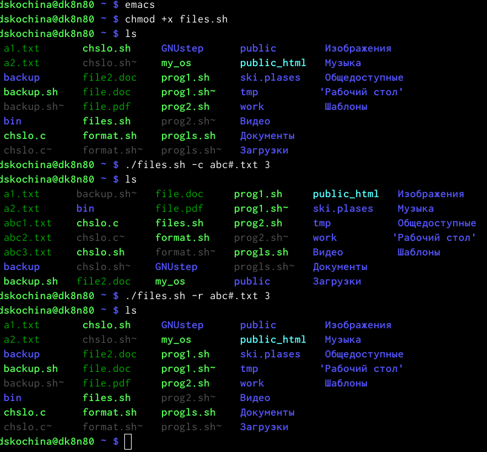
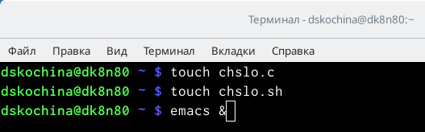
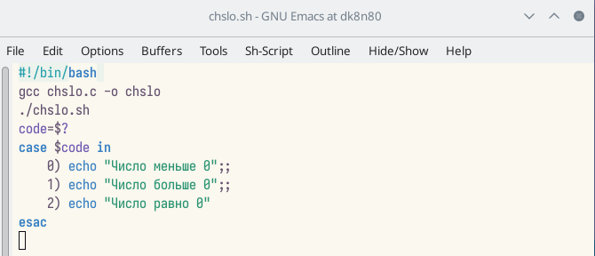
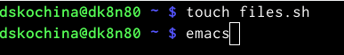
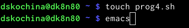
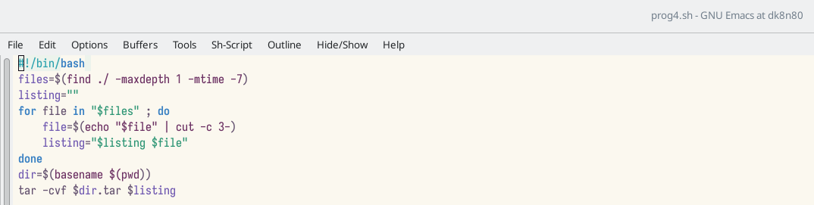

---
## Front matter
lang: ru-RU
title: Отчёт по лабораторной работе №11
subtitle: Программирование в командном процессоре ОС UNIX. Ветвления и циклы
author:
  - Кочина Д. С.
institute:
  - Российский университет дружбы народов, Москва, Россия
date: 21 апреля 2023

## i18n babel
babel-lang: russian
babel-otherlangs: english

## Formatting pdf
toc: false
toc-title: Содержание
slide_level: 2
aspectratio: 169
section-titles: true
theme: metropolis
header-includes:
 - \metroset{progressbar=frametitle,sectionpage=progressbar,numbering=fraction}
 - '\makeatletter'
 - '\beamer@ignorenonframefalse'
 - '\makeatother'
---

# Вводная часть

## Цель работы

Целью данной лабораторной работы является изучение основ программирования в оболочке ОС UNIX. А также приобретение практических навыков написания более сложные командных файлов с использованием логических управляющих конструкций и циклов.

# Основная часть

## Скрипт №1

- Используя команды getopts grep, написала командный файл, который анализирует командную строку с ключами.

## Скрипт №1

- Проверила работу написанного скрипта, используя различные опции (например, команда «./prog.sh–Ia1.txt–oa2.txt–pcapital–C-n»), предварительно добавив право на исполнение файла (команда «chmod+xprog1.sh») и создав 2 файла, которые необходимы для выполнения программы: a1.txt и a2.txt. Скрипт работает корректно.

## Скрипт №1

## Скрипт №2

- Написала на языке Си программу, которая вводит число и определяет, является ли оно больше нуля, меньше нуля или равно нулю. Затем программа завершается с помощью функции exit(n), передавая информацию в о коде завершения в оболочку. Командный файл должен вызывать эту программу и, проанализировав с помощью команды $?, выдать сообщение о том, какое число было введено. Для данной задачи я создала 2 файла: chslo.c и chislo.sh и написала соответствующие скрипты. (команды «touch prog2.sh» и «emacs &»).

## Скрипт №2

## Скрипт №2

- Проверила работу написанных скриптов (команда «./chislo.sh»), предварительно добавив право на исполнение файла (команда «chmod+x chislo.sh»). Скрипты работают корректно.

## Скрипт №3

- Написала командный файл, создающий указанное число файлов, пронумерованных последовательно от 1 до N (например 1.tmp, 2.tmp, 3.tmp,4.tmp и т.д.). Число файлов, которые необходимо создать, передаётся в аргументы командной строки. Этот же командный файл должен уметь удалять все созданные им файлы (если они существуют). Для данной задачи я создала файл: files.sh. и написала соответствующий скрипт.

## Скрипт №3

## Скрипт №3

- Далее я проверила работу написанного скрипта (команда «./files.sh»), предварительно добавив право на исполнение файла (команда «chmod+x files.sh»). Сначала я создала три файла (команда «./files.sh–cabc#.txt3»), удовлетворяющие условию задачи, а потом удалила их (команда «./files.sh–rabc#.txt3»).

## Скрипт №3

## Проверка работы скрипта

- Проверила работу скрипта, предварительно добавив для него право на выполнение (команда «chmod+x*.sh»). Проверила, появился ли каталог backup/, перейдя в него (команда «cd backup/»), посмотрела его содержимое (команда «ls») и просмотрела содержимое архива (команда «bunzip2 -cbackup.sh.bz2»).

## Проверка работы скрипта

## Скрипт №2

- Создала файл, в котором буду писать второйскрипт, и открыла его в редакторе emacs, используя клавиши.
- Написала пример командного файла, обрабатывающего любое произвольное число аргументов командной строки, в том числе превышающее десять. Например, скрипт может последовательно распечатывать значения всех переданных аргументов.

## Скрипт №2

## Проверка работы скрипта

- Проверила работу написанного скрипта, предварительно добавив для него право на выполнение. Вводила аргументы, количество которых меньше 10 и больше 10. Скрипт работает корректно.

## Проверка работы скрипта

## Скрипт №3

- Создала файл, в котором буду писать третий скрипт, и открыла его в редакторе emacs, используя клавиши.
- Написала командный файл − аналог команды ls. Он должен выдавать информацию о нужном каталоге и выводить информацию о возможностях доступа к файлам этого каталога.

## Скрипт №3

## Скрипт №4

- Написала командный файл, который с помощью команды tar запаковывает в архив все файлы в указанной директории. Модифицировала его так, чтобы запаковывались только те файлы, которые были изменены менее недели тому назад (использовать команду find). Для данной задачи я создала файл: prog4.sh и написала соответствующий скрипт.

## Скрипт №4

# Заключение

## Вывод

В ходе выполнения данной лабораторной работы я изучила основы программирования в оболочке ОС UNIX. А также приобрела практические навыки написания более сложные командных файлов с использованием логических управляющих конструкций и циклов.

