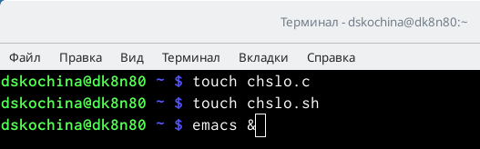

---
## Front matter
title: "Отчёт по лабораторной работе №11"
subtitle: "Программирование в командном процессоре ОС UNIX. Ветвления и циклы"
author: "Дарья Сергеевна Кочина"

## Generic otions
lang: ru-RU
toc-title: "Содержание"

## Bibliography
bibliography: bib/cite.bib
csl: pandoc/csl/gost-r-7-0-5-2008-numeric.csl

## Pdf output format
toc: true # Table of contents
toc-depth: 2
lof: true # List of figures
fontsize: 12pt
linestretch: 1.5
papersize: a4
documentclass: scrreprt
## I18n polyglossia
polyglossia-lang:
  name: russian
  options:
	- spelling=modern
	- babelshorthands=true
polyglossia-otherlangs:
  name: english
## I18n babel
babel-lang: russian
babel-otherlangs: english
## Fonts
mainfont: PT Serif
romanfont: PT Serif
sansfont: PT Sans
monofont: PT Mono
mainfontoptions: Ligatures=TeX
romanfontoptions: Ligatures=TeX
sansfontoptions: Ligatures=TeX,Scale=MatchLowercase
monofontoptions: Scale=MatchLowercase,Scale=0.9
## Biblatex
biblatex: true
biblio-style: "gost-numeric"
biblatexoptions:
  - parentracker=true
  - backend=biber
  - hyperref=auto
  - language=auto
  - autolang=other*
  - citestyle=gost-numeric
## Pandoc-crossref LaTeX customization
figureTitle: "Рис."
tableTitle: "Таблица"
listingTitle: "Листинг"
lofTitle: "Список иллюстраций"
lolTitle: "Листинги"
## Misc options
indent: true
header-includes:
  - \usepackage{indentfirst}
  - \usepackage{float} # keep figures where there are in the text
  - \floatplacement{figure}{H} # keep figures where there are in the text
---

# Цель работы

Целью данной лабораторной работы является изучение основ программирования в оболочке ОС UNIX. А также приобретение практических навыков написания более сложные командных файлов с использованием логических управляющих конструкций и циклов.

# Задание

Изучить основы программирования в оболочке ОС UNIX. Научится писать более сложные командные файлы с использованием логических управляющих конструкций и циклов.

# Теоретическое введение

Команда getopts осуществляет синтаксический анализ командной строки, выделяя флаги, и используется для объявления переменных. Синтаксис команды следующий: getopts option-string variable [arg ... ]

Флаги – это опции командной строки, обычно помеченные знаком минус; Например, -F является флагом для команды ls -F. Иногда эти флаги имеют аргументы, связанные с ними. Программы интерпретируют эти флаги, соответствующим образом изменяя свое поведение. Строка опций option-string — это список возможных букв и чисел соответствующего флага. Если ожидается, что некоторый флаг будет сопровождаться некоторым аргументом, то за этой буквой должно следовать двоеточие. Соответствующей переменной присваивается буква данной опции. Если команда getopts может распознать аргумент, она возвращает истину. Принято включать getopts в цикл while и анализировать введенные данные с помощью оператора case.

# Выполнение лабораторной работы

1. Используя команды getopts grep, написала командный файл, который анализирует командную строку с ключами:

    -iinputfile—прочитать данные из указанного файла;
    -ooutputfile—вывести данные в указанный файл;
    -p шаблон —указать шаблон для поиска;
    -C—различать большие и малые буквы;
    -n—выдавать номера строк,а затем ищет в указанном файле нужные строки, определяемые ключом –p. Для данной задачи я создала файл prog1.sh и написала соответствующие скрипты. (рис. [-@fig:001], [-@fig:002], [-@fig:003], [-@fig:004])
    
{ #fig:001 width=70% }

{ #fig:002 width=70% }

{ #fig:003 width=70% }

{ #fig:004 width=70% }

2. Проверила работу написанного скрипта, используя различные опции (например, команда «./prog.sh–Ia1.txt–oa2.txt–pcapital–C-n»), предварительно добавив право на исполнение файла (команда «chmod+xprog1.sh») и создав 2 файла, которые необходимы для выполнения программы: a1.txt и a2.txt. Скрипт работает корректно. (рис. [-@fig:005], [-@fig:006])

{ #fig:005 width=70% }

{ #fig:006 width=70% }

3. Написала на языке Си программу, которая вводит число и определяет, является ли оно больше нуля, меньше нуля или равно нулю. Затем программа завершается с помощью функции exit(n), передавая информацию в о коде завершения в оболочку. Командный файл должен вызывать эту программу и, проанализировав с помощью команды $?, выдать сообщение о том, какое число было введено. Для данной задачи я создала 2 файла: chslo.c и chislo.sh и написала соответствующие скрипты. (команды «touch prog2.sh» и «emacs &»). (рис. [-@fig:007], [-@fig:008], [-@fig:009], [-@fig:010])

{ #fig:007 width=70% }

{ #fig:008 width=70% }

{ #fig:009 width=70% }

{ #fig:010 width=70% }

4. Проверила работу написанных скриптов (команда «./chislo.sh»), предварительно добавив право на исполнение файла (команда «chmod+x chislo.sh»). Скрипты работают корректно.

5. Написала командный файл, создающий указанное число файлов, пронумерованных последовательно от 1 до N (например 1.tmp, 2.tmp, 3.tmp,4.tmp и т.д.). Число файлов, которые необходимо создать, передаётся в аргументы командной строки. Этот же командный файл должен уметь удалять все созданные им файлы (если они существуют). Для данной задачи я создала файл: files.sh. и написала соответствующий скрипт. (рис. [-@fig:011], [-@fig:012])

{ #fig:011 width=70% }

{ #fig:012 width=70% }

6. Далее я проверила работу написанного скрипта (команда «./files.sh»), предварительно добавив право на исполнение файла (команда «chmod+x files.sh»). Сначала я создала три файла (команда «./files.sh–cabc#.txt3»), удовлетворяющие условию задачи, а потом удалила их (команда «./files.sh–rabc#.txt3»). (рис. [-@fig:013])

{ #fig:013 width=70% }

7. Написала командный файл, который с помощью команды tar запаковывает в архив все файлы в указанной директории. Модифицировала его так, чтобы запаковывались только те файлы, которые были изменены менее недели тому назад (использовать команду find). Для данной задачи я создала файл: prog4.sh и написала соответствующий скрипт. (рис. [-@fig:014], [-@fig:015])

{ #fig:014 width=70% }

{ #fig:015 width=70% }

8. Далее я проверила работу написанного скрипта (команды «./prog4.sh» и «tar-tf Catalog1.tar»), предварительно добавив право на исполнение файла (команда «chmod +x prog4.sh») и создав отдельный Catalog1 с несколькими файлами. Как видно из Рисунков, файлы, измененные более недели назад, заархивированы не были. Скрипт работает корректно.

**Ответы на контрольные вопросы:**

1. Команда getopts осуществляет синтаксический анализ командной строки, выделяя флаги, ииспользуется для объявления переменных. Синтаксис команды следующий: getopts option-string variable [arg...] Флаги − это опции командной строки, обычно помеченные знаком минус; Например,для команды ls флагом может являться -F. Строка опций option-string − эт осписок возможных букв и чисел соответствующего флага. Если ожидается, что некоторый флаг будет сопровождаться некоторым аргументом, то за символом, обозначающим этот флаг, должно следовать двоеточие. Соответствующей переменной присваивается буква данной опции. Еслик оманда getopts может распознать аргумент, то она возвращает истину. Принято включать getopts в цикл while и анализировать введённые данные с помощью оператора case. Функция getopts включает две специальные переменные среды −OPTARG и OPTIND. Если ожидается доплнительное значение,то OPTARG устанавливается в значение этого аргумента. Функция getopts также понимает переменные типа массив, следовательно, можно использовать её в функции не только для синтаксического анализа аргументов функций, но и для анализа введённых пользователем данных.

2. Приперечислении имён файлов текущего каталога можно использовать следующие символы:

    *−соответствует произвольной, в том числе и пустой строке;
    ?−соответствует любому одинарному символу;
    [c1-c2] − соответствует любому символу, лексикографически находящемуся между символами с1 и с2. Например, 1.1 echo* − выведет имена всех файлов текущего каталога, что представляет собой простейший аналог команды ls; 1.2. ls*.c−выведет все файлы с последними двумя символами, совпадающими с.c. 1.3. echoprog.?−выведет все файлы, состоящие из пяти или шести символов, первыми пятью символами которых являются prog.. 1.4.[a-z]*−соответствует произвольному имени файла в текущем каталоге, начинающемуся с любой строчной буквы латинского алфавита.

3. Часто бывает необходимо обеспечить проведение каких-либо действий циклически и управление дальнейшими действиями в зависимости от результатов проверки некоторого условия. Для решения подобных задач язык программирования bash предоставляет возможность использовать такие управляющие конструкции, как for, case, if иwhile. С точки зрения командного процессора эти управляющие конструкции являются обычными командами и могут использоваться как при создании командных файлов, так и при работе в интерактивном режиме. Команды,реализующие подобные конструкции, по сути, являются операторами языка программирования bash. Поэтому при описании языка программирования bash термин оператор будет использоваться наравне с термином команда. Команды ОСUNIX возвращают код завершения, значение которого может быть использовано для принятия решения о дальнейших действиях. Команда test, например, создана специально для использования в командных файлах. Единственная функция этой команды заключается в выработке кода завершения.

4. Два несложных способа позволяют вам прерывать циклы в оболочке bash. Команда break завершает выполнение цикла, а команда continue завершает данную итерацию блока операторов. Команда break полезна для завершения цикла while в ситуациях, когда условие перестаёт быть правильным. Команда continue используется в ситуациях, когда больше нет необходимости выполнять блок операторов, но вы можете захотеть продолжить проверять данный блок на других условных выражениях.

5. Следующие две команды ОСUNIX используются только совместно с управляющими конструкциями языка программирования bash: это команда true,которая всегда возвращает код завершения, равный нулю(т.е.истина),и команда false,которая всегда возвращает код завершения,неравный нулю(т.е.ложь).Примеры бесконечных циклов:while true do echo hello andy done until false do echo hello mike done.

6. Строка if test-fman$s/$i.$s проверяет,существует ли файл man$s/$i.$s и является ли этот файл обычным файлом.Если данный файл является каталогом,то команда вернет нулевое значение (ложь).

7. Выполнение оператора цикла while сводится к тому,что сначала выполняется последовательность команд(операторов),которую задаёт список-команд в строке,содержащей служебное слово while,а затем,если последняя выполненная команда из этой последовательности команд возвращает нулевой код завершения(истина),выполняется последовательность команд(операторов),которую задаёт список-команд в строке,содержащей служебное слово do,после чего осуществляется безусловный переход на начало оператора цикла while.Выход из цикла будет осуществлён тогда,когда последняя выполненная команда из последовательности команд (операторов),которую задаёт список-команд в строке,содержащей служебное слово while, возвратит ненулевой код завершения(ложь). При замене в операторе цикла while служебного слова while на until условие,при выполнении которого осуществляется выход из цикла,меняется на противоположное.В остальном оператор цикла while и оператор цикла until идентичны.

# Выводы

В ходе выполнения данной лабораторной работы я изучила основы программирования в оболочке ОС UNIX. А также приобрела практические навыки написания более сложные командных файлов с использованием логических управляющих конструкций и циклов.

