---
## Front matter
lang: ru-RU
title: Отчёт по лабораторной работе №12
subtitle: Программирование в командном процессоре ОС UNIX. Расширенное программирование
author:
  - Кочина Д. С.
institute:
  - Российский университет дружбы народов, Москва, Россия
date: 26 апреля 2023

## i18n babel
babel-lang: russian
babel-otherlangs: english

## Formatting pdf
toc: false
toc-title: Содержание
slide_level: 2
aspectratio: 169
section-titles: true
theme: metropolis
header-includes:
 - \metroset{progressbar=frametitle,sectionpage=progressbar,numbering=fraction}
 - '\makeatletter'
 - '\beamer@ignorenonframefalse'
 - '\makeatother'
---

# Вводная часть

## Цель работы

Целью данной лабораторной работы является изучение основ программирования в оболочке ОС UNIX. А также приобретение практических навыков написания более сложные командных файлов с использованием логических управляющих конструкций и циклов.

# Основная часть

## Скрипт №1

- Написала командный файл, реализующий упрощённый механизм семафоров. Командный файл должен в течение некоторого времени t1 дожидаться освобождения ресурса, выдавая об этом сообщение, а дождавшись его освобождения, использовать его в течение некоторого времени t2<>t1, также выдавая информацию о том, что ресурс используется соответствующим командным файлом (процессом). Для данной задачи я создала файл: sem.sh и написала соответствующий скрипт.

## Скрипт №1

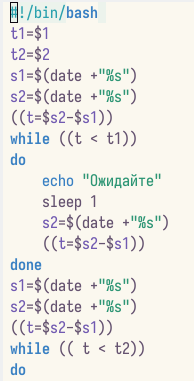

## Скрипт №1

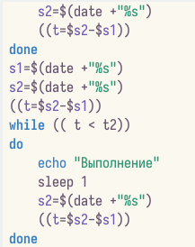

## Скрипт №1

- Далее я проверила работу написанного скрипта, предварительно добавив право на исполнение файла. Скрипт работает корректно.

## Скрипт №1

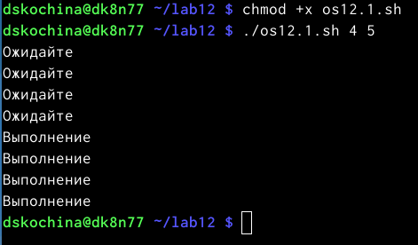

## Изменённый скрипт №1

- После этого я изменила скрипт так, чтобы его можно было выполнять в нескольких терминалах и проверила его работу. Однако у меня не получилось проверить работу скрипта, так как было отказно в доступе.

## Изменённый скрипт №1

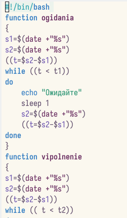

## Изменённый скрипт №1

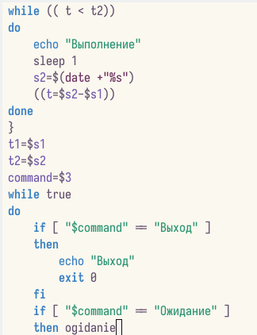

## Изменённый скрипт №1

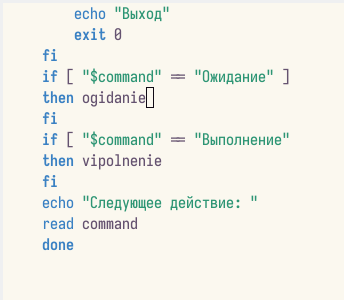

## Изменённый скрипт №1

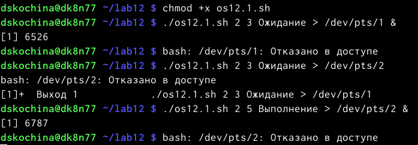

## Реализация команды man

- Реализовала команду man с помощью командного файла. Изучила содержимое каталога /usr/share/man/man1. В нем находятся архивы текстовых файлов, содержащих справку по большинству установленных в системе программ и команд. Каждый архив можно открыть командой ls сразу же просмотрев содержимое справки. Командный файл должен получать в виде аргумента командной строки название команды и в виде результата выдавать справку об этой команде или сообщение об отсутствии справки, если соответствующего файла нет в каталоге man1.

## Реализация команды man

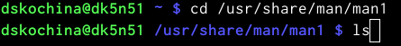

## Реализация команды man

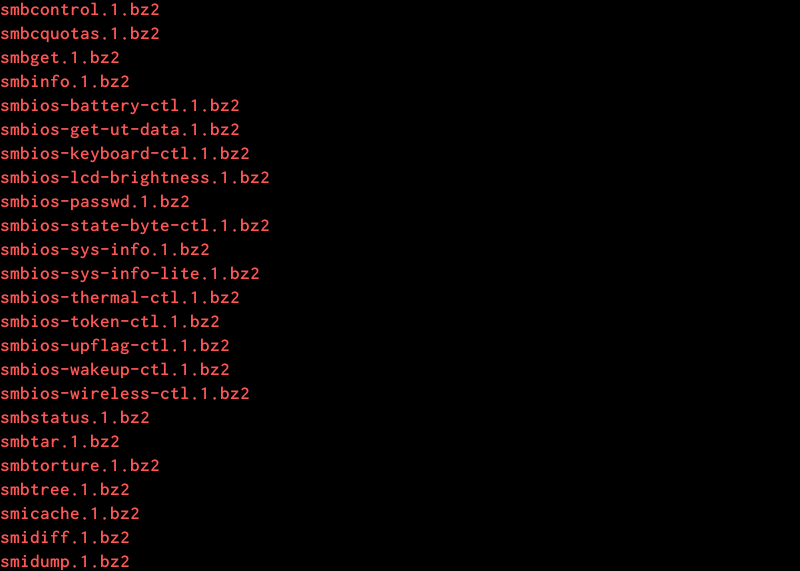

## Скрипт №2

- Для данной задачи я создала файл и написала соответствующий скрипт.

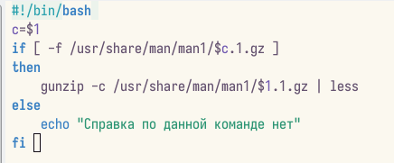

## Скрипт №2

- Далее я проверила работу написанного скрипта, предварительно добавив право на исполнение файла. Скрипт работает корректно.

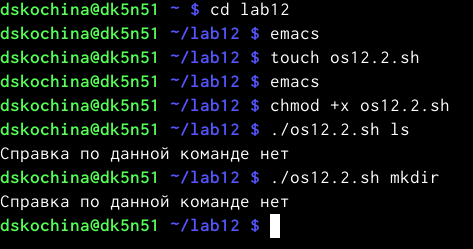

## Скрипт №3

- Используя встроенную переменную $RANDOM, написала командный файл, генерирующий случайную последовательность букв латинского алфавита. Для данной задачи я создала файл и написала соответствующий скрипт.

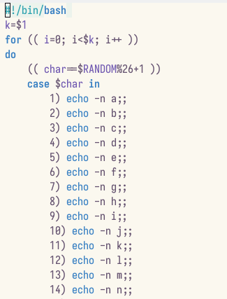

## Скрипт №3

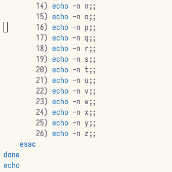

## Скрипт №3

Далее я проверила работу написанного скрипта, предварительно добавив право на исполнение файла. Скрипт работает корректно.

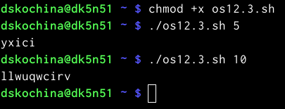

# Заключение

## Вывод

В ходе выполнения данной лабораторной работы я изучила основы программирования в оболочке ОС UNIX. А также приобрела практические навыки написания более сложные командных файлов с использованием логических управляющих конструкций и циклов.
