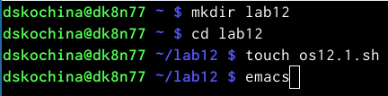
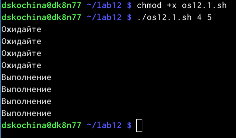
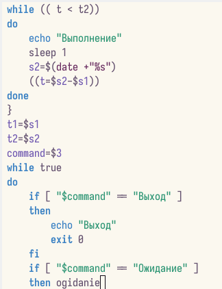
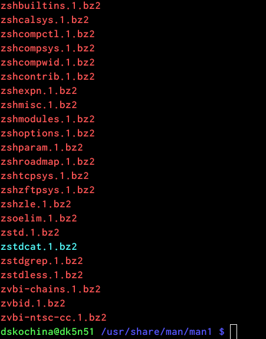
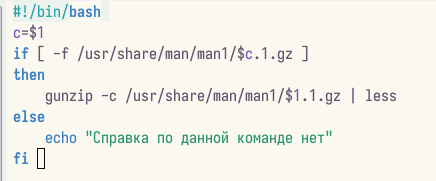
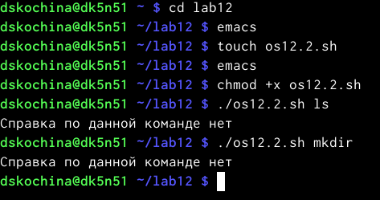
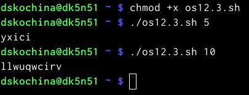

---
## Front matter
title: "Отчёт по лабораторной работе №12"
subtitle: "Программирование в командном процессоре ОС UNIX. Расширенное программирование"
author: "Дарья Сергеевна Кочина"

## Generic otions
lang: ru-RU
toc-title: "Содержание"

## Bibliography
bibliography: bib/cite.bib
csl: pandoc/csl/gost-r-7-0-5-2008-numeric.csl

## Pdf output format
toc: true # Table of contents
toc-depth: 2
lof: true # List of figures
fontsize: 12pt
linestretch: 1.5
papersize: a4
documentclass: scrreprt
## I18n polyglossia
polyglossia-lang:
  name: russian
  options:
	- spelling=modern
	- babelshorthands=true
polyglossia-otherlangs:
  name: english
## I18n babel
babel-lang: russian
babel-otherlangs: english
## Fonts
mainfont: PT Serif
romanfont: PT Serif
sansfont: PT Sans
monofont: PT Mono
mainfontoptions: Ligatures=TeX
romanfontoptions: Ligatures=TeX
sansfontoptions: Ligatures=TeX,Scale=MatchLowercase
monofontoptions: Scale=MatchLowercase,Scale=0.9
## Biblatex
biblatex: true
biblio-style: "gost-numeric"
biblatexoptions:
  - parentracker=true
  - backend=biber
  - hyperref=auto
  - language=auto
  - autolang=other*
  - citestyle=gost-numeric
## Pandoc-crossref LaTeX customization
figureTitle: "Рис."
tableTitle: "Таблица"
listingTitle: "Листинг"
lofTitle: "Список иллюстраций"
lolTitle: "Листинги"
## Misc options
indent: true
header-includes:
  - \usepackage{indentfirst}
  - \usepackage{float} # keep figures where there are in the text
  - \floatplacement{figure}{H} # keep figures where there are in the text
---

# Цель работы

Целью данной лабораторной работы является изучение основ программирования в оболочке ОС UNIX. А также приобретение практических навыков написания более сложных командных файлов с использованием логических управляющих конструкций и циклов.

# Задание

Изучить основы программирования в оболочке ОС UNIX. Научится писать более сложные командные файлы с использованием логических управляющих конструкций и циклов.

# Теоретическое введение

Преимущества и недостатки Bash:

Многие языки программирования намного удобнее и понятнее для пользователя. Например, Python более быстр, так как компилируется байтами. Однако главное преимущество Bash – его повсеместное распространение. Более того, Bash позволяет очень легко работать с файловой системой без лишних конструкций (в отличие от других языков программирования). Но относительно таких bash очень сжат. То есть, например, C имеет гораздо более широкие возможности для разработчика.

# Выполнение лабораторной работы

1. Написала командный файл, реализующий упрощённый механизм семафоров. Командный файл должен в течение некоторого времени t1 дожидаться освобождения ресурса, выдавая об этом сообщение, а дождавшись его освобождения, использовать его в течение некоторого времени t2<>t1, также выдавая информацию о том, что ресурс используется соответствующим командным файлом (процессом). Для данной задачи я создала файл: sem.sh и написала соответствующий скрипт. (рис. [-@fig:001], [-@fig:002])

{ #fig:001 width=70% }

{ #fig:002 width=70% }

{ #fig:003 width=70% }

2. Далее я проверила работу написанного скрипта, предварительно добавив право на исполнение файла. Скрипт работает корректно. (рис. [-@fig:004])

{ #fig:004 width=70% }

3. После этого я изменила скрипт так, чтобы его можно было выполнять в нескольких терминалах и проверила его работу. Однако у меня не получилось проверить работу скрипта, так как было отказно в доступе. (рис. [-@fig:005], [-@fig:006], [-@fig:007], [-@fig:008])

{ #fig:005 width=70% }

{ #fig:006 width=70% }

{ #fig:007 width=70% }

{ #fig:008 width=70% }

4. Реализовала команду man с помощью командного файла. Изучила содержимое каталога /usr/share/man/man1. В нем находятся архивы текстовых файлов, содержащих справку по большинству установленных в системе программ и команд. Каждый архив можно открыть командой ls сразу же просмотрев содержимое справки. Командный файл должен получать в виде аргумента командной строки название команды и в виде результата выдавать справку об этой команде или сообщение об отсутствии справки, если соответствующего файла нет в каталоге man1. (рис. [-@fig:009], [-@fig:010], [-@fig:011])

{ #fig:009 width=70% }

{ #fig:010 width=70% }

{ #fig:011 width=70% }

5. Для данной задачи я создала файл и написала соответствующий скрипт. (рис. [-@fig:012])

{ #fig:012 width=70% }

6. Далее я проверила работу написанного скрипта, предварительно добавив право на исполнение файла. Скрипт работает корректно. (рис. [-@fig:013])

{ #fig:013 width=70% }

7. Используя встроенную переменную $RANDOM, написала командный файл, генерирующий случайную последовательность букв латинского алфавита. Для данной задачи я создала файл и написала соответствующий скрипт. (рис. [-@fig:014], [-@fig:015])

{ #fig:014 width=70% }

{ #fig:015 width=70% }

8. Далее я проверила работу написанного скрипта, предварительно добавив право на исполнение файла. Скрипт работает корректно. (рис. [-@fig:016])

{ #fig:016 width=70% }

**Ответы на контрольные вопросы:**

1. while [$1 != "exit"]

В данной строчке допущены следующие ошибки:

не хватает пробелов после первой скобки [и перед второй скобкой ]

выражение $1 необходимо взять в “”, потому что эта переменная может содержать пробелы.

Таким образом, правильный вариант должен выглядеть так: while [“$1”!= "exit"]

2. Чтобы объединить несколько строк в одну, можно воспользоваться несколькими способами:

Первый:

VAR1="Hello,

"VAR2=" World"

VAR3="$VAR1$VAR2"

echo "$VAR3"

Результат: Hello, World

Второй:

VAR1="Hello, "

VAR1+=" World"

echo "$VAR1"

Результат: Hello, World

3. Команда seq в Linux используется для генерации чисел от ПЕРВОГО до ПОСЛЕДНЕГО шага INCREMENT.

Параметры:

seq LAST: если задан только один аргумент, он создает числа от 1 до LAST с шагом шага, равным 1. Если LAST меньше 1, значение is не выдает.

seq FIRST LAST: когда заданы два аргумента, он генерирует числа от FIRST до LAST с шагом 1, равным 1. Если LAST меньше FIRST, он не выдает никаких выходных данных.

seq FIRST INCREMENT LAST: когда заданы три аргумента, он генерирует числа от FIRST до LAST на шаге INCREMENT . Если LAST меньше, чем FIRST, он не производит вывод.

seq -f «FORMAT» FIRST INCREMENT LAST: эта команда используется для генерации последовательности в форматированном виде. FIRST и INCREMENT являются необязательными.

seq -s «STRING» ПЕРВЫЙ ВКЛЮЧЕНО: Эта команда используется для STRING для разделения чисел. По умолчанию это значение равно /n. FIRST и INCREMENT являются необязательными.

seq -w FIRST INCREMENT LAST:эта команда используется для выравнивания ширины путем заполнения начальными нулями. FIRST и INCREMENT являются необязательными.

4. Результатом данного выражения $((10/3))будет 3, потому что это целочисленное деление без остатка.

5. Отличия командной оболочки zshот bash:

В zsh более быстрое автодополнение для cdс помощью Тab

В zsh существует калькулятор zcalc, способный выполнять вычисления внутри терминала

В zsh поддерживаются числа с плавающей запятой

В zsh поддерживаются структуры данных «хэш»

В zsh поддерживается раскрытие полного пути на основе неполных данных

В zsh поддерживаетсязаменачастипути

В zsh есть возможность отображать разделенный экран, такой же как разделенный экран vim

6. for((a=1; a<= LIMIT; a++)) синтаксис данной конструкции верен, потому что, используя двойные круглые скобки, можно не писать $ перед переменными ().

7. Преимущества скриптового языка bash:

Один из самых распространенных и ставится по умолчаниюв большинстве дистрибутивах Linux, MacOS

Удобное перенаправление ввода/вывода

Большое количество команд для работы с файловыми системами Linux

Можно писать собственные скрипты, упрощающие работу в Linux

Недостатки скриптового языка bash:

Дополнительные библиотеки других языков позволяют выполнить больше действий

Bash не является языков общего назначения

Утилиты, при выполнении скрипта, запускают свои процессы, которые, в свою очередь, отражаются на быстроте выполнения этого скрипта

Скрипты, написанные на bash, нельзя запустить на других операционных системах без дополнительных действий.

# Выводы

В ходе выполнения данной лабораторной работы я изучила основы программирования в оболочке ОС UNIX. А также приобрела практические навыки написания более сложные командных файлов с использованием логических управляющих конструкций и циклов.

