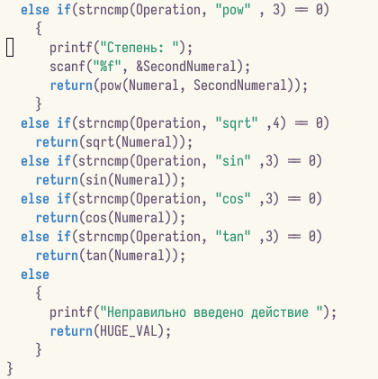

---
## Front matter
lang: ru-RU
title: Отчёт по лабораторной работе №13
subtitle: Средства, применяемые при разработке программного обеспечения в ОС типа UNIX/Linux
author:
  - Кочина Д. С.
institute:
  - Российский университет дружбы народов, Москва, Россия
date: 03 мая 2023
## i18n babel
babel-lang: russian
babel-otherlangs: english

## Formatting pdf
toc: false
toc-title: Содержание
slide_level: 2
aspectratio: 169
section-titles: true
theme: metropolis
header-includes:
 - \metroset{progressbar=frametitle,sectionpage=progressbar,numbering=fraction}
 - '\makeatletter'
 - '\beamer@ignorenonframefalse'
 - '\makeatother'
---

# Вводная часть

## Цель работы

Целью данной лабораторной работы является приобретение простейших навыков разработки, анализа, тестирования и отладки приложений в ОС типа UNIX/Linux на примере создания на языке программирования С калькулятора с простейшими функциями.

# Основная часть

## Программа в calculate.с

- Написала программу - примитивнейший калькулятор, способный складывать, вычитать, умножать и делить, возводить число в степень, брать квадратный корень, вычислять sin, cos, tan. При запуске он запрашивал первое число, операцию, второе число. После этого программа выводила результат и останавливалась.

## Программа в calculate.с

## Программа в calculate.c 

## Программа в calculate.с

## Программа в calculate.h

- Интерфейсный файл calculate.h, описывающий формат вызова функции калькулятора.

## Программа в main.c

- Основной файл main.c, реализующий интерфейс пользователя к калькулятору.

## Компиляция программы

- Выполнила компиляцию программы посредством gcc, используя команды «gcc -c calculate.c», «gcc -c main.c» и «gcc calculate.o main.o -o calcul -lm».
- В ходе компиляции программы никаких ошибок выявлено не было.

## Программа в Makefile

- Создала Makefile с необходимым содержанием.
- Далее исправила Makefile.

## Программа в Makefile

## Удаление и компиляция файлов

## Работа с gdb

- С помощью gdb выполнила отладку программы calcul. Запустила отладчик GDB, загрузив в него программу для отладки, используя команду: «gdb./calcul».
- Для запуска программы внутри отладчика ввела команду «run».
- Для постраничного просмотра исходного кода использовала команду «list».
- Для просмотра строк с 12 по 15 основного файла использовала команду «list 12,15».
- Для просмотра определённых строк не основного файла использовала команду «list calculate.c:20,29».
- Установила точку останова в файле calculate.c на строке номер 21, используя команды «list calculate.c:20,27» и «break 21».
- Вывела информацию об имеющихся в проекте точках останова с помощью команды «info breakpoints».
- Запустила программу внутри отладчика и убедилась, что программа остановилась в момент прохождения точки останова. Использовала команды «run», «5», «*» и «backtrace».
- Посмотрела, чему равно на этом этапе значение переменной Numeral, введя команду «print Numeral». Сравнила с результатом вывода на экран после использования команды «display Numeral». Значения совпадают.
- Убрала точки останова с помощью команд «info breakpoints» и «delete 1».

## Работа с gdb

## Работа с gdb

## Команда splint calculate.c

Воспользовалась командами «splint calculate.c» и «splint main.c».

## Команда splint main.c

# Заключение

## Вывод

В ходе выполнения данной лабораторной работы я изучила основы программирования в оболочке ОС UNIX. А также приобрела практические навыки написания более сложные командных файлов с использованием логических управляющих конструкций и циклов.
