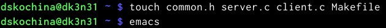
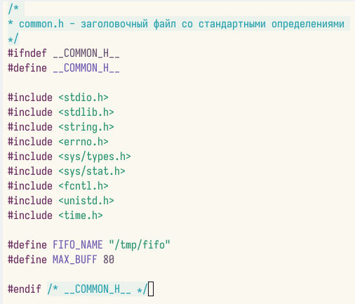
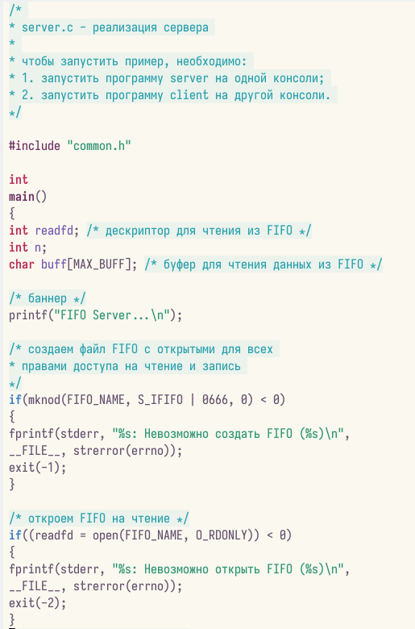
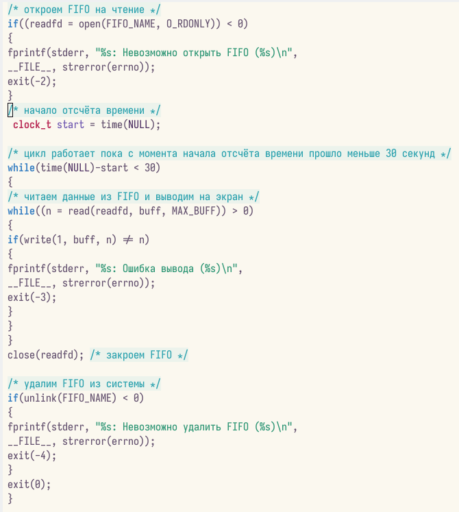
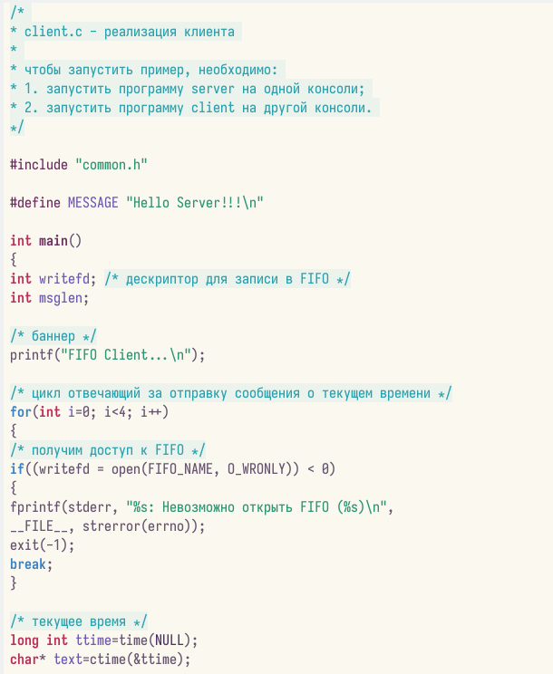
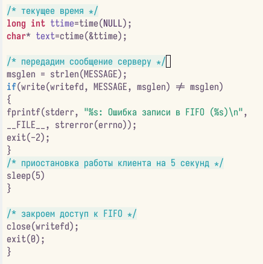
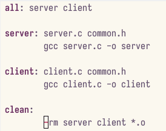
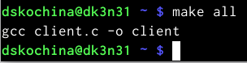
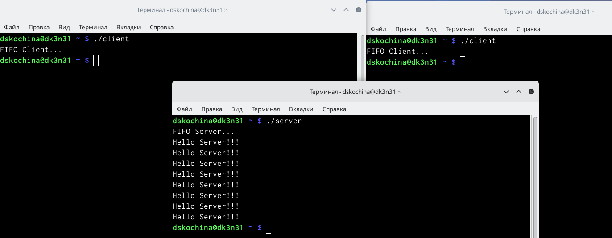
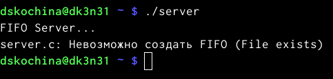

---
## Front matter
lang: ru-RU
title: Отчёт по лабораторной работе №14
subtitle: Именованные каналы
author:
  - Кочина Д. С.
institute:
  - Российский университет дружбы народов, Москва, Россия
date: 10 мая 2023

## i18n babel
babel-lang: russian
babel-otherlangs: english

## Formatting pdf
toc: false
toc-title: Содержание
slide_level: 2
aspectratio: 169
section-titles: true
theme: metropolis
header-includes:
 - \metroset{progressbar=frametitle,sectionpage=progressbar,numbering=fraction}
 - '\makeatletter'
 - '\beamer@ignorenonframefalse'
 - '\makeatother'
---

# Вводная часть

## Цель работы

Целью данной лабораторной работы является приобретение практических навыков работы с именованными каналами.

# Основная часть

## Создание файлов

- Для начала изучили материал лабораторной работы. Далее на основе примеров напишем аналогичные программы, но с изменениями.
- Создадим необходимые файлы для работы.

## Файл common.h

- Затем изменим коды программ, данных в лабораторной работе. В файл common.h добавим стандартные заголовочные файлы: "unistd.h", "time.h". Это необходимо для работы других файлов. Этот файл является заголовочным, чтобы в остальных програмах не прописывать одно и то же каждый раз.

## Файл common.h

## Файл server.c

- Затем в файл server.c добавляем цикл "while" для контроля за верменем работы сервера. Разница между текущим временем и началом работы не должна превышать 30 секунд.

## Файл server.c

## Файл server.c

## Файл client.c

- В файл client.c добавим цикл, который отвечает за количество сообщений о текущем времени (4 сообщения). С промощью команды "sleep" приостановим работу клиента на 5 секунд.

## Файл client.c

## Файл client.c

## Файл Makefile

- Makefile оставили без изменений.

## Компиляция

- Далее делаем компиляцию файлов с помощью команды "make all".

## Проверка

- Затем открываем три терминала для проверки работы наших файлов. В первом пишем "./server", а в остальных "./client". В результате каждый терминал вывел по 4 сообщения, а по истечение 30 секунд работа сервера была завершена. Всё работает верно.

## Проверка

## Проверка

- Проверим длительность работы сервера. Вводим команду "./server" в одном терминале. Он завершил свою раюоту через 30 секунд. Если сервер завершит свою работу, не закрыва канал, то при повторном запуске появится ошибка "Невозможно создать FIFO", так как у нас уже есть один канал.

# Заключение

## Вывод

В ходе выполнения данной лабораторной работы я приобрела практические навыки работы с именованными каналами.

