---
## Front matter
lang: ru-RU
title: "Отчёт по первому этапу индивидуального проекта"
subtitle: "дисциплина: Операционные системы"
author:
  - Кочина Д. С.
institute:
  - Российский университет дружбы народов, Москва, Россия
date: 22 февраля 2023

## i18n babel
babel-lang: russian
babel-otherlangs: english

## Formatting pdf
toc: false
toc-title: Содержание
slide_level: 2
aspectratio: 169
section-titles: true
theme: metropolis
header-includes:
 - \metroset{progressbar=frametitle,sectionpage=progressbar,numbering=fraction}
 - '\makeatletter'
 - '\beamer@ignorenonframefalse'
 - '\makeatother'
---

# Вводная часть

## Цель работы

Целью первого этапа индивидуального проекта является размещение на Github pages заготовки для персонального сайта.

# Основная часть

## Скачивание необходимых файлов

- Я скачала файл hugo для дальнейшей работы.
- Перенесла данный файл в созданную папку bin.

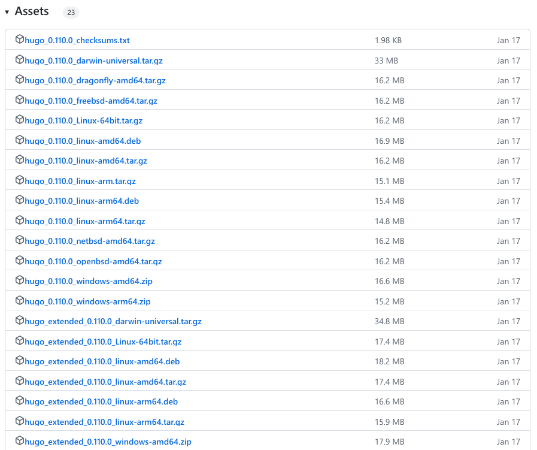

## Создание нового репозитория на GitHub

- Я открыла ссылку из ТУИСа на репозиторий. Перешла по этой ссыллке и создала новый репозиторий под названием blog.

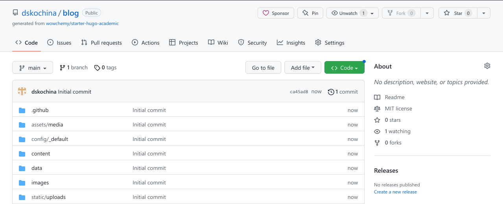

## Клонирование созданного репозитория

- Я скопировала ссылку своего репозитория (SSH), открыла терминал и прописала команду клонирования.

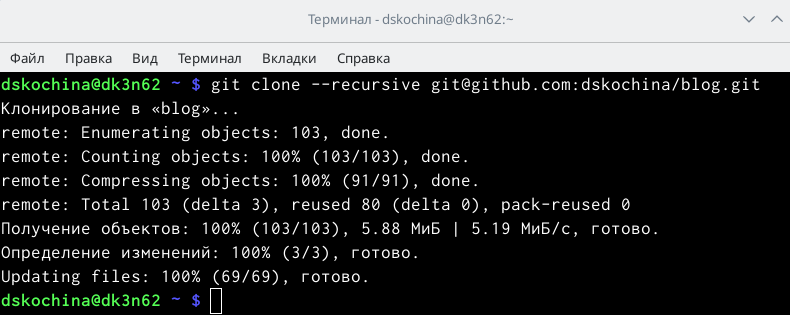

## Создание нового репозитория

- Я создала новый репозиторий со специальным названием "dskochina.github.io".

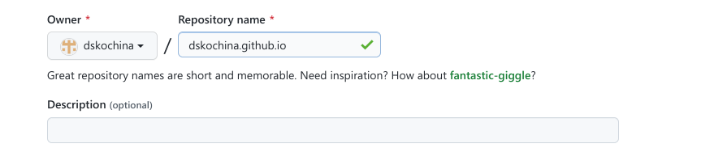

## Применение команды git clone --recursive

- Я перешла на уровень выше из каталога blog, скопировала ссылку репозитория, применила команду git clone --recursive, чтобы клонировать репозиторий.

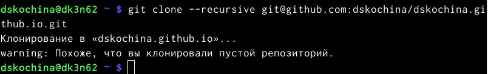

## Создание новой ветки

- Я ввела команду для создания новой ветки main.

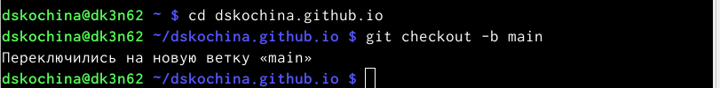

## Создание пустого файла

- Я создала пустой файл и отправила его на Github.

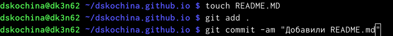

## Подключение репозитория к папке

- Я ввела команду, которая подключила новый репозиторий к папке public внутри blog.

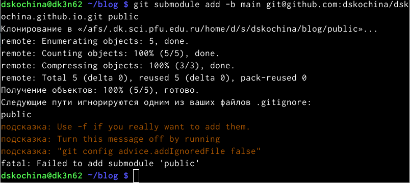

## Игнорирование каталогов public

- Я открыла mc, перешла в .gitignore, поставила знак "#" возле "public" и сохранила изменения.
- При помощи команды cat я убедилась, что файл public со знаком "#", чтобы не происходило игнорирование этих каталогов.

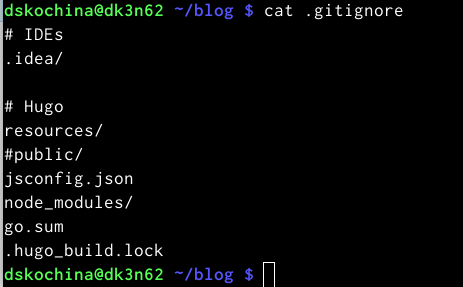

## Команда git submodule add -b main

- Я повторила команду, чтобы моя папка была видна в репозитории.

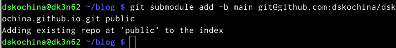

## Команда git remote

- Я ввела команду git remote, чтобы подключить каталог к моему репозиторию.
- Я обновила репозиторий и убедилась в том, что появились все файлы.
- Я ввела в Браузер ссылку на сайт из репозитория и перешла по ней.

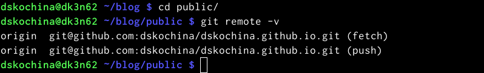

# Заключение

## Вывод

Я сделала первый этап индивидуального проекта, целью которого являлось размещение на Github pages заготовки для персонального сайта.

