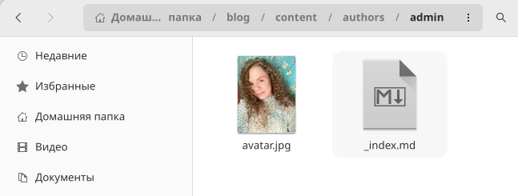
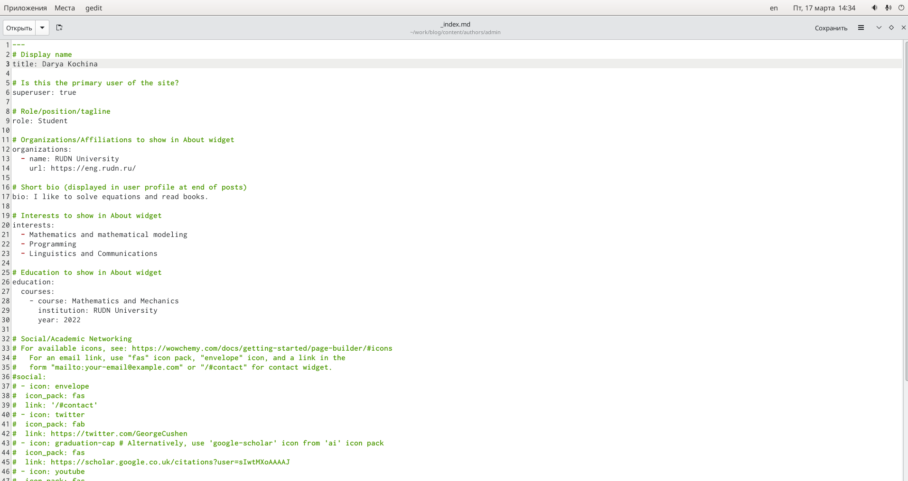
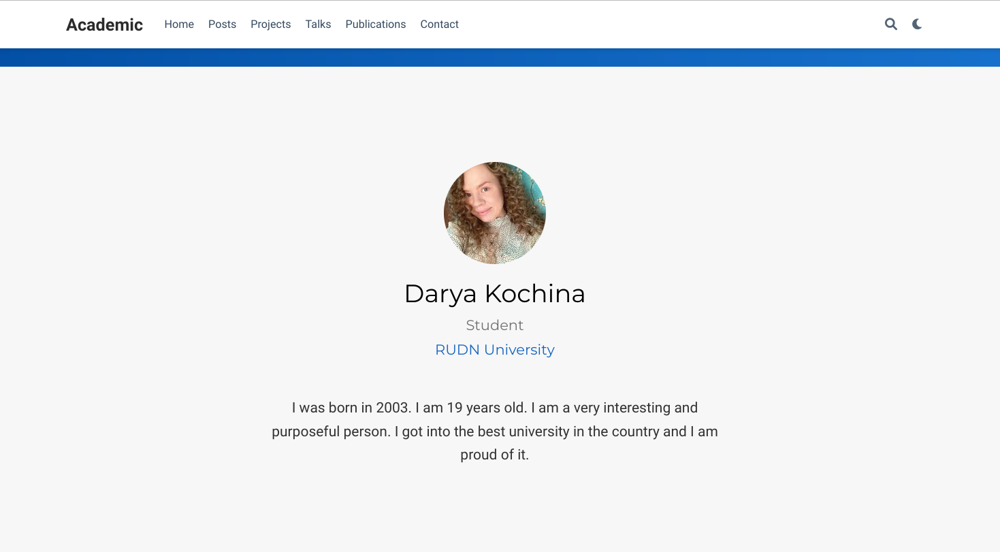
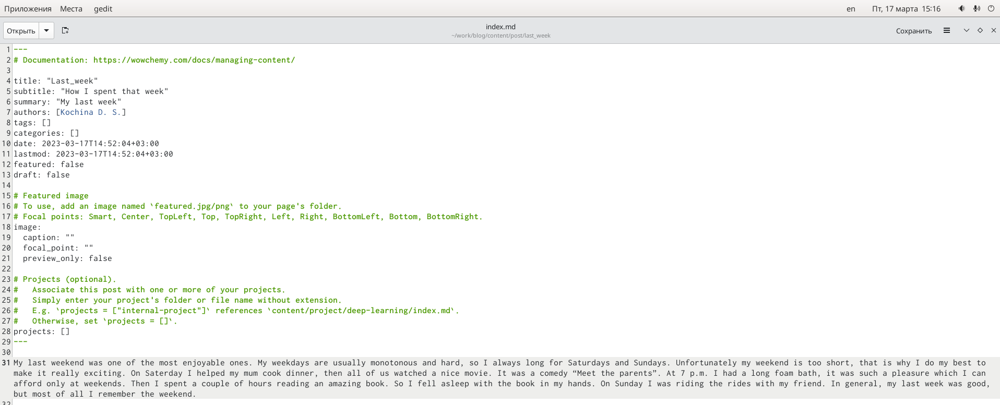
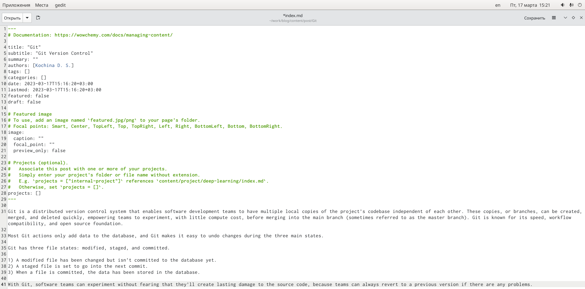
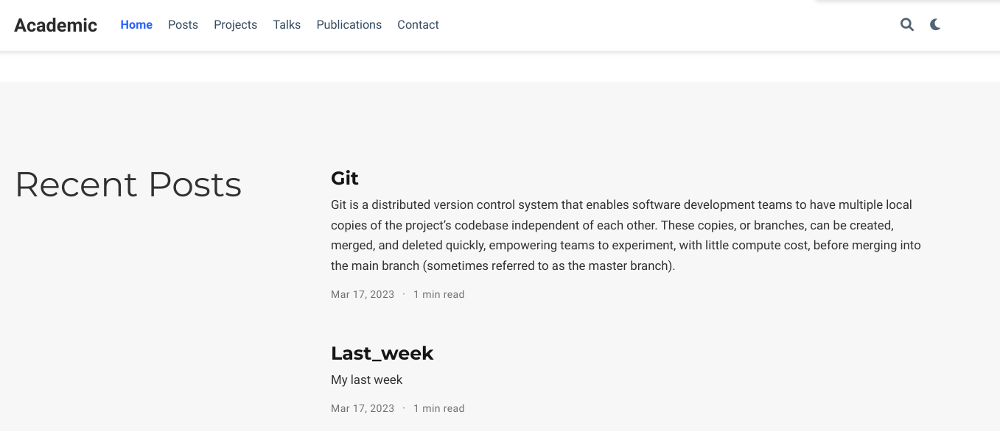

---
## Front matter
lang: ru-RU
title: "Отчёт по второму этапу индивидуального проекта"
subtitle: "дисциплина: Операционные системы"
author:
  - Кочина Д. С.
institute:
  - Российский университет дружбы народов, Москва, Россия
date: 17 марта 2023

## i18n babel
babel-lang: russian
babel-otherlangs: english

## Formatting pdf
toc: false
toc-title: Содержание
slide_level: 2
aspectratio: 169
section-titles: true
theme: metropolis
header-includes:
 - \metroset{progressbar=frametitle,sectionpage=progressbar,numbering=fraction}
 - '\makeatletter'
 - '\beamer@ignorenonframefalse'
 - '\makeatother'
---

# Вводная часть

## Цель работы

Целью второго этапа индивидуального проекта является добавление к сайту данных о себе. А также размещение постов.

# Основная часть

## Размещение фотографии

- Я разместила фотграфию владельца сайта. Для этого заменила фото из шаблона на собственное.

## Размещение основной информации

- Я разместила основную информацию: моё имя, название университета, ссылка на сайт, краткое описание владельца сайта.
- Добавила информацию об интересах и об образовании.

# Проверка изменений

- Я ввела в терминале команду ~/bin/hugo server и получила ссылку на сайт. Проверила изменения содержимого.

# Создание поста о прошедшей неделе

- Я ввела в терминале команду ~/bin/hugo new post/last_week. 
- Затем я создала пост о прошедшей неделе, размещая необходимую информацию.

# Создание поста на тему по выбору

- Я ввела в терминале команду ~/bin/hugo new post/Git. 
- Затем я создала пост на тему по выбору: Управление версиями. Git. Я создала пост, размещая необходимую информацию.

# Проверка изменений

- Я проверила изменения на сайте.

# Заключение

## Вывод

В ходе выполнения второго этапа индивидуального проекта я добавила к сайту данные о себе, а также разместила несколько постов.

