---
## Front matter
title: "Отчёт по второму этапу индивидуального проекта"
subtitle: "*дисциплина: Операционные системы*"
author: "Дарья Сергеевна Кочина"

## Generic otions
lang: ru-RU
toc-title: "Содержание"

## Bibliography
bibliography: bib/cite.bib
csl: pandoc/csl/gost-r-7-0-5-2008-numeric.csl

## Pdf output format
toc: true # Table of contents
toc-depth: 2
lof: true # List of figures
fontsize: 12pt
linestretch: 1.5
papersize: a4
documentclass: scrreprt
## I18n polyglossia
polyglossia-lang:
  name: russian
  options:
	- spelling=modern
	- babelshorthands=true
polyglossia-otherlangs:
  name: english
## I18n babel
babel-lang: russian
babel-otherlangs: english
## Fonts
mainfont: PT Serif
romanfont: PT Serif
sansfont: PT Sans
monofont: PT Mono
mainfontoptions: Ligatures=TeX
romanfontoptions: Ligatures=TeX
sansfontoptions: Ligatures=TeX,Scale=MatchLowercase
monofontoptions: Scale=MatchLowercase,Scale=0.9
## Biblatex
biblatex: true
biblio-style: "gost-numeric"
biblatexoptions:
  - parentracker=true
  - backend=biber
  - hyperref=auto
  - language=auto
  - autolang=other*
  - citestyle=gost-numeric
## Pandoc-crossref LaTeX customization
figureTitle: "Рис."
tableTitle: "Таблица"
listingTitle: "Листинг"
lofTitle: "Список иллюстраций"
lolTitle: "Листинги"
## Misc options
indent: true
header-includes:
  - \usepackage{indentfirst}
  - \usepackage{float} # keep figures where there are in the text
  - \floatplacement{figure}{H} # keep figures where there are in the text
---

# Цель работы

Целью второго этапа индивидуального проекта является добавление к сайту данных о себе. А также размещение постов.

# Задание

Добавить к сайту данные о себе.

# Выполнение работы

1. Я разместила фотографию владельца сайта. Для этого заменила фото из шаблона на собственное. (рис. [-@fig:001])

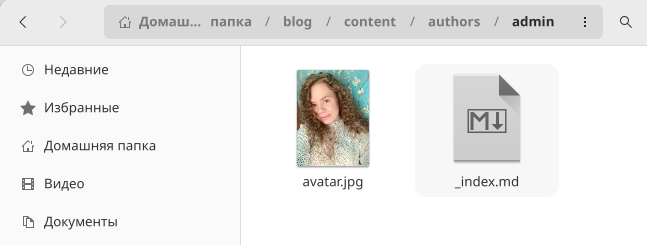{ #fig:001 width=70% }

2. Я разместила основную информацию: моё имя, название университета, ссылка на сайт, краткое описание владельца сайта. Добавила информацию об интересах и об образовании. (рис. [-@fig:002], рис. [-@fig:003])

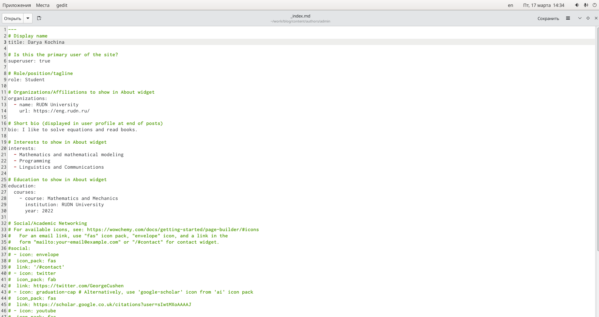{ #fig:002 width=70% }

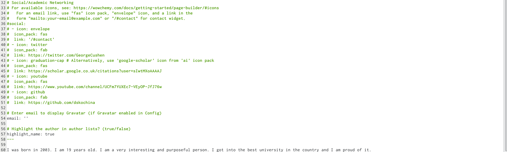{ #fig:003 width=70% }

3. Я ввела в терминале команду ~/bin/hugo server и получила ссылку на сайт. Проверила изменения содержимого. (рис. [-@fig:004])

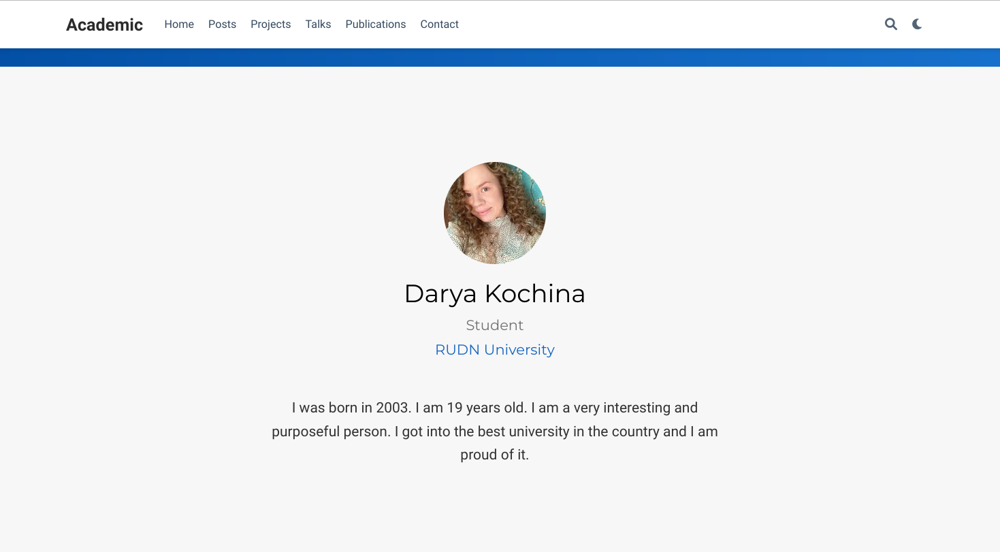{ #fig:004 width=70% }

4. Я ввела в терминале команду ~/bin/hugo new post/last_week. Затем я создала пост о прошедшей неделе, размещая необходимую информацию. (рис. [-@fig:005], рис. [-@fig:006])

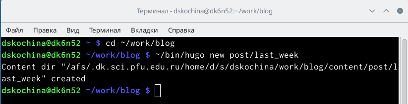{ #fig:005 width=70% }

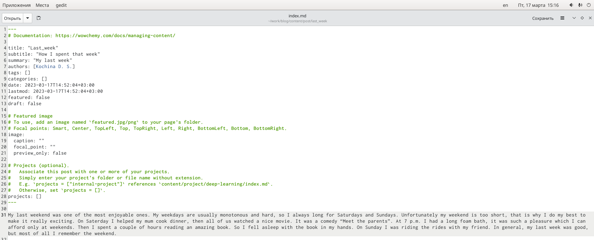{ #fig:006 width=70% }

5. Я ввела в терминале команду ~/bin/hugo new post/Git. Затем я создала пост на тему по выбору: Управление версиями. Git. Я создала пост, размещая необходимую информацию. (рис. [-@fig:007], рис. [-@fig:008])

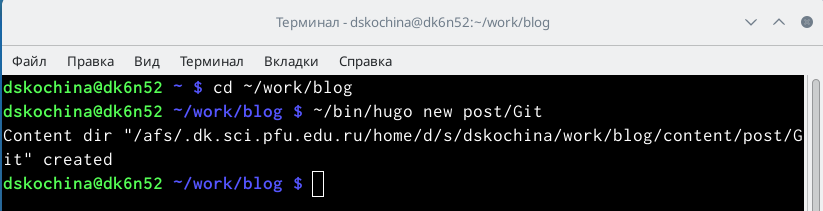{ #fig:007 width=70% }

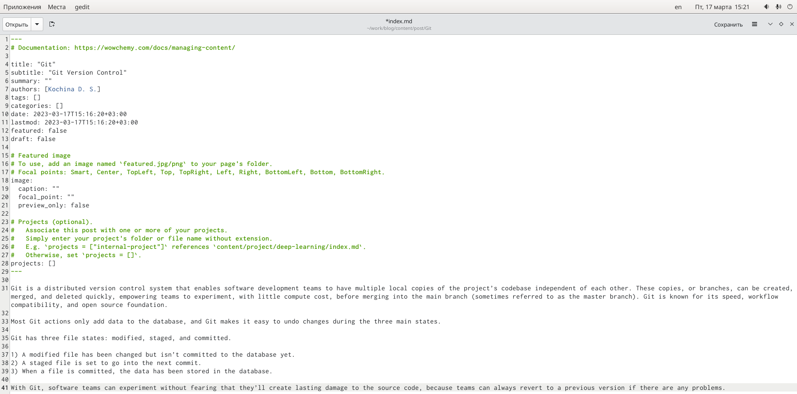{ #fig:008 width=70% }

6. Я проверила изменения на сайте. (рис. [-@fig:009], рис. [-@fig:010], рис. [-@fig:011])

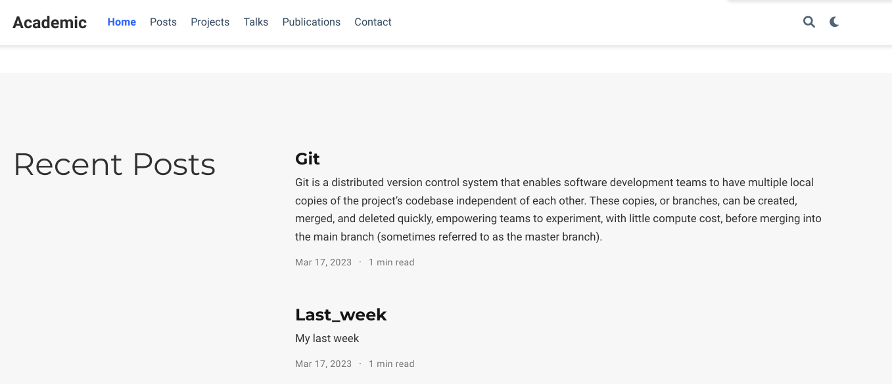{ #fig:009 width=70% }

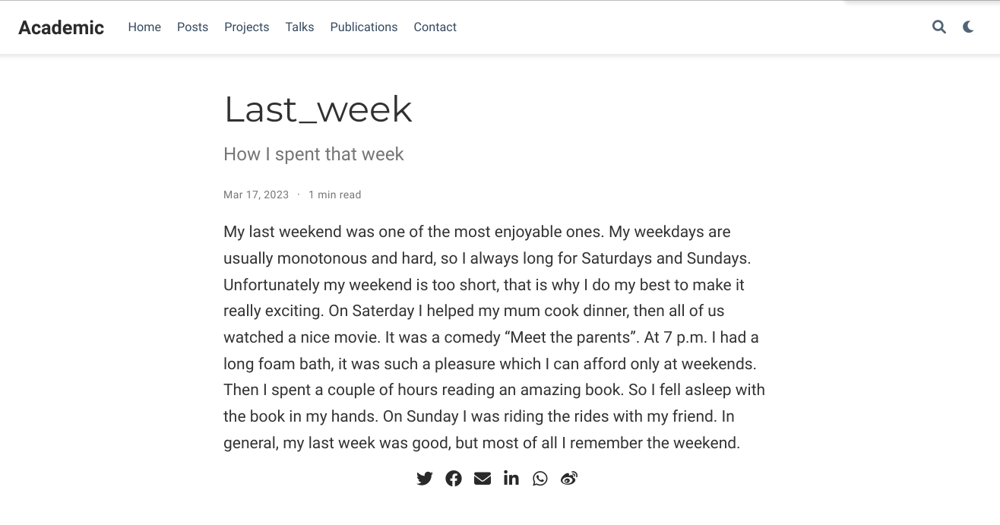{ #fig:010 width=70% }

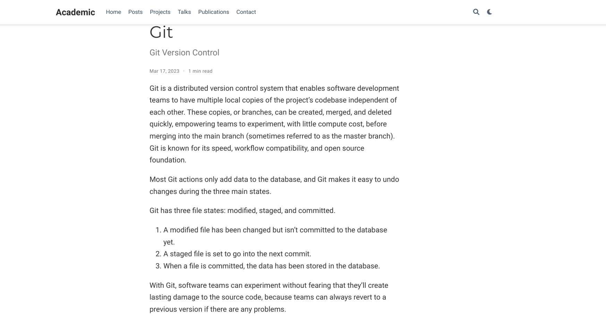{ #fig:011 width=70% }

# Выводы

В ходе выполнения второго этапа индивидуального проекта я добавила к сайту данные о себе, а также разместила несколько постов.

