---
## Front matter
lang: ru-RU
title: "Отчёт по третьему этапу индивидуального проекта"
subtitle: "*дисциплина: Операционные системы*"
author:
  - Кочина Д. С.
institute:
  - Российский университет дружбы народов, Москва, Россия
date: 06 апреля 2023

## i18n babel
babel-lang: russian
babel-otherlangs: english

## Formatting pdf
toc: false
toc-title: Содержание
slide_level: 2
aspectratio: 169
section-titles: true
theme: metropolis
header-includes:
 - \metroset{progressbar=frametitle,sectionpage=progressbar,numbering=fraction}
 - '\makeatletter'
 - '\beamer@ignorenonframefalse'
 - '\makeatother'
---

## Вводная часть

# Цель работы

Целью третьего этапа индивидуального проекта является добавление к сайту данных о себе: добавление достижений. А также размещение постов.

# Основная часть

## Добавление информации

- Введя команду ~/bin/hugo server, получила ссылку на локальный сайт, где промежуточно отслеживала все изменения.
- Открыла файл в папке content. Изменила информацию о навыках из шаблона на свои.

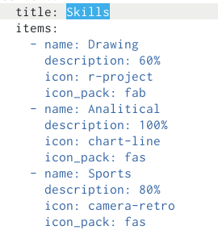

## Добавление информации

- Добавила информацию об опыте.

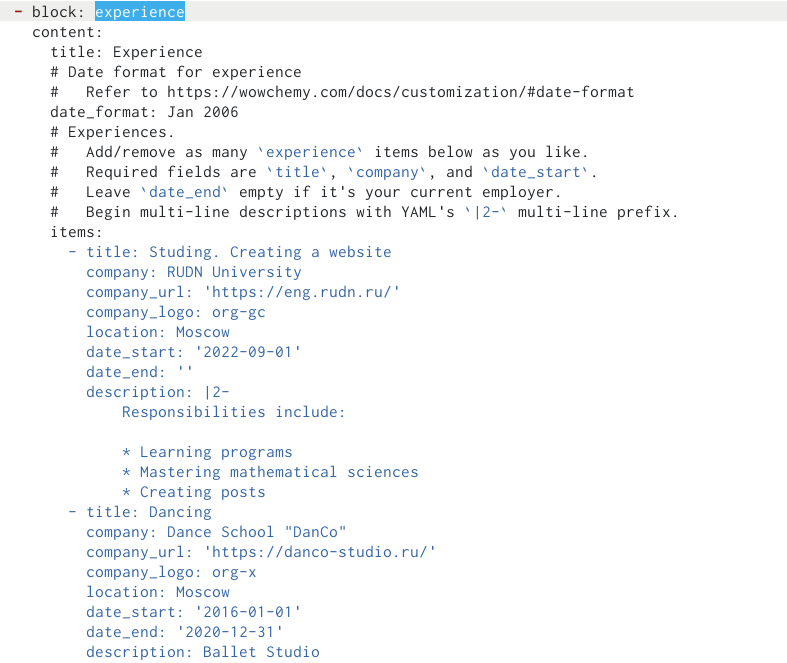

# Добавление информации

- Добавила информацию о достижениях.

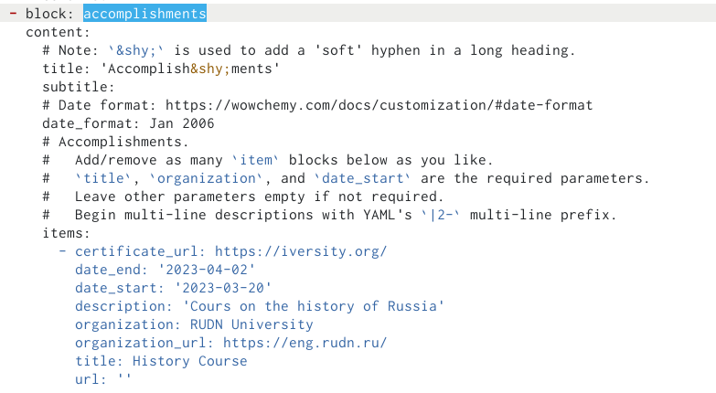

# Проверка изменений на сайте

- Я ввела в терминале команду ~/bin/hugo server и получила ссылку на сайт.
- Проверила изменения содержимого.

# Проверка изменений на сайте

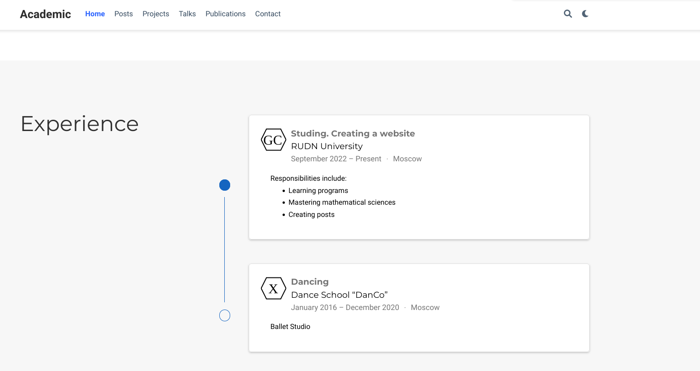

# Проверка изменений на сайте

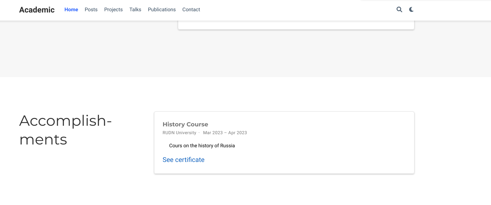

## Создание поста о прошедшей неделе

- Я ввела в терминале команду ~/bin/hugo new post/last_week1. 
- Затем я создала пост о прошедшей неделе, размещая необходимую информацию.

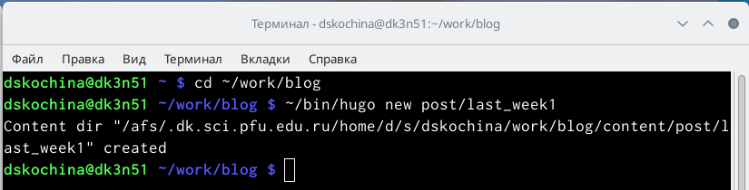

## Создание поста о прошедшей неделе

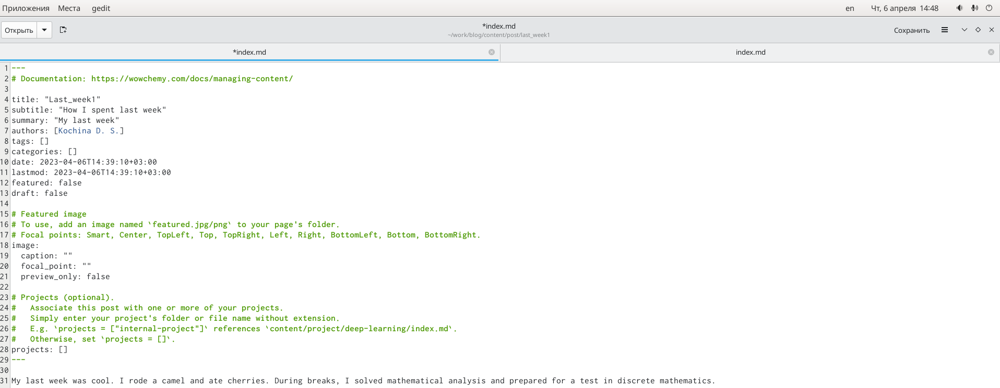

# Создание поста на тему по выбору

- Я ввела в терминале команду ~/bin/hugo new post/Markdown. 
- Затем я создала пост на тему по выбору: Язык разметки Markdown. Я создала пост, размещая необходимую информацию.

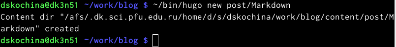

## Создание поста на тему по выбору

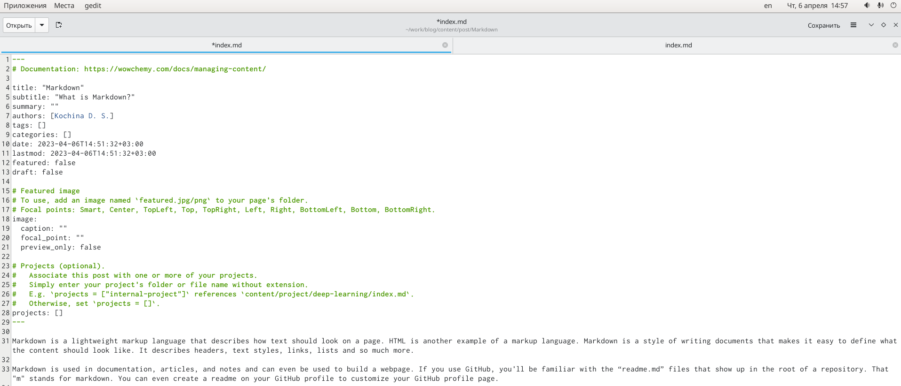

# Проверка изменений на сайте

- Я проверила изменения на сайте.

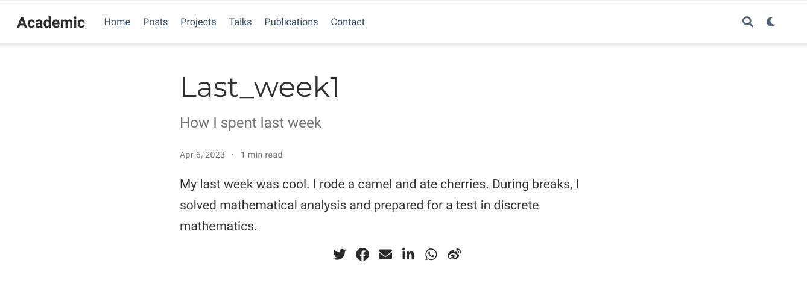

# Проверка изменений на сайте

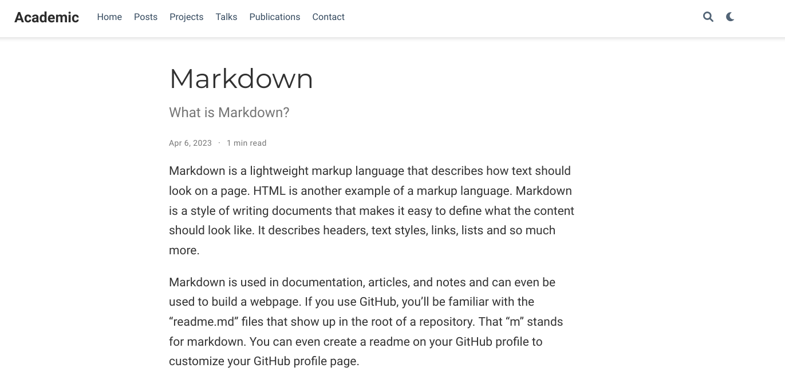

# Заключение

## Вывод

В ходе выполнения третьего этапа индивидуального проекта я добавила к сайту данные о себе (добавила достижения). А также разместила несколько постов.

