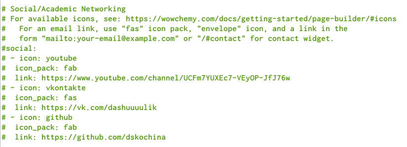
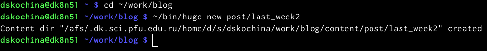
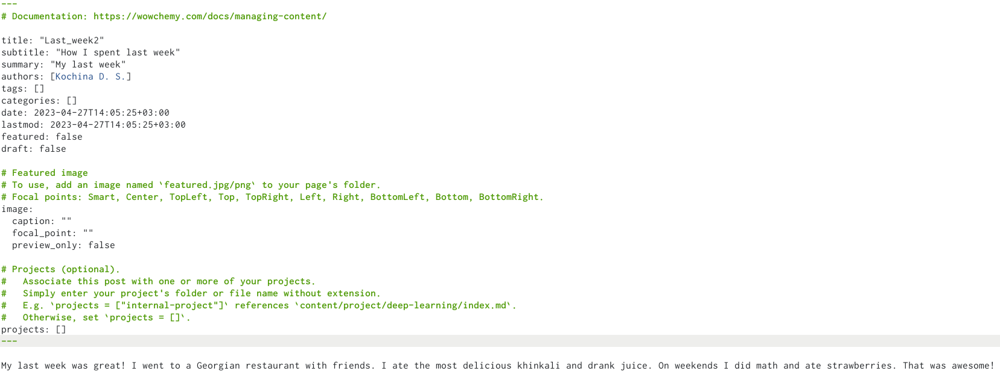
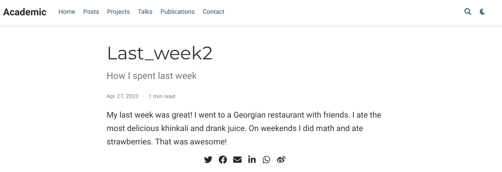
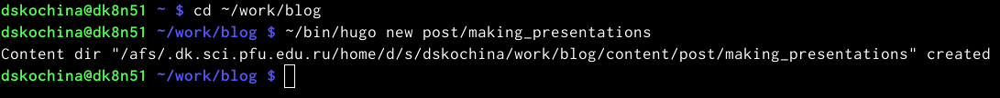
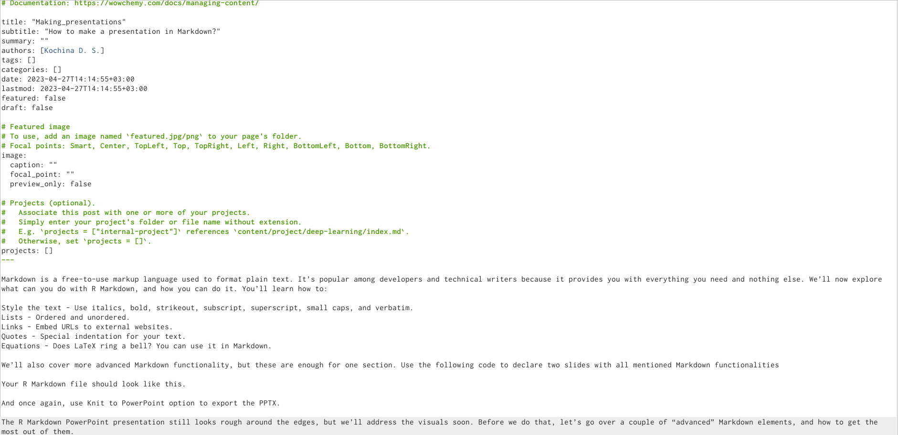
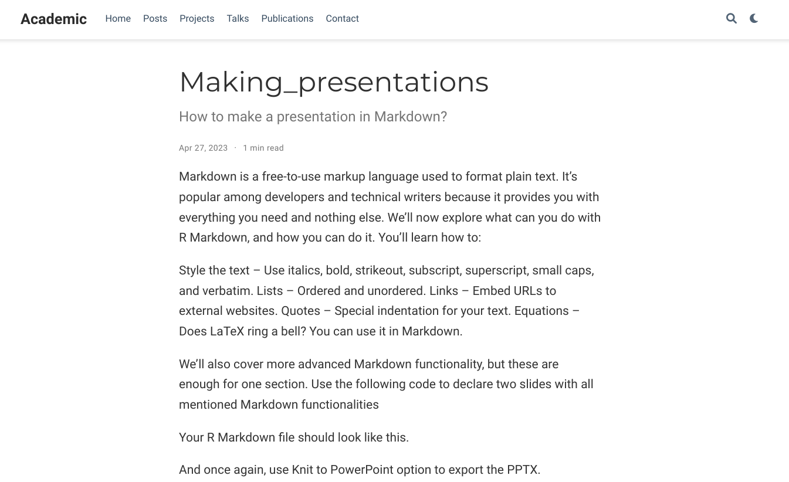

---
## Front matter
lang: ru-RU
title: Отчёт по четвёртому этапу индивидуального проекта
subtitle: дисциплина "Операционные системы"
author:
  - Кочина Д. С.
institute:
  - Российский университет дружбы народов, Москва, Россия
date: 27 апреля 2023

## i18n babel
babel-lang: russian
babel-otherlangs: english

## Formatting pdf
toc: false
toc-title: Содержание
slide_level: 2
aspectratio: 169
section-titles: true
theme: metropolis
header-includes:
 - \metroset{progressbar=frametitle,sectionpage=progressbar,numbering=fraction}
 - '\makeatletter'
 - '\beamer@ignorenonframefalse'
 - '\makeatother'
---

# Вводная часть

## Цель работы

Целью четвёртого этапа индивидуального проекта является добавление к сайту ссылок на научные и библиометрические ресурсы.

# Основная часть

## Изменение ссылок

- Вместо данных ресурсов я добавила ссылки на свой канал на youtube, ВК и гитхаб. Для этого перешла в папку "content" -> "authors" -> "admin" и в файле изменила информацию. Затем проверила информацию на сайте.

## Изменение ссылок

## Изменение ссылок

## Пост недели

- Я ввела в терминале команду ~/bin/hugo new post/last_week2. Далее написала пост по прошедшей неделе и проверила изменения на сайте.

## Пост недели

## Пост недели

## Пост недели

## Пост на тему

- Я ввела в терминале команду ~/bin/hugo new post/making_presentations. Затем я создала пост на тему по выбору: Создание презентаций. Я создала пост, размещая необходимую информацию и проверила изменения на сайте.

## Пост на тему

## Пост на тему

## Пост на тему

# Заключение

## Вывод

В ходе выполнения четвёртого этапа индивидуального проекта я приобрела практические навыки по созданию сайта, получила новые знания. Добавила к сайту ссылки на научные и библиометрические ресурсы.

