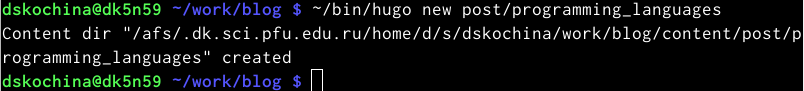

---
## Front matter
title: "Отчёт по пятому этапу индивидуального проекта"
subtitle: "*дисциплина: Операционные системы*"
author: "Дарья Сергеевна Кочина"

## Generic otions
lang: ru-RU
toc-title: "Содержание"

## Bibliography
bibliography: bib/cite.bib
csl: pandoc/csl/gost-r-7-0-5-2008-numeric.csl

## Pdf output format
toc: true # Table of contents
toc-depth: 2
lof: true # List of figures
fontsize: 12pt
linestretch: 1.5
papersize: a4
documentclass: scrreprt
## I18n polyglossia
polyglossia-lang:
  name: russian
  options:
	- spelling=modern
	- babelshorthands=true
polyglossia-otherlangs:
  name: english
## I18n babel
babel-lang: russian
babel-otherlangs: english
## Fonts
mainfont: PT Serif
romanfont: PT Serif
sansfont: PT Sans
monofont: PT Mono
mainfontoptions: Ligatures=TeX
romanfontoptions: Ligatures=TeX
sansfontoptions: Ligatures=TeX,Scale=MatchLowercase
monofontoptions: Scale=MatchLowercase,Scale=0.9
## Biblatex
biblatex: true
biblio-style: "gost-numeric"
biblatexoptions:
  - parentracker=true
  - backend=biber
  - hyperref=auto
  - language=auto
  - autolang=other*
  - citestyle=gost-numeric
## Pandoc-crossref LaTeX customization
figureTitle: "Рис."
tableTitle: "Таблица"
listingTitle: "Листинг"
lofTitle: "Список иллюстраций"
lolTitle: "Листинги"
## Misc options
indent: true
header-includes:
  - \usepackage{indentfirst}
  - \usepackage{float} # keep figures where there are in the text
  - \floatplacement{figure}{H} # keep figures where there are in the text
---

# Цель работы

Целью пятого этапа индивидуального проекта является добавление к сайту остальных элементов

# Задание

Добавить к сайту все остальные элементы.

- Сделать записи для персональных проектов.

- Сделать пост по прошедшей неделе.

- Добавить пост на тему по выбору:

Языки научного программирования.

# Выполнение лабораторной работы

1. Сделала записи для персональных проектов. Для этого перешла в папку contents -> project и сделала необходимые изменения. Затем проверила информацию на сайте. (рис. [-@fig:001], [-@fig:002], [-@fig:003], [-@fig:004])

{#fig:001 width=80%}

{#fig:002 width=80%}

{#fig:003 width=80%}

{#fig:004 width=80%}

2. Я ввела в терминале команду ~/bin/hugo new post/last_week3. Далее написала пост по прошедшей неделе и проверила изменения на сайте. (рис. [-@fig:005], [-@fig:006], [-@fig:007])

{#fig:005 width=80%}

{#fig:006 width=80%}

{#fig:007 width=80%}

3. Я ввела в терминале команду ~/bin/hugo new post/programming_languages. Затем я создала пост на тему по выбору: Языки научного программирования. Я создала пост, размещая необходимую информацию и проверила изменения на сайте. (рис. [-@fig:008], [-@fig:009], [-@fig:010])

{#fig:008 width=80%}

{#fig:009 width=80%}

{#fig:010 width=80%}

# Выводы

В процессе выполнения данного этапа проекта, я приобрела практические навыки по созданию сайта, получила новые знания. Добавила к сайту остальные элементы.

