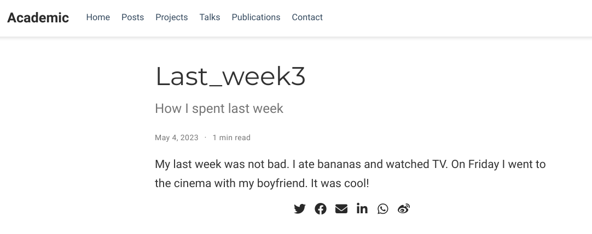

---
## Front matter
lang: ru-RU
title: Отчёт по шестому этапу индивидуального проекта
subtitle: дисциплина "Операционные системы"
author:
  - Кочина Д. С.
institute:
  - Российский университет дружбы народов, Москва, Россия
date: 26 мая 2023

## i18n babel
babel-lang: russian
babel-otherlangs: english

## Formatting pdf
toc: false
toc-title: Содержание
slide_level: 2
aspectratio: 169
section-titles: true
theme: metropolis
header-includes:
 - \metroset{progressbar=frametitle,sectionpage=progressbar,numbering=fraction}
 - '\makeatletter'
 - '\beamer@ignorenonframefalse'
 - '\makeatother'
---

# Вводная часть

## Цель работы

Целью пятого этапа индивидуального проекта является добавление к сайту остальных элементов.

# Основная часть

## Персональные проекты

- Сделала записи для персональных проектов. Для этого перешла в папку contents -> project и сделала необходимые изменения. Затем проверила информацию на сайте.

## Персональные проекты

## Персональные проекты

## Персональные проекты

## Персональные проекты

## Пост недели

- Я ввела в терминале команду ~/bin/hugo new post/last_week3. Далее написала пост по прошедшей неделе и проверила изменения на сайте.

## Пост недели

## Пост недели

## Пост недели

## Пост на тему

- Я ввела в терминале команду ~/bin/hugo new post/programming_languages. Затем я создала пост на тему по выбору: Языки научного программирования. Я создала пост, размещая необходимую информацию и проверила изменения на сайте.

## Пост на тему

## Пост на тему

## Пост на тему

# Заключение

## Вывод

В процессе выполнения данного этапа проекта, я приобрела практические навыки по созданию сайта, получила новые знания. Добавила к сайту остальные элементы.

